# Models for Printing

=== "iDryer v4 stl"

    | Part | Description |
    |--------|----------|
    | 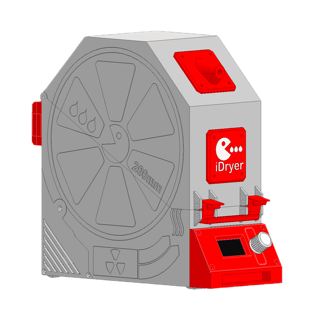 | [archive - parts bundle](CAD/v4/STL/UNIT.zip) |
    | 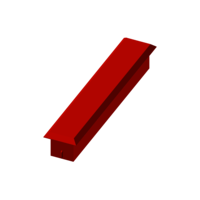 | [Light diffuser](CAD/v4/STL/UNIT_LIFGHT-DIFFUSER_Light_diffuser.stl) |
    | 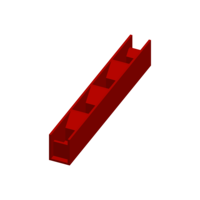 | [Light separator](CAD/v4/STL/UNIT_LIFGHT-DIFFUSER_Light_separator.stl) |
    |  | [Base - lower housing (plain)](CAD/v4/STL/UNIT_MCU_base_plain.stl) |
    |  | [Base - lower housing](CAD/v4/STL/UNIT_MCU_base_embossed.stl) |
    | 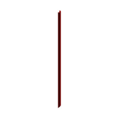 | [UTP cable duct](CAD/v4/STL/UNIT_MCU_cable_duct_UTP.stl) |
    | 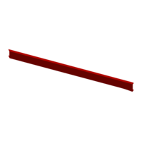 | [Cable duct](CAD/v4/STL/UNIT_MCU_cable_duct.stl) |
    | 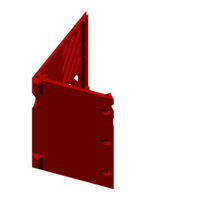 | [MCU electronics bay back cover](CAD/v4/STL/UNIT_MCU_Back-Cover-3-ports.stl) |
    | 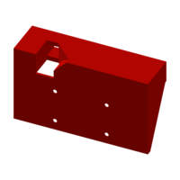 | [Display enclosure](CAD/v4/STL/UNIT_STANDALONE-FRONT-PANEL_ENCLOSURE.stl) |
    | 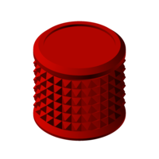 | [Knob](CAD/v4/STL/UNIT_STANDALONE-FRONT-PANEL_Knob_2.1.stl) |
    | 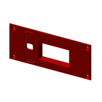 | [Display panel](CAD/v4/STL/UNIT_STANDALONE-FRONT-PANEL_IDRYER_UNIT_display_panel3.stl) |
    |  | [Base - lower housing (plain)](CAD/v4/STL/UNIT_EXT_base_plain.stl) |
    | 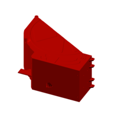 | [Base - lower housing](CAD/v4/STL/UNIT_EXT_base_embossed.stl) |
    |  | [EXT electronics bay back cover](CAD/v4/STL/UNIT_EXT_Back-Cover-1-port.stl) |
    | 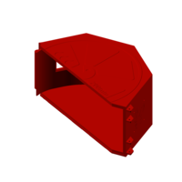 | [Top cover](CAD/v4/STL/UNIT_top_cover_embossed.stl) |
    | 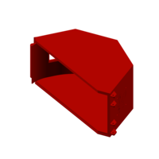 | [Top cover (plain)](CAD/v4/STL/UNIT_top_cover_plain.stl) |
    | 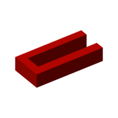 | [Heater spacer (left)](CAD/v4/STL/UNIT_HEATER_SPACER_left.stl) |
    | 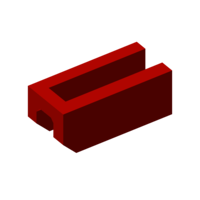 | [Heater spacer (right)](CAD/v4/STL/UNIT_HEATER_SPACER_right.stl) |
    | 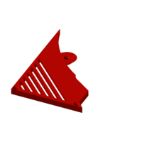 | [Electronics bay side cover (left)](CAD/v4/STL/UNIT_ELECTRONICS_BAY_Left-Cover.stl) |
    | 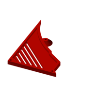 | [Electronics bay side cover (right)](CAD/v4/STL/UNIT_ELECTRONICS_BAY_Right-Cover.stl) |
    | 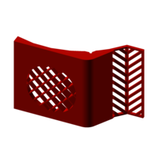 | [Internal floor](CAD/v4/STL/UNIT_FLOOR_Flor1.stl) |
    | 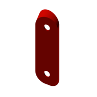 | [Floor clip for flat temp/humidity sensor cable](CAD/v4/STL/UNIT_FLOOR_Flor2.stl) |
    | 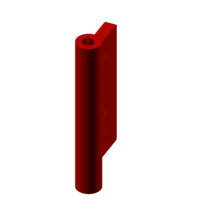 | [Air damper blade for 3.7g servo](CAD/v4/STL/UNIT_AIR_DAMPER_SRVO_37G_damper_blade.stl) |
    | 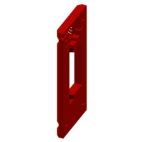 | [Damper housing half 1 (3.7g servo)](CAD/v4/STL/UNIT_AIR_DAMPER_SRVO_37G_housing_halve_1.stl) |
    | 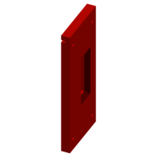 | [Damper housing half 2 (3.7g servo)](CAD/v4/STL/UNIT_AIR_DAMPER_SRVO_37G_housing_halve_2.stl) |
    | 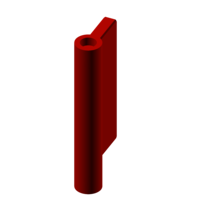 | [Air damper blade for 9g servo](CAD/v4/STL/UNIT_AIR_DAMPER_SRVO_9G_damper_blade.stl) |
    | 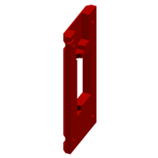 | [Damper housing half 1 (9g servo)](CAD/v4/STL/UNIT_AIR_DAMPER_SRVO_9G_housing_halve_1.stl) |
    | 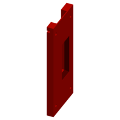 | [Damper housing half 2 (9g servo)](CAD/v4/STL/UNIT_AIR_DAMPER_SRVO_9G_housing_halve_2.stl) |
    | 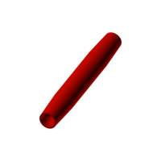 | [Printed roller 11×84 for 693 bearings](CAD/v4/STL/UNIT_SPOOL-ROLLER_PRINTED-ROLLER_Printable_Roller_Straight_Taper_with_Center_Flat_11x84mm_693.stl) |
    | 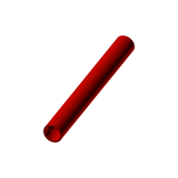 | [Printed roller 11×84 for 693 bearings](CAD/v4/STL/UNIT_SPOOL-ROLLER_PRINTED-ROLLER_Printable_Roller_Straight_Face11x84mm_693.stl) |
    | 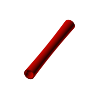 | [Printed roller 11×84 for 693 bearings](CAD/v4/STL/UNIT_SPOOL-ROLLER_PRINTED-ROLLER_Printable_Roller_Concave_Crown_11x84mm_693.stl) |
    | 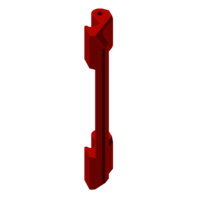 | [Latch handle](CAD/v4/STL/UNIT_Latch-Handle.stl) |
    | 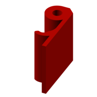 | [Latch](CAD/v4/STL/UNIT_Latch.stl) |
    | 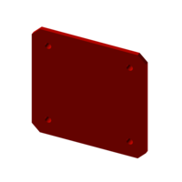 | [Logo plate](CAD/v4/STL/UNIT_Logo-Plate.stl) |
    | 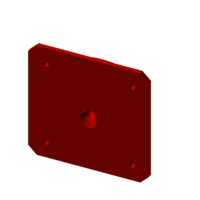 | [Filament outlet (plastic fitting)](CAD/v4/STL/UNIT_Filament-Outlet.stl) |
    | 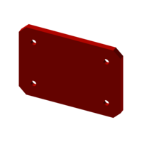 | [Nameplate](CAD/v4/STL/UNIT_Name-Plate.stl) |
    | 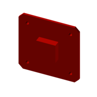 | [Filament outlet plug](CAD/v4/STL/UNIT_Plug.stl) |
    | 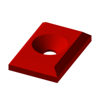 | [Foot](CAD/v4/STL/UNIT_Foot.stl) |

=== "iDryer v4 step"

    | Part | Description |
    |--------|----------|
    |  | [assembly](CAD/v4/STEP/UNIT.step) |
    |  | [archive - parts bundle](CAD/v4/STEP/UNIT.zip) |
    |  | [Light diffuser](CAD/v4/STEP/UNIT_LIFGHT-DIFFUSER_Light_diffuser.step) |
    |  | [Light separator](CAD/v4/STEP/UNIT_LIFGHT-DIFFUSER_Light_separator.step) |
    |  | [Base - lower housing (plain)](CAD/v4/STEP/UNIT_MCU_base_plain.step) |
    |  | [Base - lower housing](CAD/v4/STEP/UNIT_MCU_base_embossed.step) |
    |  | [UTP cable duct](CAD/v4/STEP/UNIT_MCU_cable_duct_UTP.step) |
    |  | [Cable duct](CAD/v4/STEP/UNIT_MCU_cable_duct.step) |
    |  | [MCU electronics bay back cover](CAD/v4/STEP/UNIT_MCU_Back-Cover-3-ports.step) |
    |  | [Display enclosure](CAD/v4/STEP/UNIT_STANDALONE-FRONT-PANEL_ENCLOSURE.step) |
    |  | [Knob](CAD/v4/STEP/UNIT_STANDALONE-FRONT-PANEL_Knob_2.1.step) |
    |  | [Display panel](CAD/v4/STEP/UNIT_STANDALONE-FRONT-PANEL_IDRYER_UNIT_display_panel3.step) |
    |  | [Base - lower housing (plain)](CAD/v4/STEP/UNIT_EXT_base_plain.step) |
    |  | [Base - lower housing](CAD/v4/STEP/UNIT_EXT_base_embossed.step) |
    |  | [EXT electronics bay back cover](CAD/v4/STEP/UNIT_EXT_Back-Cover-1-port.step) |
    |  | [Top cover](CAD/v4/STEP/UNIT_top_cover_embossed.step) |
    |  | [Top cover (plain)](CAD/v4/STEP/UNIT_top_cover_plain.step) |
    |  | [Heater spacer (left)](CAD/v4/STEP/UNIT_HEATER_SPACER_left.step) |
    |  | [Heater spacer (right)](CAD/v4/STEP/UNIT_HEATER_SPACER_right.step) |
    |  | [Electronics bay side cover (left)](CAD/v4/STEP/UNIT_ELECTRONICS_BAY_Left-Cover.step) |
    |  | [Electronics bay side cover (right)](CAD/v4/STEP/UNIT_ELECTRONICS_BAY_Right-Cover.step) |
    |  | [Internal floor](CAD/v4/STEP/UNIT_FLOOR_Flor1.step) |
    |  | [Floor clip for flat temp/humidity sensor cable](CAD/v4/STEP/UNIT_FLOOR_Flor2.step) |
    |  | [Air damper blade for 3.7g servo](CAD/v4/STEP/UNIT_AIR_DAMPER_SRVO_37G_damper_blade.step) |
    |  | [Damper housing half 1 (3.7g servo)](CAD/v4/STEP/UNIT_AIR_DAMPER_SRVO_37G_housing_halve_1.step) |
    |  | [Damper housing half 2 (3.7g servo)](CAD/v4/STEP/UNIT_AIR_DAMPER_SRVO_37G_housing_halve_2.step) |
    |  | [Air damper blade for 9g servo](CAD/v4/STEP/UNIT_AIR_DAMPER_SRVO_9G_damper_blade.step) |
    |  | [Damper housing half 1 (9g servo)](CAD/v4/STEP/UNIT_AIR_DAMPER_SRVO_9G_housing_halve_1.step) |
    |  | [Damper housing half 2 (9g servo)](CAD/v4/STEP/UNIT_AIR_DAMPER_SRVO_9G_housing_halve_2.step) |
    |  | [Printed roller 11×84 for 693 bearings](CAD/v4/STEP/UNIT_SPOOL-ROLLER_PRINTED-ROLLER_Printable_Roller_Straight_Taper_with_Center_Flat_11x84mm_693.step) |
    |  | [Printed roller 11×84 for 693 bearings](CAD/v4/STEP/UNIT_SPOOL-ROLLER_PRINTED-ROLLER_Printable_Roller_Straight_Face11x84mm_693.step) |
    |  | [Printed roller 11×84 for 693 bearings](CAD/v4/STEP/UNIT_SPOOL-ROLLER_PRINTED-ROLLER_Printable_Roller_Concave_Crown_11x84mm_693.step) |
    |  | [Latch handle](CAD/v4/STEP/UNIT_Latch-Handle.step) |
    |  | [Latch](CAD/v4/STEP/UNIT_Latch.step) |
    |  | [Logo plate](CAD/v4/STEP/UNIT_Logo-Plate.step) |
    |  | [Filament outlet (plastic fitting)](CAD/v4/STEP/UNIT_Filament-Outlet.step) |
    |  | [Nameplate](CAD/v4/STEP/UNIT_Name-Plate.step) |
    |  | [Filament outlet plug](CAD/v4/STEP/UNIT_Plug.step) |
    |  | [Foot](CAD/v4/STEP/UNIT_Foot.step) |

=== "iDryer Duo"

    **[Duo MCU Compartment Back Cover](CAD/v3/UNIT%20MCU%20duo%20Back%20Cover.stl)**

    **[Duo MCU Base](CAD/v3/UNIT%20MCU%20duo%20Base%20screw%20mounting.stl)**

    **[Duo Silica Tray](CAD/v3/UNIT%20duo%20silica%20tray.stl)**

    **[Duo Top Cover](CAD/v3/UNIT%20duo%20Top%20Cover%20screw%20mounting.stl)**

=== "iDryer v3"

    **[MCU Base](CAD/v3/UNIT%20MCU%20Base%20screw%20mounting.stl)**

    **[EXT Base](CAD/v3/UNIT%20EXT%20Base%20screw%20mounting.stl)**

    **[Top Cover](CAD/v3/UNIT%20Top%20Cover%20screw%20mounting.stl)**

    **[EXT Electronics Compartment Back Cover](CAD/v3/UNIT%20EXT%20Back%20Cover.stl)**

    **[MCU Electronics Compartment Back Cover](CAD/v3/UNIT%20MCU%20Back%20Cover.stl)**

    **[Left Electronics Compartment Cover](CAD/v3/UNIT%20Left%20Cover.stl)**

    **[Right Electronics Compartment Cover](CAD/v3/UNIT%20Right%20Cover.stl)**

    **[Latch Handle](CAD/v3/UNIT%20Latch%20Handle.stl)**

    **[Latch](CAD/v3/UNIT%20Latch.stl)**

    **[Filament Outlet](CAD/v3/UNIT%20Filament%20Outlet.stl)**

    **[Floor](CAD/v3/UNIT%20Floor.stl)**

    **[Sensor Retainer](CAD/v3/UNIT%20Floor%20Sensor%20Retainer.stl)**

    **[MCU Light Diffuser](CAD/v3/UNIT%20MCU%20Light%20diffuser.stl)**

    **[MCU Light Separator 1](CAD/v3/UNIT%20MCU%20Light%20separator.stl)**

    **[MCU Light Separator 2](CAD/v3/UNIT%20MCU%20Light%20separator%202.stl)**

    **[MCU Light Separator 3](CAD/v3/UNIT%20MCU%20Light%20separator%203.stl)**

    **[MCU Light Separator 4](CAD/v3/UNIT%20MCU%20Light%20separator%204.stl)**

    **[Damper](CAD/v3/UNIT%20Servo%20damper.stl)**

    **[Damper Lower Housing](CAD/v3/UNIT%20Servo%20damper%20Lower%20Housing.stl)**

    **[Damper Upper Housing](CAD/v3/UNIT%20Servo%20damper%20Upper%20Housing.stl)**

    **[Servo damper 3.7г](CAD/v3/UNIT-servo-damper-37g.stp)**

    **[Servo damper 3.7г gap 0.25](CAD/v3/UNIT-servo-damper-37g-025.stp)**

    **[Servo damper 3.7г gap 0.5](CAD/v3/UNIT-servo-damper-37g-05.stp)**

    **[Logo Plate](CAD/v3/UNIT%20Logo%20Plate.stl)**

    **[Name Plate 1](CAD/v3/UNIT%20Name%20Plate%201.stl)**

    **[Name Plate 2](CAD/v3/UNIT%20Name%20Plate%202.stl)**

    **[Name Plate 3](CAD/v3/UNIT%20Name%20Plate%203.stl)**

    **[Name Plate 4](CAD/v3/UNIT%20Name%20Plate%204.stl)**

    **[Foot](CAD/v3/UNIT%20Foot.stl)**

    **[Plug 1](CAD/v3/UNIT%20Plug%201.stl)**

    **[Plug 2](CAD/v3/UNIT%20Plug%202.stl)**

#### Enclosure Printing Parameters:

* Material: ABS, ABS-CF, ABS-GF, PP
* Line width: 0.6 - 0.8 mm (ensure proper chamber formation during printing)
* Perimeters: 1
* Infill: 10-15%
* Infill pattern: linear
* Gap closing radius: 0.02

All enclosure parts are printed **without supports**.
