# Модели для печати

=== "iDryer v4 stl"

    | Деталь | Описание |
    |--------|----------|
    | 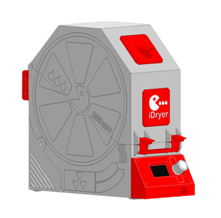 | [архив - комплект деталей](CAD/v4/STL/UNIT.zip) |
    | 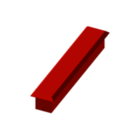 | [Рассеиватель](CAD/v4/STL/UNIT_LIFGHT-DIFFUSER_Light_diffuser.stl) |
    | 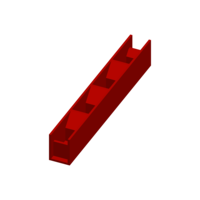 | [Сепаратор](CAD/v4/STL/UNIT_LIFGHT-DIFFUSER_Light_separator.stl) |
    |  | [База - нижняя часть корпуса без барельефа](CAD/v4/STL/UNIT_MCU_base_plain.stl) |
    |  | [База - нижняя часть корпуса](CAD/v4/STL/UNIT_MCU_base_embossed.stl) |
    | 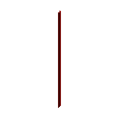 | [Кабель канал для укладки UTP кабеля](CAD/v4/STL/UNIT_MCU_cable_duct_UTP.stl) |
    | 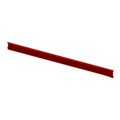 | [Кабель канал](CAD/v4/STL/UNIT_MCU_cable_duct.stl) |
    |  | [Задняя крышка отсека электроники MCU](CAD/v4/STL/UNIT_MCU_Back-Cover-3-ports.stl) |
    |  | [Корпус дисплея](CAD/v4/STL/UNIT_STANDALONE-FRONT-PANEL_ENCLOSURE.stl) |
    |  | [Ручка](CAD/v4/STL/UNIT_STANDALONE-FRONT-PANEL_Knob_2.1.stl) |
    | 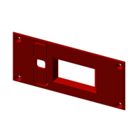 | [Панель дисплаея](CAD/v4/STL/UNIT_STANDALONE-FRONT-PANEL_IDRYER_UNIT_display_panel3.stl) |
    |  | [База - нижняя часть корпуса без барельефа](CAD/v4/STL/UNIT_EXT_base_plain.stl) |
    | 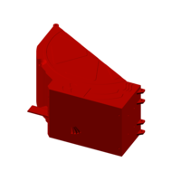 | [База - нижняя часть корпуса](CAD/v4/STL/UNIT_EXT_base_embossed.stl) |
    |  | [Задняя крышка отсека электроники EXT](CAD/v4/STL/UNIT_EXT_Back-Cover-1-port.stl) |
    | 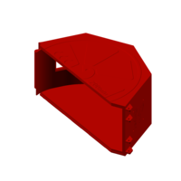 | [Крышка - верхняя часть корпуса](CAD/v4/STL/UNIT_top_cover_embossed.stl) |
    | 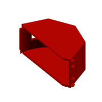 | [Крышка - верхняя часть корпуса без барельефа](CAD/v4/STL/UNIT_top_cover_plain.stl) |
    |  | [Проставка нагревателя левая](CAD/v4/STL/UNIT_HEATER_SPACER_left.stl) |
    |  | [Проставка нагревателя правая](CAD/v4/STL/UNIT_HEATER_SPACER_right.stl) |
    | 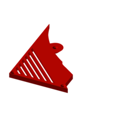 | [Боковая крышка отсека электроники](CAD/v4/STL/UNIT_ELECTRONICS_BAY_Left-Cover.stl) |
    | 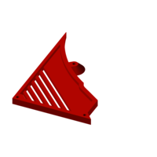 | [Боковая крышка отсека электроники](CAD/v4/STL/UNIT_ELECTRONICS_BAY_Right-Cover.stl) |
    |  | [Пол в корпус](CAD/v4/STL/UNIT_FLOOR_Flor1.stl) |
    |  | [Фиксатор к полу для плоского каблея датчика температуры и влажности](CAD/v4/STL/UNIT_FLOOR_Flor2.stl) |
    |  | [Заслонка для серво 3.7г](CAD/v4/STL/UNIT_AIR_DAMPER_SRVO_37G_damper_blade.stl) |
    |  | [Корпус заслонки для серво 3.7г](CAD/v4/STL/UNIT_AIR_DAMPER_SRVO_37G_housing_halve_1.stl) |
    |  | [Корпус заслонки для серво 3.7г](CAD/v4/STL/UNIT_AIR_DAMPER_SRVO_37G_housing_halve_2.stl) |
    | 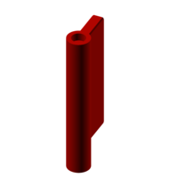 | [Заслонка для серво 9г](CAD/v4/STL/UNIT_AIR_DAMPER_SRVO_9G_damper_blade.stl) |
    |  | [Корпус заслонки для серво 9г](CAD/v4/STL/UNIT_AIR_DAMPER_SRVO_9G_housing_halve_1.stl) |
    | 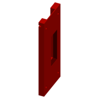 | [Корпус заслонки для серво 9г](CAD/v4/STL/UNIT_AIR_DAMPER_SRVO_9G_housing_halve_2.stl) |
    | 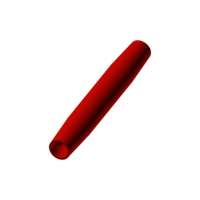 | [Печатный ролик 11х84 под 693 подшипники](CAD/v4/STL/UNIT_SPOOL-ROLLER_PRINTED-ROLLER_Printable_Roller_Straight_Taper_with_Center_Flat_11x84mm_693.stl) |
    | 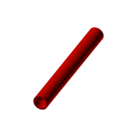 | [Печатный ролик 11х84 под 693 подшипники](CAD/v4/STL/UNIT_SPOOL-ROLLER_PRINTED-ROLLER_Printable_Roller_Straight_Face11x84mm_693.stl) |
    | 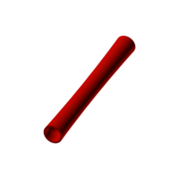 | [Печатный ролик 11х84 под 693 подшипники](CAD/v4/STL/UNIT_SPOOL-ROLLER_PRINTED-ROLLER_Printable_Roller_Concave_Crown_11x84mm_693.stl) |
    |  | [Общая защелка](CAD/v4/STL/UNIT_Latch-Handle.stl) |
    | 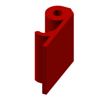 | [Защелка](CAD/v4/STL/UNIT_Latch.stl) |
    | 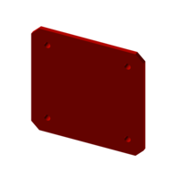 | [Табличка с логотипом](CAD/v4/STL/UNIT_Logo-Plate.stl) |
    | 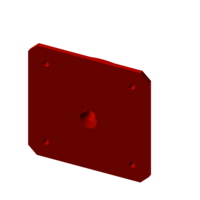 | [Выход филамента под пластиковый фиттинг](CAD/v4/STL/UNIT_Filament-Outlet.stl) |
    |  | [Шильдик устройства](CAD/v4/STL/UNIT_Name-Plate.stl) |
    |  | [Заглушка выхода филамента](CAD/v4/STL/UNIT_Plug.stl) |
    |  | [Опора](CAD/v4/STL/UNIT_Foot.stl) |

=== "iDryer v4 step"

    | Деталь | Описание |
    |--------|----------|
    |  | [сборка](CAD/v4/STEP/UNIT.step) |
    |  | [архив - комплект деталей](CAD/v4/STEP/UNIT.zip) |
    |  | [Рассеиватель](CAD/v4/STEP/UNIT_LIFGHT-DIFFUSER_Light_diffuser.step) |
    |  | [Сепаратор](CAD/v4/STEP/UNIT_LIFGHT-DIFFUSER_Light_separator.step) |
    |  | [База - нижняя часть корпуса без барельефа](CAD/v4/STEP/UNIT_MCU_base_plain.step) |
    |  | [База - нижняя часть корпуса](CAD/v4/STEP/UNIT_MCU_base_embossed.step) |
    |  | [Кабель канал для укладки UTP кабеля](CAD/v4/STEP/UNIT_MCU_cable_duct_UTP.step) |
    |  | [Кабель канал](CAD/v4/STEP/UNIT_MCU_cable_duct.step) |
    |  | [Задняя крышка отсека электроники MCU](CAD/v4/STEP/UNIT_MCU_Back-Cover-3-ports.step) |
    |  | [Корпус дисплея](CAD/v4/STEP/UNIT_STANDALONE-FRONT-PANEL_ENCLOSURE.step) |
    |  | [Ручка](CAD/v4/STEP/UNIT_STANDALONE-FRONT-PANEL_Knob_2.1.step) |
    |  | [Панель дисплаея](CAD/v4/STEP/UNIT_STANDALONE-FRONT-PANEL_IDRYER_UNIT_display_panel3.step) |
    |  | [База - нижняя часть корпуса без барельефа](CAD/v4/STEP/UNIT_EXT_base_plain.step) |
    |  | [База - нижняя часть корпуса](CAD/v4/STEP/UNIT_EXT_base_embossed.step) |
    |  | [Задняя крышка отсека электроники EXT](CAD/v4/STEP/UNIT_EXT_Back-Cover-1-port.step) |
    |  | [Крышка - верхняя часть корпуса](CAD/v4/STEP/UNIT_top_cover_embossed.step) |
    |  | [Крышка - верхняя часть корпуса без барельефа](CAD/v4/STEP/UNIT_top_cover_plain.step) |
    |  | [Проставка нагревателя левая](CAD/v4/STEP/UNIT_HEATER_SPACER_left.step) |
    |  | [Проставка нагревателя правая](CAD/v4/STEP/UNIT_HEATER_SPACER_right.step) |
    |  | [Боковая крышка отсека электроники](CAD/v4/STEP/UNIT_ELECTRONICS_BAY_Left-Cover.step) |
    |  | [Боковая крышка отсека электроники](CAD/v4/STEP/UNIT_ELECTRONICS_BAY_Right-Cover.step) |
    |  | [Пол в корпус](CAD/v4/STEP/UNIT_FLOOR_Flor1.step) |
    |  | [Фиксатор к полу для плоского каблея датчика температуры и влажности](CAD/v4/STEP/UNIT_FLOOR_Flor2.step) |
    |  | [Заслонка для серво 3.7г](CAD/v4/STEP/UNIT_AIR_DAMPER_SRVO_37G_damper_blade.step) |
    |  | [Корпус заслонки для серво 3.7г](CAD/v4/STEP/UNIT_AIR_DAMPER_SRVO_37G_housing_halve_1.step) |
    |  | [Корпус заслонки для серво 3.7г](CAD/v4/STEP/UNIT_AIR_DAMPER_SRVO_37G_housing_halve_2.step) |
    |  | [Заслонка для серво 9г](CAD/v4/STEP/UNIT_AIR_DAMPER_SRVO_9G_damper_blade.step) |
    |  | [Корпус заслонки для серво 9г](CAD/v4/STEP/UNIT_AIR_DAMPER_SRVO_9G_housing_halve_1.step) |
    |  | [Корпус заслонки для серво 9г](CAD/v4/STEP/UNIT_AIR_DAMPER_SRVO_9G_housing_halve_2.step) |
    |  | [Печатный ролик 11х84 под 693 подшипники](CAD/v4/STEP/UNIT_SPOOL-ROLLER_PRINTED-ROLLER_Printable_Roller_Straight_Taper_with_Center_Flat_11x84mm_693.step) |
    |  | [Печатный ролик 11х84 под 693 подшипники](CAD/v4/STEP/UNIT_SPOOL-ROLLER_PRINTED-ROLLER_Printable_Roller_Straight_Face11x84mm_693.step) |
    |  | [Печатный ролик 11х84 под 693 подшипники](CAD/v4/STEP/UNIT_SPOOL-ROLLER_PRINTED-ROLLER_Printable_Roller_Concave_Crown_11x84mm_693.step) |
    |  | [Общая защелка](CAD/v4/STEP/UNIT_Latch-Handle.step) |
    |  | [Защелка](CAD/v4/STEP/UNIT_Latch.step) |
    |  | [Табличка с логотипом](CAD/v4/STEP/UNIT_Logo-Plate.step) |
    |  | [Выход филамента под пластиковый фиттинг](CAD/v4/STEP/UNIT_Filament-Outlet.step) |
    |  | [Шильдик устройства](CAD/v4/STEP/UNIT_Name-Plate.step) |
    |  | [Заглушка выхода филамента](CAD/v4/STEP/UNIT_Plug.step) |
    |  | [Опора](CAD/v4/STEP/UNIT_Foot.step) |

=== "iDryer Duo"

    **Duo**

    **[Задняя крышка отсека электроники Duo](CAD/v3/UNIT%20MCU%20duo%20Back%20Cover.stl)**

    **[База MCU Duo](CAD/v3/UNIT%20MCU%20duo%20Base%20screw%20mounting.stl)**

    **[Лоток для силикагеля Duo](CAD/v3/UNIT%20duo%20silica%20tray.stl)**

    **[Верхняя крышка Duo](CAD/v3/UNIT%20duo%20Top%20Cover%20screw%20mounting.stl)**

=== "iDryer v3"

    **[База MCU](CAD/v3/UNIT%20MCU%20Base%20screw%20mounting.stl)**

    **[База EXT](CAD/v3/UNIT%20EXT%20Base%20screw%20mounting.stl)**

    **[Верхняя крышка](CAD/v3/UNIT%20Top%20Cover%20screw%20mounting.stl)**

    **[Задняя крышка отсека электроники EXT](CAD/v3/UNIT%20EXT%20Back%20Cover.stl)**

    **[Задняя крышка отсека электроники MCU](CAD/v3/UNIT%20MCU%20Back%20Cover.stl)**
    
    **[Левая крышка отсека электроники](CAD/v3/UNIT%20Left%20Cover.stl	)**

    **[Правая крышка отсека электроники](CAD/v3/UNIT%20Right%20Cover.stl	)**

    **[Ручка-защелка](CAD/v3/UNIT%20Latch%20Handle.stl	)**

    **[Защелка](CAD/v3/UNIT%20Latch.stl	)**

    **[Выход филамента](CAD/v3/UNIT%20Filament%20Outlet.stl)**

    **[Пол](CAD/v3/UNIT%20Floor.stl)**

    **[Фиксатор датчика](CAD/v3/UNIT%20Floor%20Sensor%20Retainer.stl)**

    **[Рассеиватель  MCU](CAD/v3/UNIT%20MCU%20Light%20diffuser.stl)**

    **[Разделитль 1 MCU](CAD/v3/UNIT%20MCU%20Light%20separator.stl)**
    
    **[Разделитль 2 MCU](CAD/v3/UNIT%20MCU%20Light%20separator%202.stl)**
    
    **[Разделитль 3 MCU](CAD/v3/UNIT%20MCU%20Light%20separator%203.stl)**
    
    **[Разделитль 4 MCU](CAD/v3/UNIT%20MCU%20Light%20separator%204.stl)**

    **[Заслонка](CAD/v3/UNIT%20Servo%20damper.stl)**
    
    **[Корпус заслонки низ](CAD/v3/UNIT%20Servo%20damper%20Lower%20Housing.stl)**
    
    **[Корпус заслонки верх](CAD/v3/UNIT%20Servo%20damper%20Upper%20Housing.stl)**

    **[Заслонка серво 3.7г](CAD/v3/UNIT-servo-damper-37g.stp)**
    **[Заслонка серво 3.7г зазоры 0.25](CAD/v3/UNIT-servo-damper-37g-025.stp)**
    **[Заслонка серво 3.7г зазоры 0.5](CAD/v3/UNIT-servo-damper-37g-05.stp)**

    
    **[Логотип](CAD/v3/UNIT%20Logo%20Plate.stl	)**
    
    **[Табличка 1](CAD/v3/UNIT%20Name%20Plate%201.stl	)**
    
    **[Табличка 2](CAD/v3/UNIT%20Name%20Plate%202.stl	)**
    
    **[Табличка 3](CAD/v3/UNIT%20Name%20Plate%203.stl	)**
    
    **[Табличка 4](CAD/v3/UNIT%20Name%20Plate%204.stl	)**
    
    **[Опора](CAD/v3/UNIT%20Foot.stl)**

    **[Заглушка](CAD/v3/UNIT%20Plug%201.stl)**

    **[Заглушка](CAD/v3/UNIT%20Plug%202.stl)**

    **Duo**

    **[Задняя крышка отсека электроники Duo](CAD/v3/UNIT%20MCU%20duo%20Back%20Cover.stl)**

    **[База MCU Duo](CAD/v3/UNIT%20MCU%20duo%20Base%20screw%20mounting.stl)**

    **[Лоток для силикагеля Duo](CAD/v3/UNIT%20duo%20silica%20tray.stl)**

    **[Верхняя крышка Duo](CAD/v3/UNIT%20duo%20Top%20Cover%20screw%20mounting.stl)**

#### Параметры печати корпуса:

  - материал ABS, ABS-CF, ABS-GF, PP

  - ширина линии 0.6 - 0.8 (необходимо проверить чтобы при печати сформировались четкие камеры)

  - количество периметров 1
  
  - заполнение 10-15% 

  - шаблон заполнения прямолинейный

  - радиус закрытия пробелов(зазоров) 0.02

  Все детали корпуса печатаются без поддержек