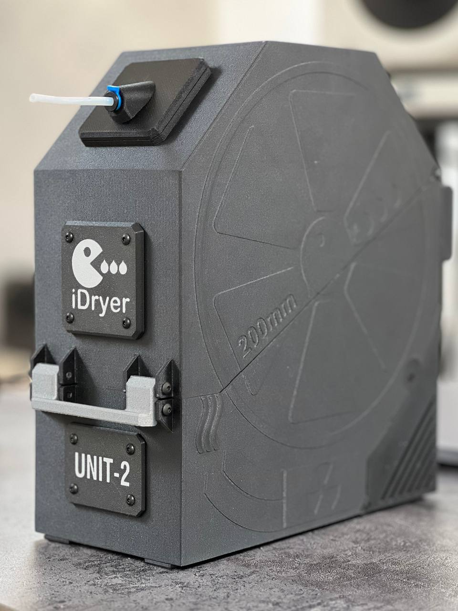
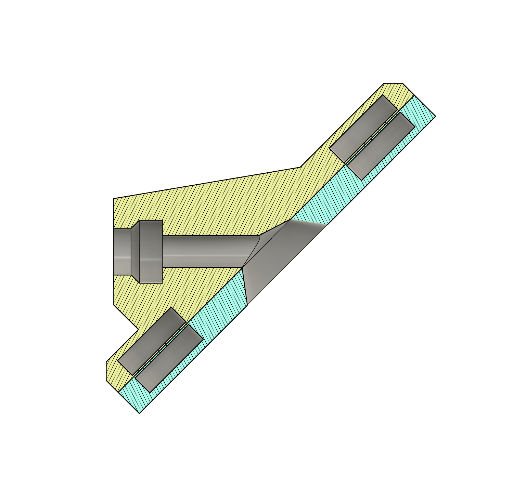

Flip Filament Out Mod

Описание

Flip Filament Out Mod — это модификация для сушилки iDryer Unit, позволяющая быстро и легко развернуть выход филамента на 90 градусов. Оригинальная конструкция предусматривает поворот выхода с помощью 4 болтов, но для быстрого и удобного изменения расположения было решено использовать магниты.

Данная модификация полезна в случаях, когда большие катушки с пластиком, например FD Plast, зацепляются за крышку и застряют. В таких ситуациях можно быстро развернуть выход филамента вверх, чтобы устранить проблему.

Список материалов

8 магнитов диаметром 10 мм, толщина 2.7 мм.

4 болта M3x8 мм (подходят болты из кита iDryer).

Инструкция по печати деталей

Толщина первого слоя 0.25 мм, последующих 0.2 мм.

Детали нужно расположить как на скриншоте.

Перед слоем 16 добавить паузу, чтобы вставить магниты (соблюдайте полярность).

Flip Filament Out Mod

Description

Flip Filament Out Mod is a modification for the iDryer Unit that allows you to quickly and easily rotate the filament output by 90 degrees. The original design allows for this adjustment using four bolts, but to make it more convenient and faster, magnets were used.

This modification is particularly useful in cases where large filament spools get stuck against the lid. By simply rotating the filament output upward, this problem is eliminated.

Materials List

8 magnets (10 mm diameter, 2.7 mm thick).

4 M3x8 mm bolts (compatible with iDryer kit bolts).

Printing Instructions

First layer height: 0.25 mm, subsequent layers: 0.2 mm.

Arrange parts as shown in the screenshot.

Add a pause before layer 16 to insert magnets (ensure correct polarity).

