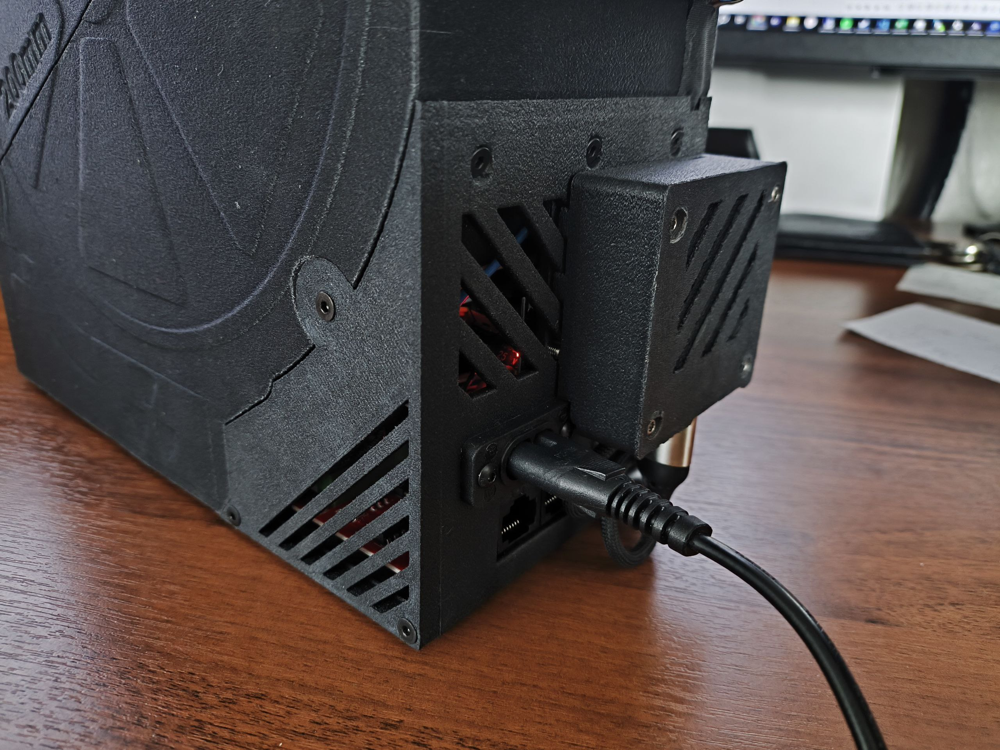
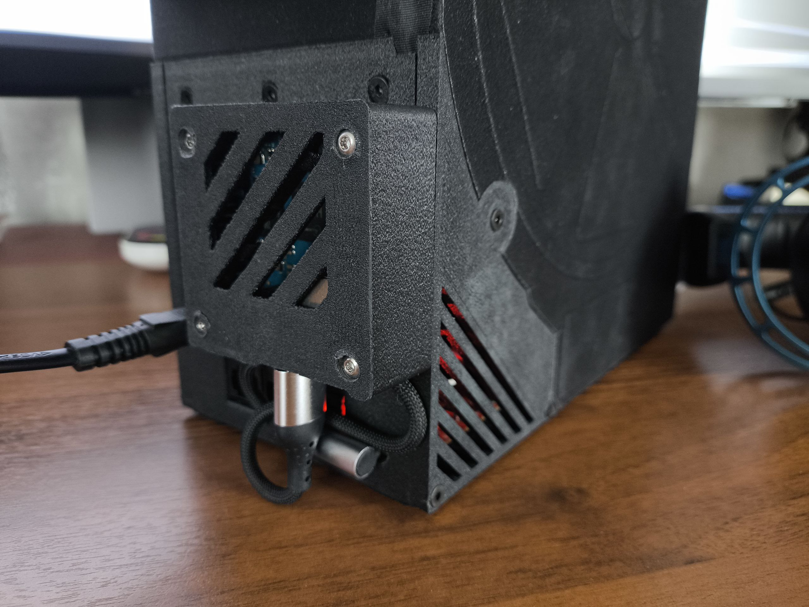

## Short description

This is a way to make a place to install the OrangePi Zero 3 and the power supply for it.

## To build, you will need
1. [5V 5000MA power supply](https://sl.aliexpress.ru/p?key=jpm2G5k)
2. Screw M3x18 - 4 pcs.
3. Screw M3x5 - 5 pcs.
4. [Type-C Short Wire](https://sl.aliexpress.ru/p?key=Tjm2G40)

## Photo mod

