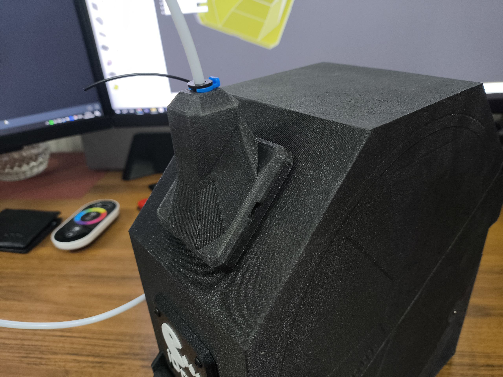
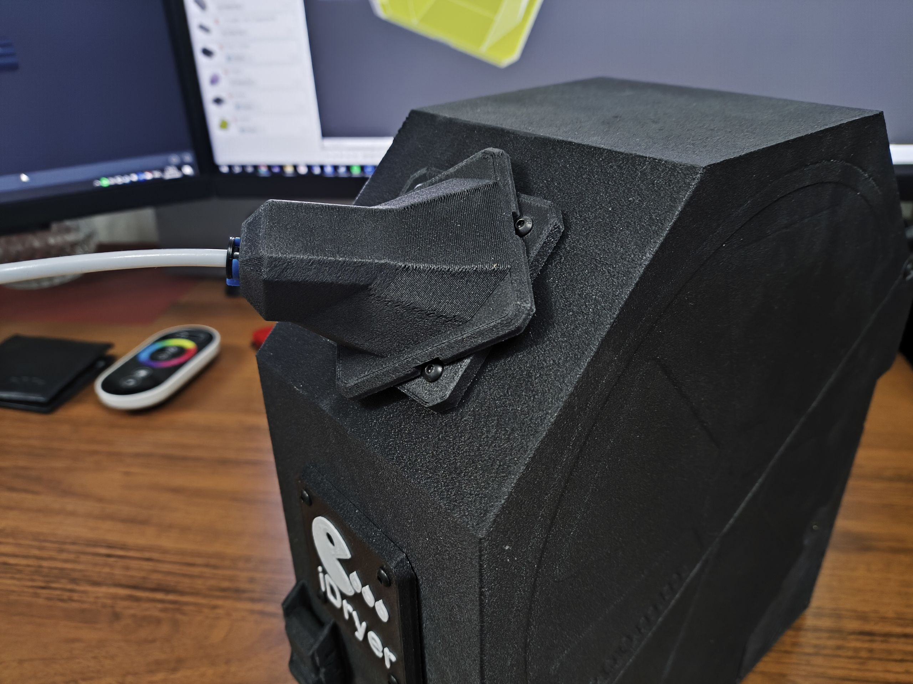
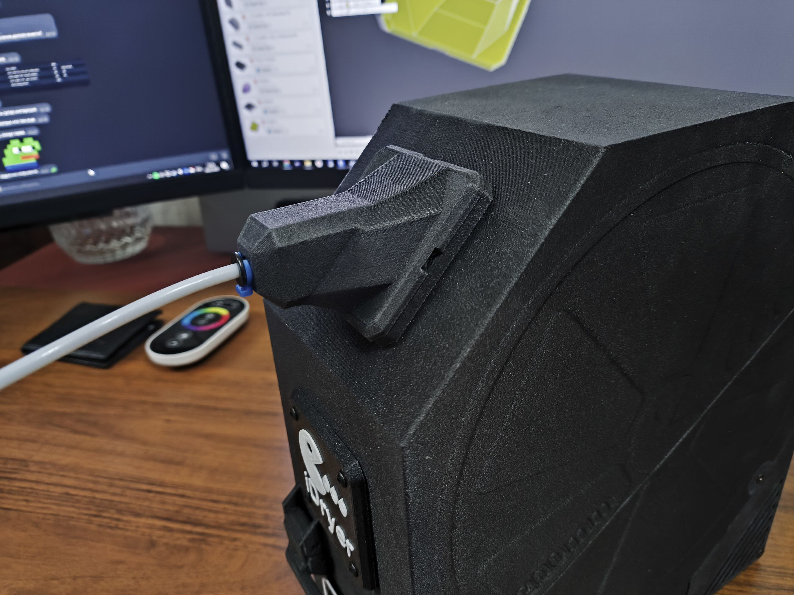
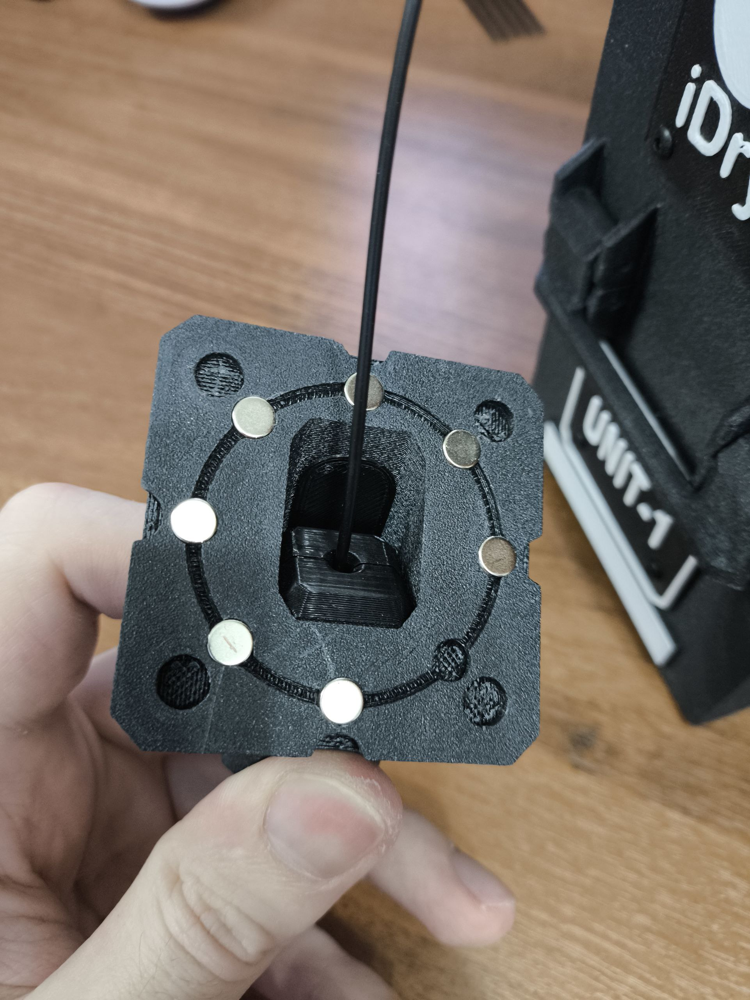

## Short description

This mod allows you to add a filter to the plastic outlet, as well as choose the outlet angle.

## To build, you will need
1. Screw M3x8 - 4 pcs.
2. Magnets 6x2mm - 16 pcs.

## Photo mod

