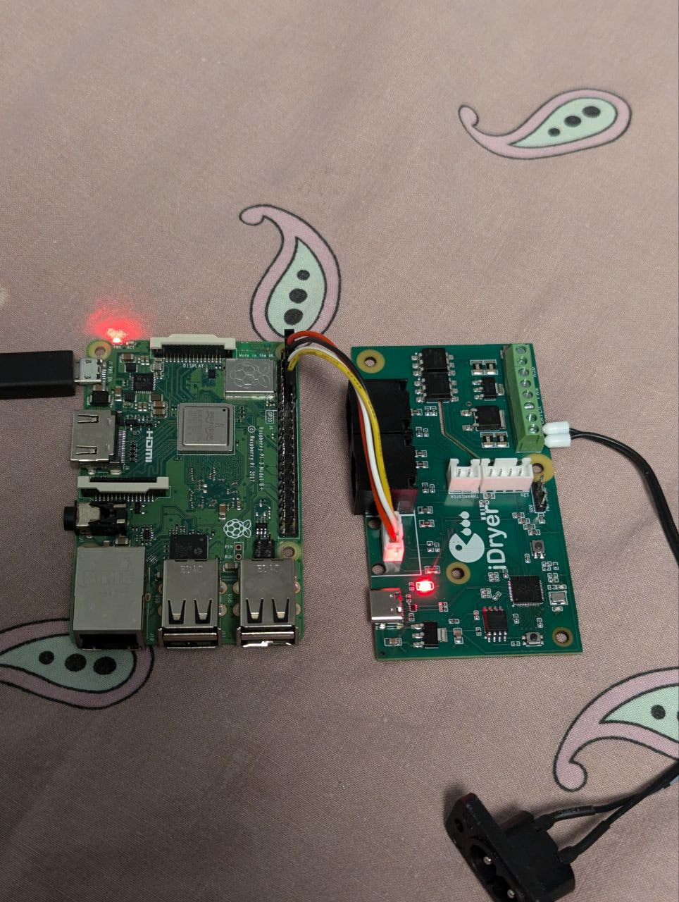
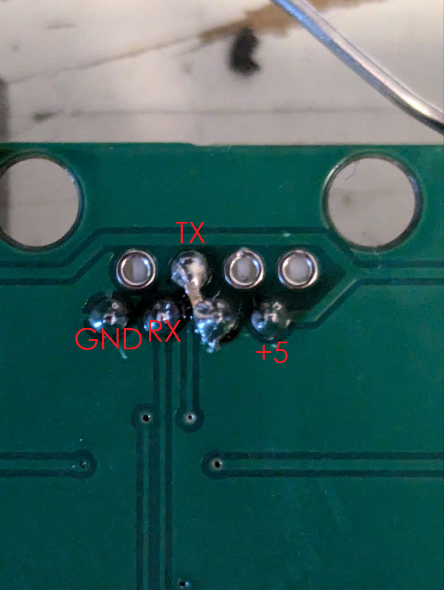

# [UART Mod]

## Summary

This mod adds UART connection support to UNIT's controller board at the expense of the U4 slave port.
It provides a clean integration for internal communication without external wires.

## Manual

### Simple Method
1. Solder wires to the designated UART pins under U4 (refer to the provided pinout below).
2. Flash the firmware with enabled UART interface (on GPIO0/GPIO1).

### Advanced Method (PH2.0 Hotswap connector)
1. Desolder the U4 connector.
2. Solder a PH2.0 connector as shown in the pinout photo below.
3. Add a single jumper wire under the connector as shown in the pinout photo below.
4. Remove the designated resistor and capacitor (locations indicated in photo below).
5. Flash the firmware with enabled UART interface (on GPIO0/GPIO1).

## Components to remove (Advanced Method only!)

## U4 port pinout

