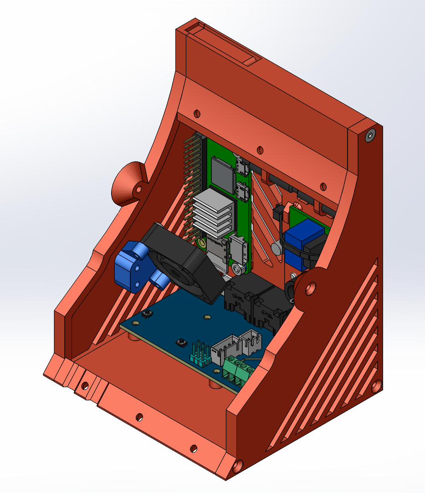
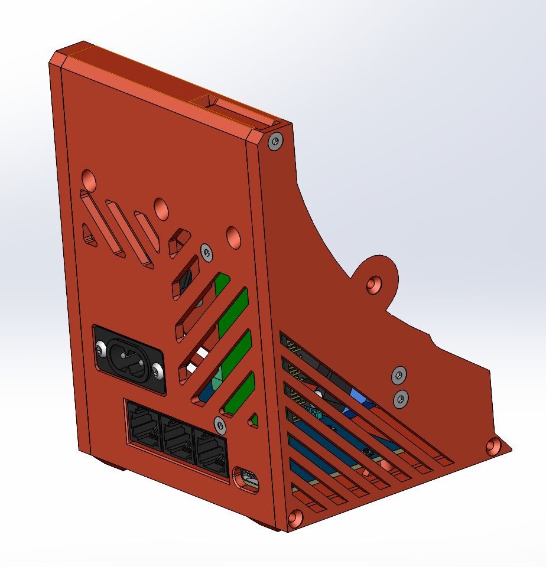
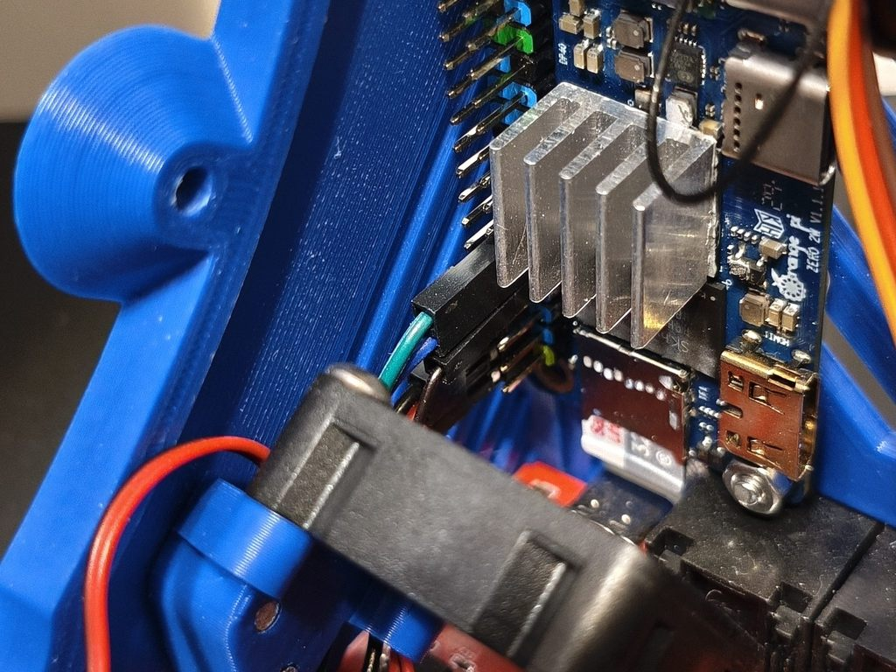
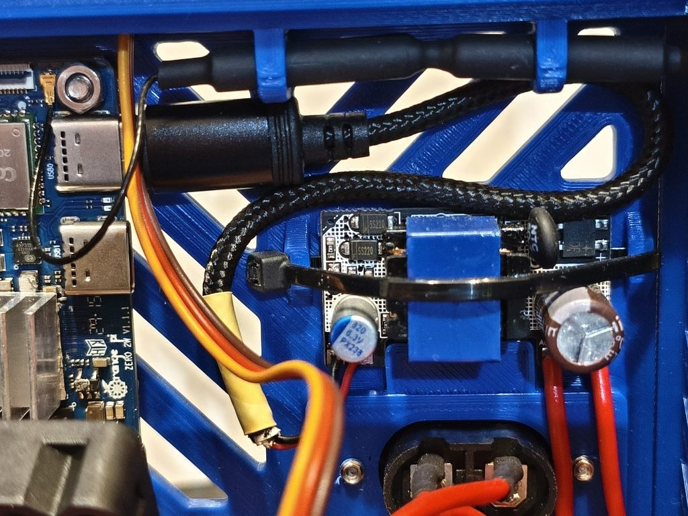
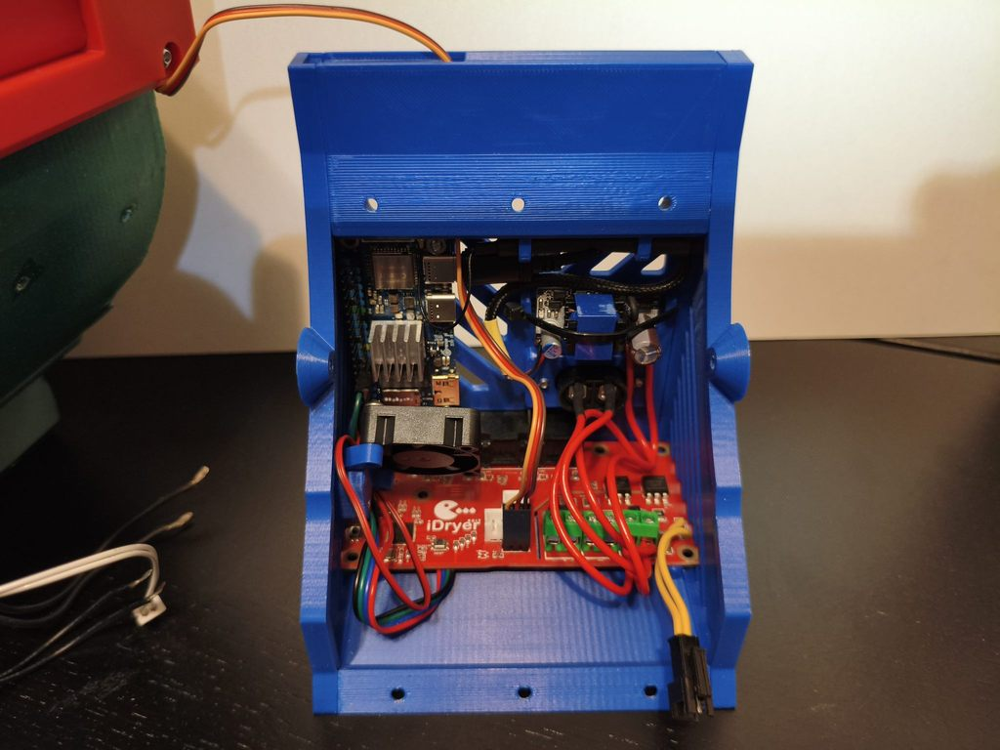
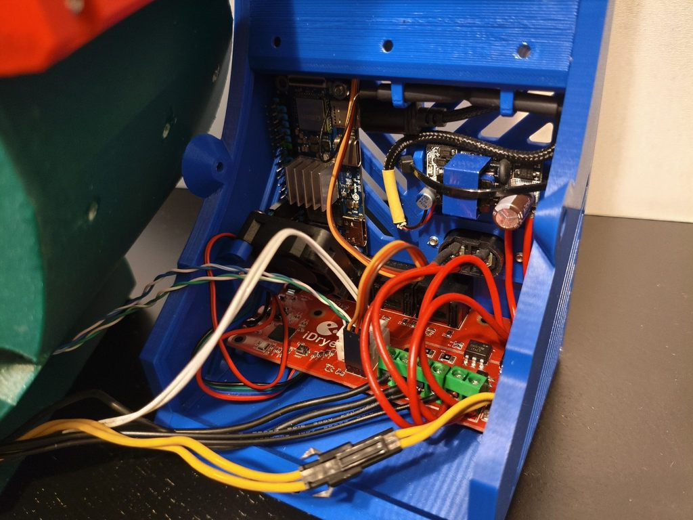
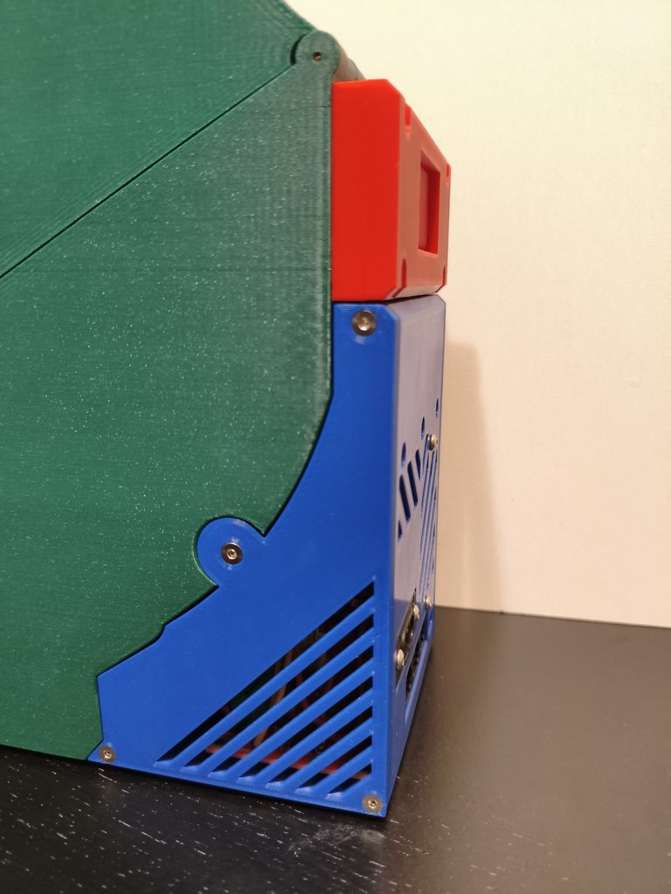
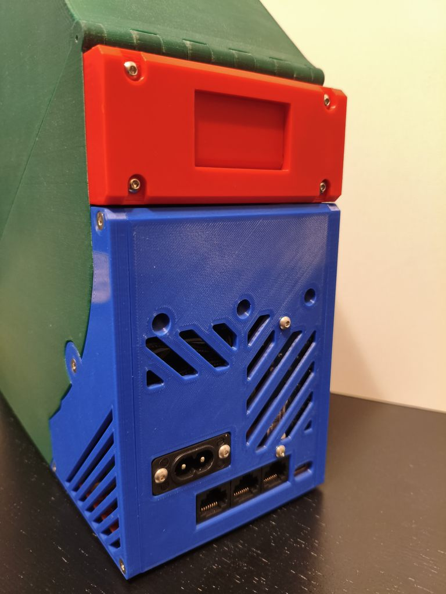

# [iDryer_StandAlone]

Модификация сушилки, позволяющая использовать её независимо от принтера за счёт увеличенного отсека электроники и установки OPi Zero 2w. Для максимальной компактности в части кабель-менеджемента крайне рекомендуется делать совместно с [UART mod](https://github.com/DieselFork/iDryer-Unit/tree/main/User-mods/hardware/UART%20mod).

>[!WARNING]
>Работоспособность UART мода обеспечивается использованием одного из разъёмов расширения - одновременно можно будет подключить только 2 EXT платы.

## Рендеры

### Вид спереди

### Вид сзади

## BOM

### Докупаемые детали

1. [Orange Pi Zero 2 W](https://aliexpress.ru/item/1005007543231333.html), желательно брать версию с 2 Гб памяти, с расчётом на дополнительные модификации.
2. [Блок питания 5В, 2А](https://aliexpress.ru/item/1005001970797548.html?sku_id=12000018270798953), не менее. Если сделать не очень качественно серво-заслонку (когда шторка цепляется за корпус), то могут быть просадки по питанию.
3. [Вентилятор 3010, 5В](https://aliexpress.ru/item/4000256787938.html?sku_id=12000032631942721), охлаждение процессора OPi Zero 2w. Столкнулся с тем, что в простое (даже на столе без работы сушилки) температура OPi Zero 2w поднимается примерно до 50 градусов (возможно, брак).
4. [Радиатор 14х14х10 мм](https://aliexpress.ru/item/32956250962.html?sku_id=12000030307252205) для процессора OPi Zero 2w. Также для крепления радиатора к процессору понадобится термопаста.
5. Кабель USB Type-C, потребуется часть с type-C разъёмом для подключения OPi Zero 2w к блоку питания. Как вариант, можно кабель не покупать и подключить 5В и GND от блока питания на гребёнку, но в данном случае придётся объединить 5В от блока питания с 5В вентилятора или UART, т.к. таких пинов на гребёнке всего лишь два.
6. Кабельный хомут 2,5х150, для крепления блока питания.
7. Винты с потайной головкой M3x10 DIN 7991 - 4 шт, для крепления OPi Zero 2w и кронштейна вентилятора. Можно заменить на M3x12 DIN 7991 для унификации.
8. Винты с потайной головкой M3x12 DIN 7991 - 2 шт, для верхней части отсека электроники.
9. Винты с полусферической головкой M3x14 ISO 225 - 2 шт, для крепления вентилятора 3010.

>[!WARNING]
>При покупке не ошибитесь с длиной винтов, т.к. нормативная документация на винты с потайной и полусферической головкой разная. Длина в обозначение винта согласно DIN 7991 указывается с учётом высоты головки, а согласно ISO 225 в обозначении указывается только длина резьбовой части.

10. Гайки M3 DIN 934 - 2 шт, для крепления OPi Zero 2w.

### Печатаемые детали

1. Центральная часть EE_BackCover - 1 шт.
2. Боковая стенка EE_Side_L, левая - 1 шт.
3. Боковая стенка EE_Side_R, правая - 1 шт.

>[!WARNING]
>Обратите внимание на название моделей из пунктов 1-3 - есть варианты для старой (обозначены как Old_PCB) и актуальной платы.
>На текущий момент **актуальные платы имеют габариты 90х50 мм** и крепятся внутри отсека с помощью трёх винтов М3х6, **старые - имели габариты 100х49 мм** и зажимались в прорезях боковых стенок при сборке.

4. Кронштейн вентилятора Fan_Bracket - 1 шт.
5. Пластиковые шайбы Spacer_5-3,2-1 - 2 шт, для изоляции гайек от платы OPi Zero 2w. Фактически диэлектрические шайбы под резьбу М3 и высотой 1 мм.

## Сборка

Фотографии даны для облегчения понимания сборки. Стоит учесть, что на фотографиях одна из первых модификаций платы и первый вариант корпуса, а также крепёж OPi Zero 2w будет отличаться от BOM и моделей.

### Подключение UART и вентилятора

### Подключение блока питания

### Подключение сервопривода

### Электроника в сборе

### Установленный отсек электроники

