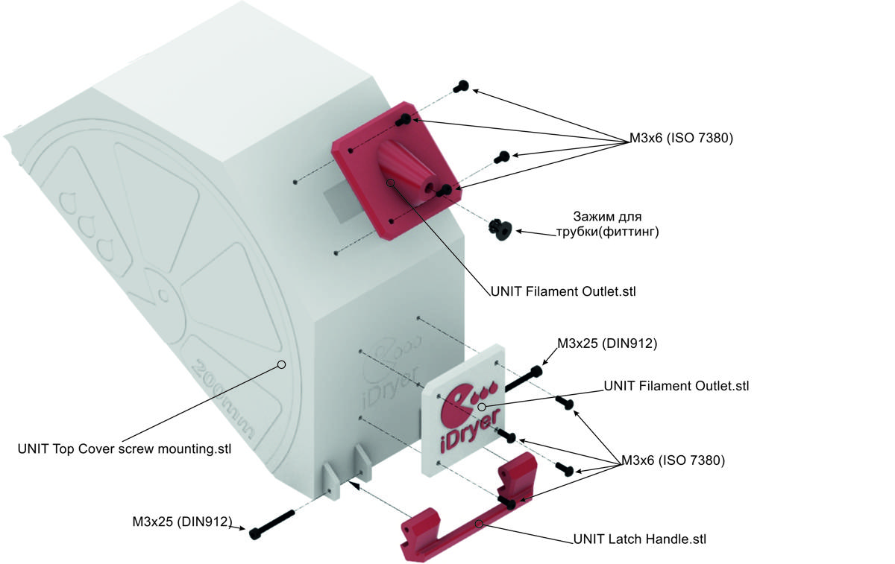
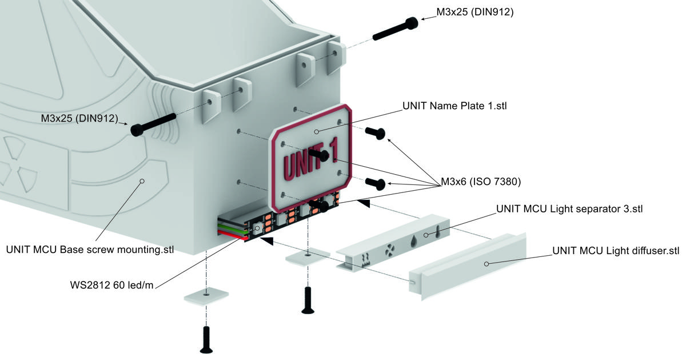
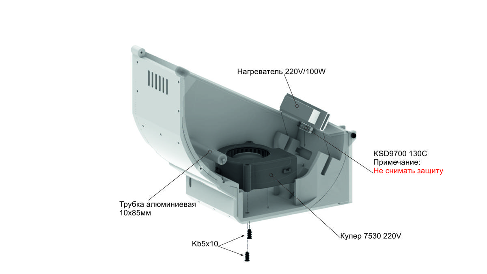
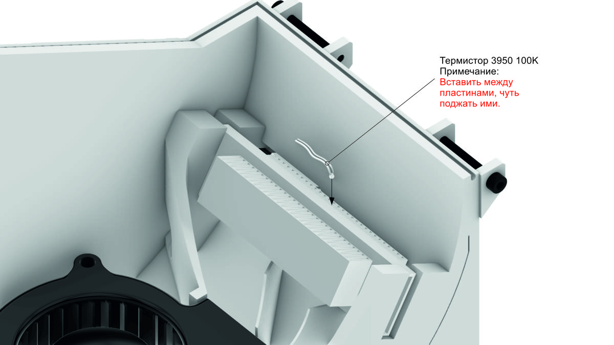
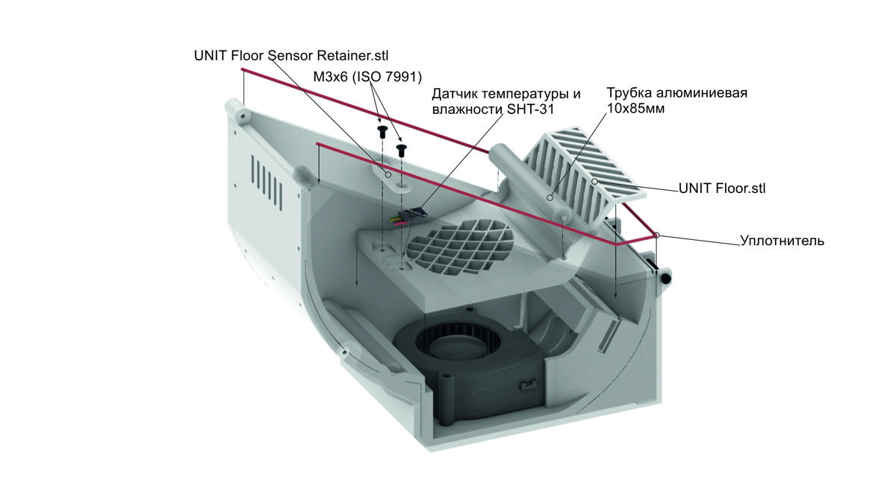
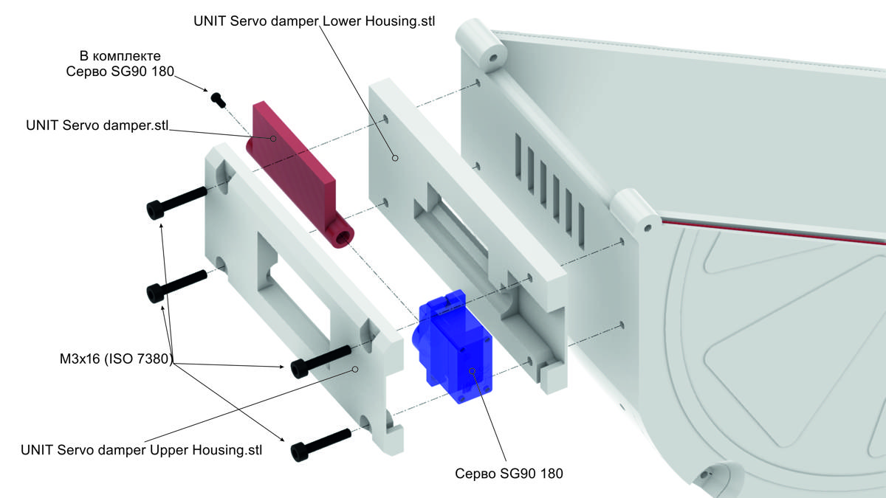
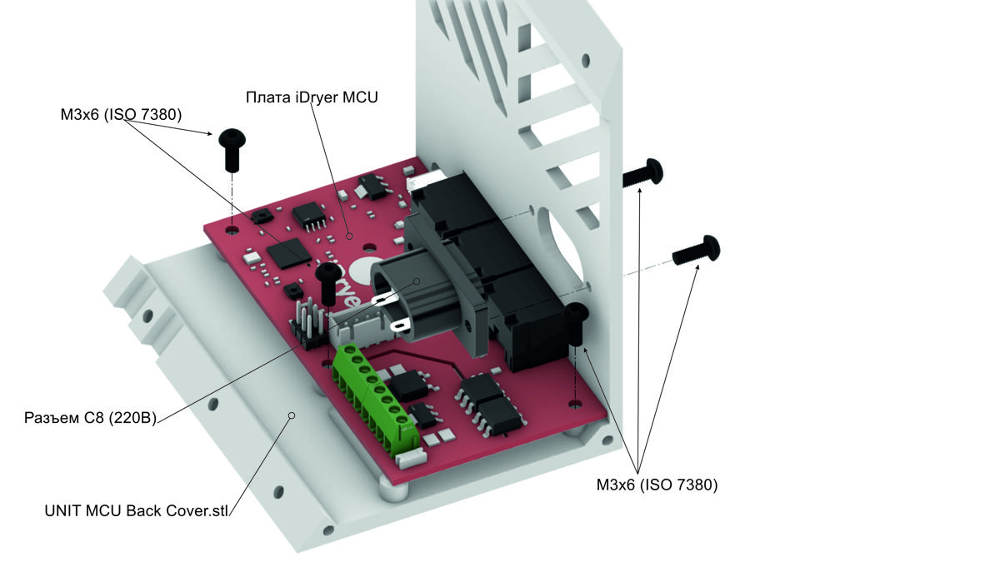
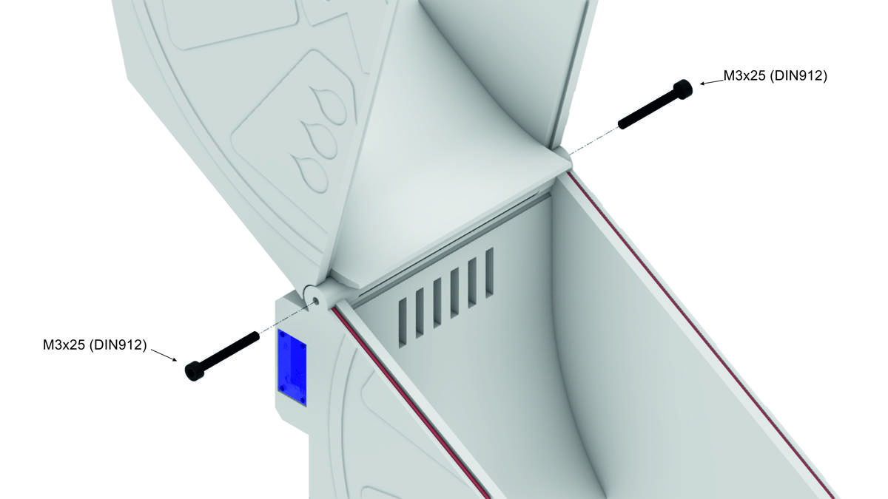
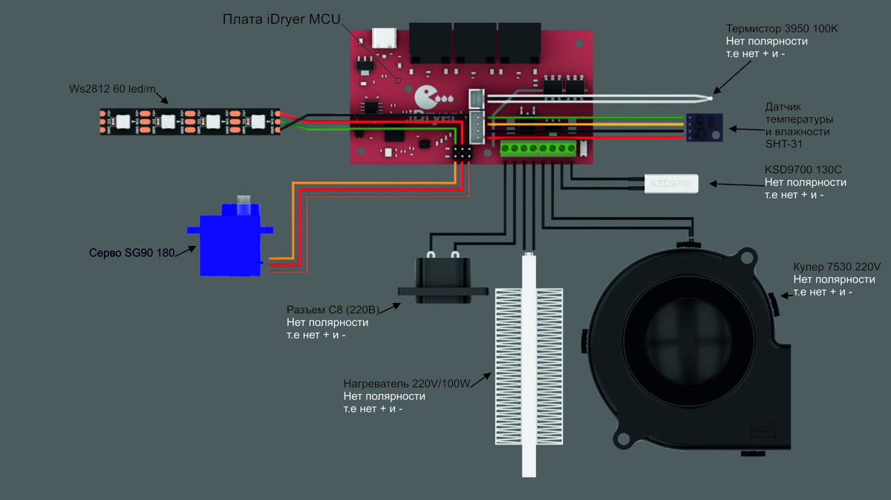

# Assembly

## Hardware Assembly

In the base part of the enclosure:

* Connect the heating element and the fan to the iDryer Unit board.
* Install the thermistor and the SHT3X sensor (or any other supported temperature/humidity sensor) inside the dryer and connect them to the corresponding pins on the board.

In the electronics compartment:

* Secure the controller board.
* Install and wire the power connector.

Assemble the remaining components according to the instruction.

## Instruction

<div class="grid cards" markdown>
- 
- 
- 
- 
- 
- 
- 
- 
- 
- 
</div>

!!! Tip  "Acknowledgements"

```
Huge thanks to Igor (@dr_perry_coke) for the incredible work, aesthetic sense, and the provided iDryer Unit assembly images.
```
