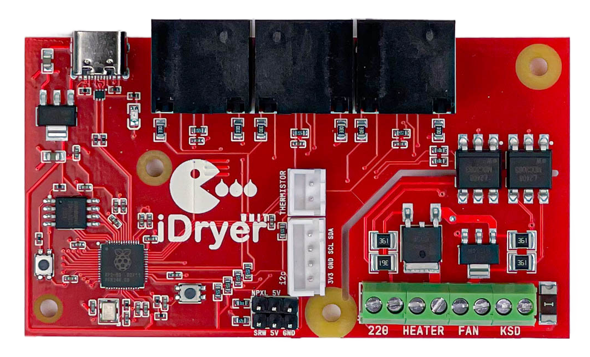
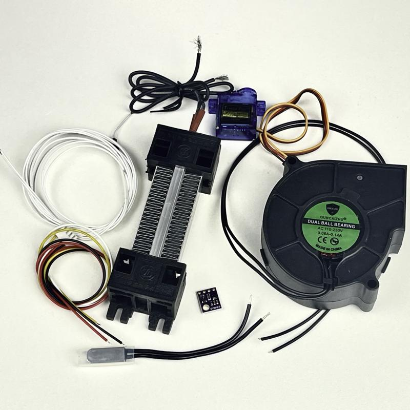
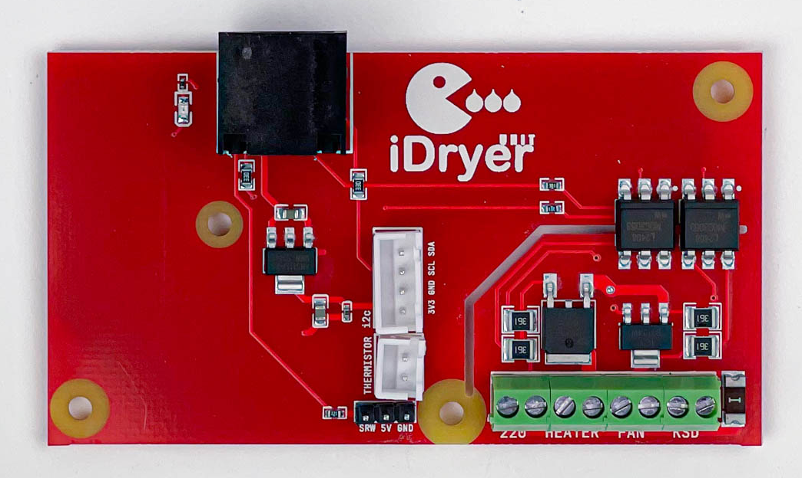

# Before Assembly

## Documentation

Review the documentation, download and print the required parts. Make sure all necessary components and tools are available.

## Hardware

* iDryer Unit control board with RP2040 microcontroller
  
  
* NTC 100K thermistor for temperature control (or any other sensor supported by Klipper firmware)
* Heating element (ideally 220V, 100W)
* Fan for air circulation inside the dryer
* Temperature and humidity sensor (e.g., SHT3X, or any other sensor supported by Klipper)
* Additional board
  
* Fasteners
* Connectors
* Crimping tool
* Ferrule crimping pliers

## Software

* Klipper (latest version)
* Configured 3D printer running Klipper firmware

## Getting Started

It is recommended to assemble the entire system **on the desk** first, without mounting into the case, and run initial tests:

* Connect all components.
* Test functionality of the heater, fan, damper servo, and temperature sensors.
* Connect the system to **Klipper** and verify macro functionality.
