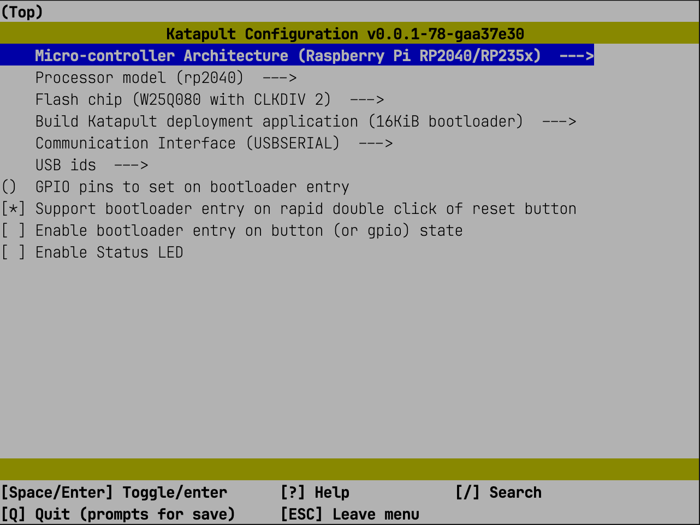
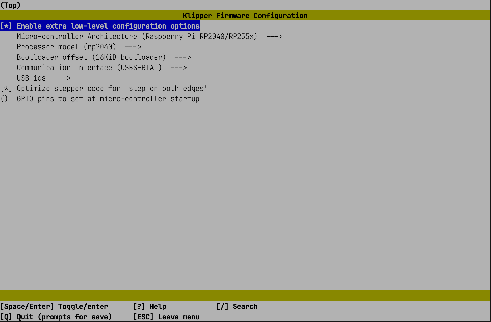

# Klipper: Instalace firmwaru

Tato stránka popisuje instalaci firmwaru Klipper na řadič iDryer Unit (MCU na RP2040).

Instalace firmwaru se provádí ve dvou krocích:

1. Instalace zavaděče **Katapult** — umožňuje přeprogramovat Klipper přes USB bez vstupu do režimu BOOT.
2. Instalace **Klipper** prostřednictvím Katapult.

---

## Požadavky

- Hostitel s nainstalovaným Klipper (Raspberry Pi nebo podobný).
- Datový kabel USB.
- Přístup SSH k terminálu hostitele.

---

## Část 1: Instalace Katapult

### 1. Příprava prostředí

Ujistěte se, že je systém aktualizován, a nainstalujte závislosti:

```bash
sudo apt update
sudo apt install git build-essential gcc-arm-none-eabi libnewlib-arm-none-eabi \
  libstdc++-arm-none-eabi-newlib cmake python3 python3-pip python3-serial \
  usbutils dfu-util
```

### 2. Stažení Katapult

```bash
git clone https://github.com/Arksine/katapult
```

### 3. Konfigurace buildu

```bash
cd katapult
make menuconfig
```

Vyberte parametry podle snímku obrazovky:



!!! danger "Důležité"
    Ujistěte se, že je konfigurace vybrána správně. Přepsání zavaděče nesprávným buildem učiní zařízení nefunkčním – pro obnovení je potřeba programátor.

### 4. Kompilace

```bash
make
```

### 5. Převedení řadiče do režimu BOOT

Proveďte jeden z následujících postupů:

- Držte `BOOT` stisknutý, připojte USB, uvolněte `BOOT` (s odpojeným USB).
- Držte `BOOT` stisknutý, krátce stiskněte `RESET`, uvolněte `BOOT`.

### 6. Určení ID USB řadiče

```bash
lsusb
```

Výstup zobrazí řádek jako:

```
Bus 001 Device 004: ID 2e8a:0003 Raspberry Pi RP2 Boot
```

### 7. Programování Katapult

```bash
make flash FLASH_DEVICE=2e8a:0003
```

---

## Část 2: Instalace Klipper

### 8. Konfigurace buildu Klipper

```bash
cd ~/klipper/
make clean
make menuconfig
```

Vyberte parametry podle snímku obrazovky:



### 9. Kompilace Klipper

```bash
make
```

### 10. Instalace Python knihovny

```bash
pip3 install pyserial
```

### 11. Určení sériového ID

Znovu připojte USB nebo stiskněte `RESET`, počkejte na vzhled zařízení:

```bash
ls /dev/serial/by-id/*
```

Očekávaný výsledek:

```
/dev/serial/by-id/usb-katapult_rp2040_XXXXXXXXXXXXXXXX-XXXX
```

### 12. Programování Klipper prostřednictvím Katapult

```bash
cd ~/katapult/scripts
python3 flashtool.py -d /dev/serial/by-id/usb-katapult_rp2040_XXXXXXXXXXXXXXXX-XXXX
```

### 13. Ověření výsledku

```bash
ls /dev/serial/by-id/*
```

Pokud bylo programování úspěšné, ID zařízení bude obsahovat `Klipper`:

```
/dev/serial/by-id/usb-Klipper_rp2040_XXXXXXXXXXXXXXXX-XXXX
```

---

## Další krok

Instalace konfiguračních souborů iDryer – část «Konfigurace».
