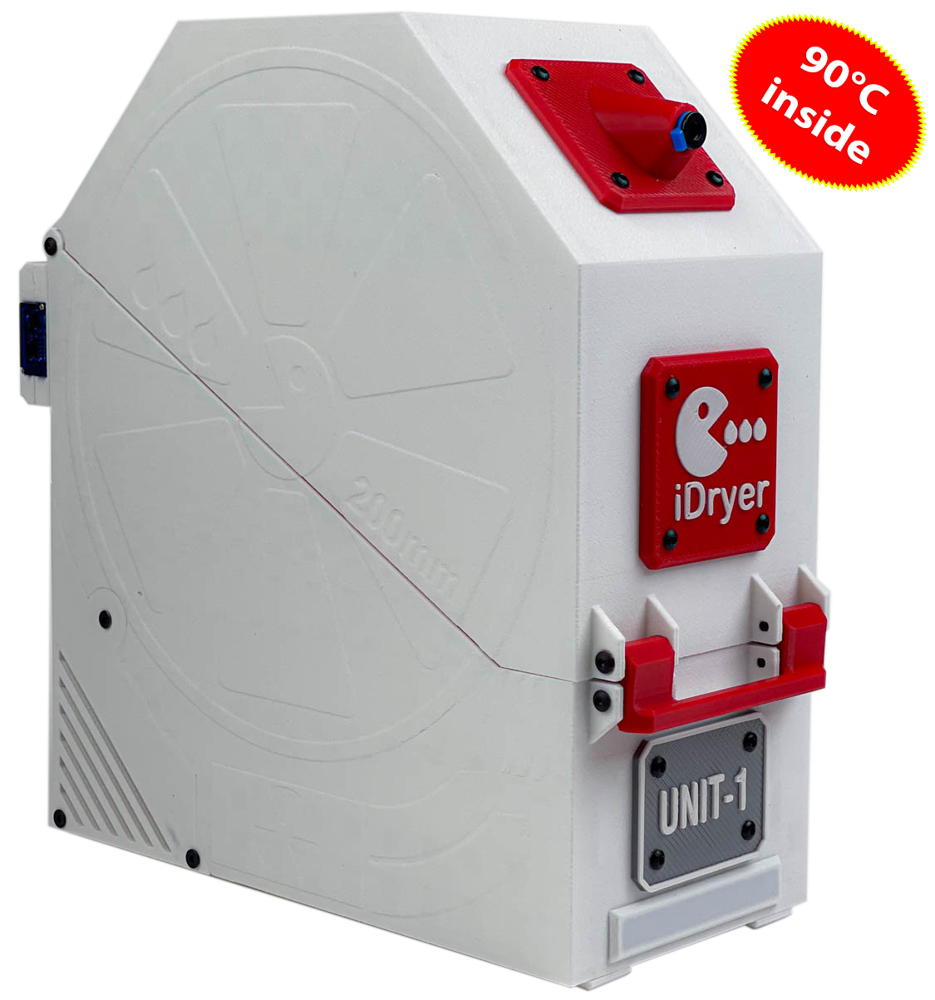
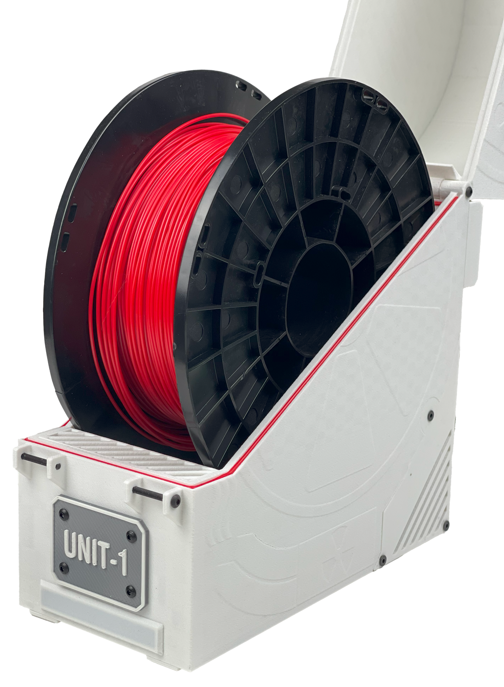
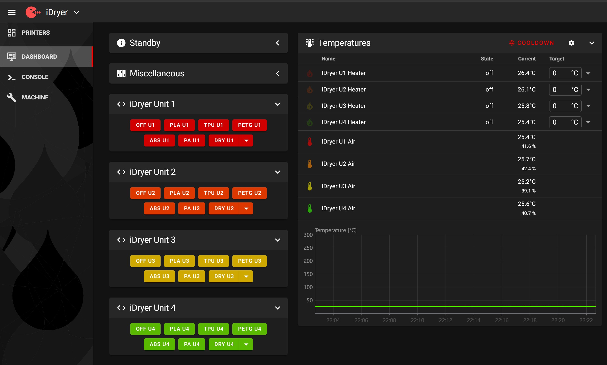
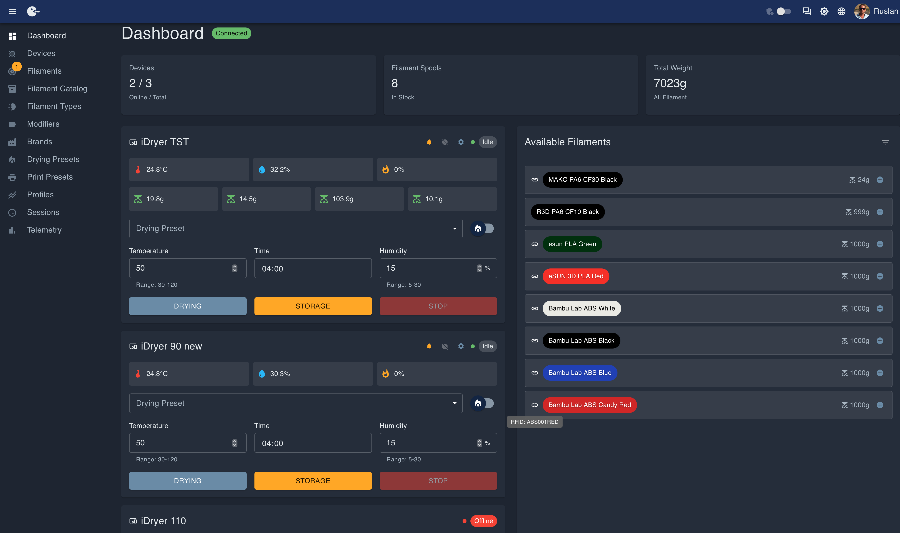
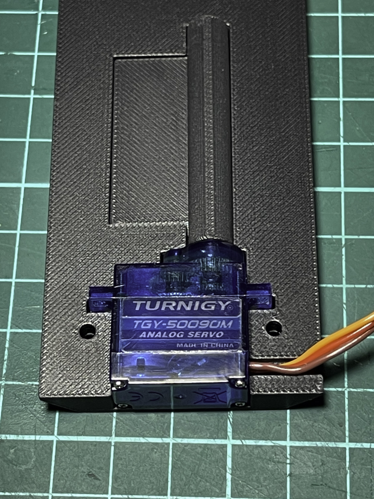
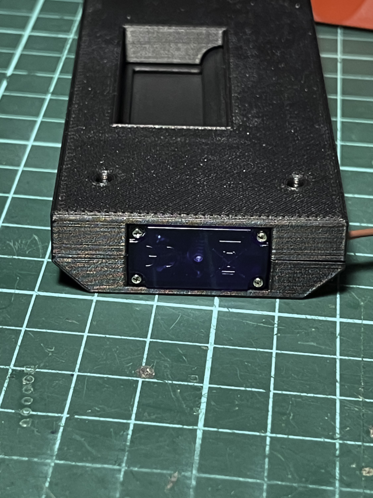

# iDryer Unit

iDryer Unit is a modular filament drying and storage system for 3D printers. Printable enclosure for 1 or 2 spools, up to four independent drying chambers in a single system.

Drying temperature — up to 90 °C in a standard enclosure, up to 110 °C with heat-resistant enclosure materials. Supported modes: Drying, Storage, and Profile.



## Who this project is for

iDryer Unit is a DIY project for those who want a reliable dryer with real control over the process, not a ready-made commercial device with a closed-source interior.

All components are standard and readily available: fan, PTC heater, temperature and humidity sensor, servo, Thermal Protector. Any of them can be replaced without searching for proprietary spare parts. Unlike most mass-produced dryers, there is nothing here that cannot be repaired or improved.

The enclosure is printed on any 3D printer. Schematics, firmware, and documentation are open.



---

## Two modes of operation

Choose a scenario before starting assembly — it determines the firmware and control method.

### Klipper



The Unit controller connects to the printer host and operates as `[mcu]` or `[second_mcu]` in Klipper. Control is via the Fluidd / Mainsail interface, G-code macros, and integration with the main printer config.

Additional Klipper features are available: notifications via Telegram bot (drying status, cycle completion, overheating), addressable LED strip for visual mode indication, automatic event logging.

Suitable if:

- you already have Klipper running;
- you want to control the dryer directly from the printer interface;
- you need deep integration with macros and scheduling.

→ [Klipper Firmware](controller/firmware.md)

### Standalone



The controller operates independently: its own firmware, control via the cloud portal [portal.idryer.org](https://portal.idryer.org/) and mobile app. Optionally — local control via OLED display and encoder. Scales (filament remainder control by weight) and RFID (automatic spool identification) are supported.

Suitable if:

- you want a dryer separate from the printer;
- you need remote control via mobile app or portal;
- you use multiple dryers with a single control point.

<!-- → [Standalone: about firmware](../../../iDryerRP2040/README.md) -->

---

## Specifications

| Parameter | Value |
|---|---|
| Drying temperature | up to 90 °C (up to 110 °C with heat-resistant enclosure) |
| Modes | Drying, Storage, Profile (Standalone) |
| Number of chambers | 1–4 (MCU + up to 3 × EXT) |
| Module connection | RJ45 patch cables |
| Thermal Protector | KSD9700 (130 °C) |
| Current protection | 2 A fuse |
| Heating element | PTC, full electrical isolation |
| Spools | 1 or 2 per chamber; width up to 85 mm, diameter up to 200 mm |
| Enclosure options | Single-spool and dual-spool |
| Enclosure material | Printable, ABS / ABS-CF / PC / HTPLA |
| Humidity sensor | SHT3X or any supported by firmware |
| LED indication | Addressable LED strip output on MCU board |

---

## Operating modes

**Drying** — set temperature and duration. When the cycle ends, the system automatically switches to Storage mode.

**Storage** — maintains the set temperature and minimum humidity level. The heater and fan activate when the set parameters are exceeded.

**Profile** — custom scenarios with configurable parameters and transitions between modes. Available in Standalone firmware.

---

## Humidity control

Each chamber has a servo-controlled damper. The servo opens the damper on a schedule to vent moisture-saturated air and closes it to retain heat. The SHT3X sensor continuously monitors temperature and humidity inside the chamber — the firmware adjusts the damper and heater operation based on this data.




---

## System architecture

One **iDryer Unit MCU** board controls the system. Up to three **iDryer Unit EXT** boards (without their own microcontroller) connect directly via RJ45.

```
              ┌— RJ45 — [EXT U2]
[MCU] ————————┼— RJ45 — [EXT U3]
              └— RJ45 — [EXT U4]
```

Each unit is an independent drying chamber with its own sensor, heater, fan, and damper servo.

---

## Built-in safety

- **KSD9700** — Thermal Protector at 130 °C: physically opens the heater circuit on overheating.
- **2 A fuse** — protection against fault currents.
- **PTC heater** — the heater body is not live.
- **Software protection** — Klipper (or Standalone firmware) monitors temperature, sensor presence, and shuts off heating on error.

!!! danger "Working with mains voltage"
    The device contains components operating at 110–230 V. Disconnect power before any electrical work. See the [Safety](unit/safety.md) section for details.

---

## Getting started

1. **Print the enclosure** → [CAD: models for printing](unit/cad.md)
2. **Prepare components** → [Before assembly](unit/before.md)
3. **Assemble the device** → [Assembly](unit/assembly.md)
4. **Install firmware**:
   - Klipper → [Klipper Firmware](controller/firmware.md)
   - Standalone → [Standalone installation](../../../iDryerRP2040/docs/manual/firmware_install.md)
5. **Configure the system** → [User guide](controller/user-guide.md)
