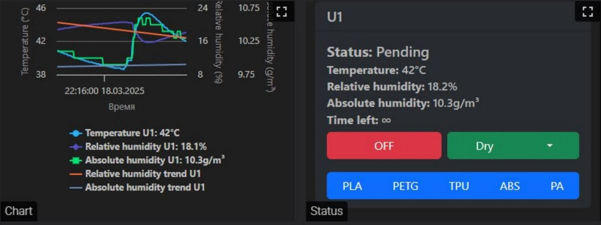

# Klipper: Configuration

This page describes installing configuration files and setting up iDryer Unit in Klipper. The controller firmware must be installed first — see [Firmware Installation](firmware.md).

---

## Configuration: mcu or second_mcu

iDryer Unit connects to Klipper in two ways:

=== "mcu (standalone host)"

    iDryer Unit runs as the main MCU on a dedicated host (e.g., a Raspberry Pi for the dryer only). Config section:

    ```ini
    [mcu]
    serial: /dev/serial/by-id/usb-Klipper_rp2040_XXXXXXXXXXXXXXXX-XXXX
    ```

=== "second_mcu (shared with printer)"

    iDryer Unit connects to the printer host as a second MCU on the same Klipper instance. Config section:

    ```ini
    [mcu iDryer]
    serial: /dev/serial/by-id/usb-Klipper_rp2040_XXXXXXXXXXXXXXXX-XXXX
    ```

    In this case, all pins get the `iDryer:` prefix, e.g. `iDryer:H_U1`.

---

## Installing configuration files

### 1. Connect to the host via SSH

```bash
ssh user_name@printer_address
```

### 2. Navigate to the config directory

```bash
cd ~/printer_data/config/
```

!!! note ""
    The path may differ: `~/klipper_config/` or `~/printer_data/config/` depending on the installation version. Make sure the directory contains `printer.cfg`.

### 3. Download and run the install script

=== "mcu"

    ```bash
    wget https://raw.githubusercontent.com/pavluchenkor/iDryer-Unit/main/sh/download_iDryer_mcu.sh
    chmod +x download_iDryer_mcu.sh
    ./download_iDryer_mcu.sh
    ```

=== "second_mcu"

    ```bash
    wget https://raw.githubusercontent.com/pavluchenkor/iDryer-Unit/main/sh/download_iDryer_second_mcu.sh
    chmod +x download_iDryer_second_mcu.sh
    ./download_iDryer_second_mcu.sh
    ```

The script will create a directory with the required configuration files.

### Manual configuration file installation

If installation through the script is not possible, download the project archive from GitHub and move the required configuration files through the Fluidd or Mainsail interface.

[Download the project archive from GitHub](https://github.com/pavluchenkor/iDryer-Unit/archive/refs/heads/main.zip)

### 4. Include the config in printer.cfg

Add the following line at the top of `printer.cfg`:

=== "mcu"
    ```ini
    [include iDryer_mcu/iDryer.cfg]
    ```

=== "second_mcu"
    ```ini
    [include iDryer_second_mcu/iDryer.cfg]
    ```

### 5. Set the serial ID in iDryer.cfg

Get the controller ID:

```bash
ls /dev/serial/by-id/*
```

In `iDryer.cfg`, in the `[mcu iDryer]` section, replace the placeholder with the obtained ID:

```ini
[mcu iDryer]
serial: /dev/serial/by-id/usb-Klipper_rp2040_XXXXXXXXXXXXXXXX-XXXX
```

### 6. Connecting additional units (U2–U4)

By default, unit U1 is connected. Uncomment the required lines in `iDryer.cfg`:

```ini
[include U1.cfg]
# [include U2.cfg]
# [include U3.cfg]
# [include U4.cfg]
```

---

## Hardware configuration

### Heater

```ini
[heater_generic iDryer_U1_Heater]
heater_pin: H_U1
max_power: 1
sensor_type: NTC 100K MGB18-104F39050L32
sensor_pin: T_U1
control: pid
pwm_cycle_time: 0.3
min_temp: 0
max_temp: 120
pid_Kp: 32.923
pid_Ki: 5.628
pid_Kd: 48.150
```

### Fan

```ini
[heater_fan Fan_U1]
fan_speed: 1
pin: FAN_U1
# when using second_mcu: pin: iDryer:FAN_U1
heater: iDryer_U1_Heater
heater_temp: 55
```

### Temperature and humidity sensor

Example using SHT3X on the I2C bus:

```ini
[temperature_sensor iDryer_U1_Air]
i2c_mcu: iDryer
sensor_type: SHT3X
i2c_bus: i2c0f
i2c_address: 68  # 68 or 69
```

!!! note ""
    U1 and U2 sensors share one I2C bus; U3 and U4 share another. Sensor addresses on the same bus must differ: one set to `68`, the other to `69`. For other sensor types, refer to the [Klipper documentation](https://www.klipper3d.org/Config_Reference.html#temperature-sensors).

---

## PID calibration

Perform calibration with the dryer lid closed:

1. Open the Klipper console.
2. Run the command:
   ```
   PID_CALIBRATE HEATER=iDryer_U1_Heater TARGET=100
   ```
3. Wait for it to complete.
4. Save the obtained coefficients in `iDryer.cfg`.

---

## Damper servo configuration

### 1. Determining end positions

The servo is controlled by a PWM signal. Different servo models respond differently to the same values — configuration is always individual.

**Do not attach the damper to the enclosure** at this stage — first determine the working range.

Test end positions in the Klipper console:

```
SET_SERVO SERVO=srv_U1 ANGLE=0
SET_SERVO SERVO=srv_U1 ANGLE=90
```

If the servo hits the enclosure — adjust the range.

### 2. Saving angles to config

Check the servo section in `iDryer.cfg`:

```ini
[servo srv_U1]
pin: SRV_U1
maximum_servo_angle: 180
minimum_pulse_width: 0.00055
maximum_pulse_width: 0.002
```

In `iDryer.cfg`, in the `DRY_U1` macro, set the angles:

```ini
variable_servo_open_angle: 40    # degrees for open position
variable_servo_closed_angle: 94  # degrees for closed position
```

### 3. Servo power correction

When using multiple servos, glitches may occur due to peak load on the host USB port.

**Option 1 — resistor in the servo power line:**

Install a 4–10 Ohm resistor in the servo power supply line. Revision 3 boards already have resistors soldered, but the specific resistance must be selected individually.

**Option 2 — active USB hub:**

Connect the controller via a USB hub with its own power supply — this eliminates host port overload.

!!! note ""
    Communication stability issues (dropouts, MCU reboots) may be caused by electromagnetic interference from power wires or the fan. Solutions — ferrite filter on the USB cable and RC snubber in parallel with the fan. → [Troubleshooting](troubleshooting.md)

---

## delta_high configuration

`variable_delta_high` controls the difference between the heater temperature and the target air temperature.

Configuration procedure:

1. Set the initial value `variable_delta_high: 15`.
2. Start heating with the `PA_U1` macro.
3. Wait for the temperature to plateau.
4. Check the chamber temperature:
   - If the chamber is at 90 °C — the value is suitable.
   - If lower — increase `variable_delta_high`.
5. Let it run for 30 minutes, then check every 30–60 minutes.

!!! warning ""
    If the heater sticks to the plastic enclosure — the plastic cannot withstand the temperature. Reduce `variable_delta_high`, reprint the enclosure in ABS or ABS-CF, or change the heater mounting method.

---

## G-code macros

Use preset macros to control drying by material type:

| Macro | Temperature | Duration |
|---|---|---|
| `PLA_U1` | 55 °C | 180 min |
| `PETG_U1` | 65 °C | 240 min |
| `ABS_U1` | 80 °C | 240 min |
| `PA_U1` | 90 °C | 240 min |
| `TPU_U1` | 60 °C | 300 min |
| `OFF_U1` | off | — |

Run a custom drying mode:

```gcode
DRY_U1 UNIT_TEMPERATURE=70 HUMIDITY=10 TIME=180
```

Open/close the damper manually:

```gcode
SET_SERVO SERVO=srv_U1 ANGLE=90  ; open
SET_SERVO SERVO=srv_U1 ANGLE=0   ; close
```

---

## Alternative control algorithm — PyUnit

Community project by [@Xatang](https://github.com/xatang). Automatic maintenance of drying and storage parameters with configurable coefficients and informative graphs.



→ [PyUnit repository on GitHub](https://github.com/xatang/PyUnit)
