# Assembly

This page describes the physical assembly of the iDryer Unit enclosure and electronics.

!!! danger "Warning! High-risk electrical work"
    Before starting, carefully read the safety precautions.

    iDryer Unit contains components operating at mains voltage 110–230 V. Incorrect wiring or operation can lead to electric shock, fire, or device failure.

!!! danger "Working with mains voltage"
    All work involving connection to 110–230 V mains must be done with the device powered off. Verify that all connections are properly insulated before the first power-on. See the [Safety](safety.md) section for details.

!!! warning "General precautions"
    - Disconnect the device from mains power before any work.
    - Do not touch exposed live parts.
    - Check wiring integrity before powering on.
    - Do not operate the device with a damaged enclosure or exposed wires.
    - Do not leave the powered device unattended.
    - Ensure reliable grounding of all metal enclosure parts.
    - If you notice a burning smell, smoke, or abnormal enclosure heating, disconnect the device from mains power immediately.
    - Avoid moisture and condensation on device components.
    - Use a circuit breaker or overload protection relay.
    - All connections must be made with proper electrical insulation.
    - If you do not have experience working with electrical equipment, contact a qualified specialist.

!!! tip "Before you start"
    First, assemble the system on a bench without mounting in the enclosure and verify all components are working. Preparation instructions are in [Before Assembly](before.md).

---

## What you need

- Printed enclosure — [CAD: models and print parameters](cad.md)
- All components from the [bill of materials](before.md)
- Flashed and tested Unit MCU board

---

## Step-by-step assembly

### Steps 1–4: Main chamber

- 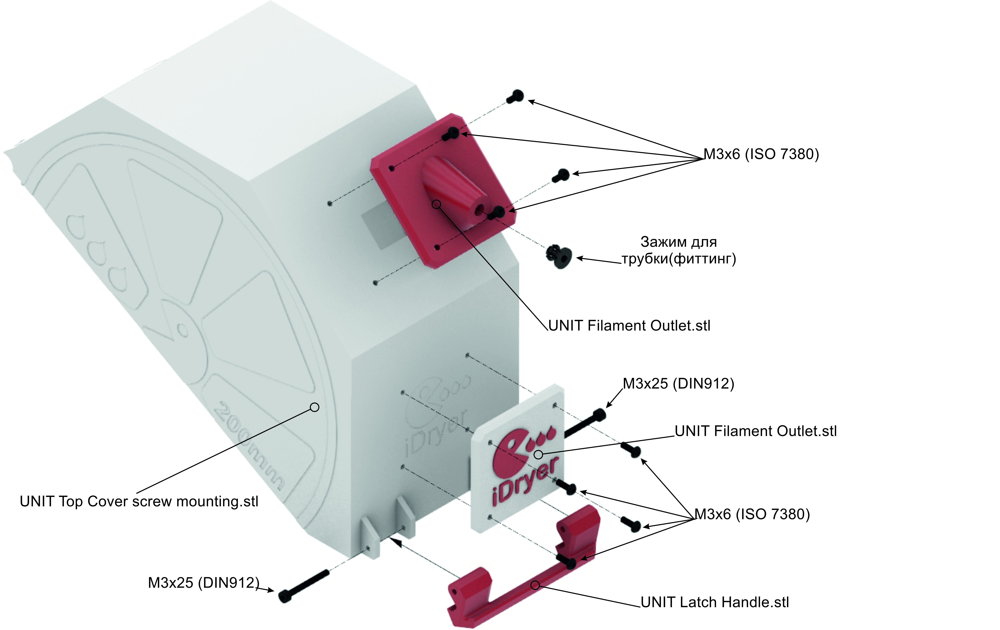
- 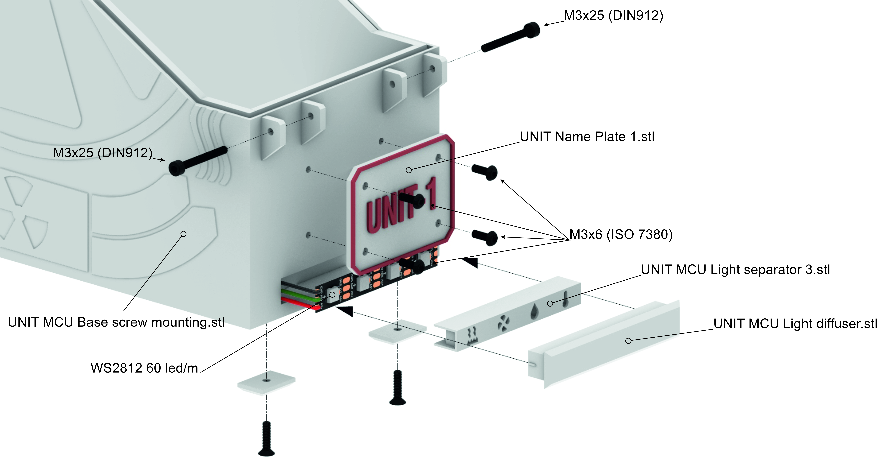
- 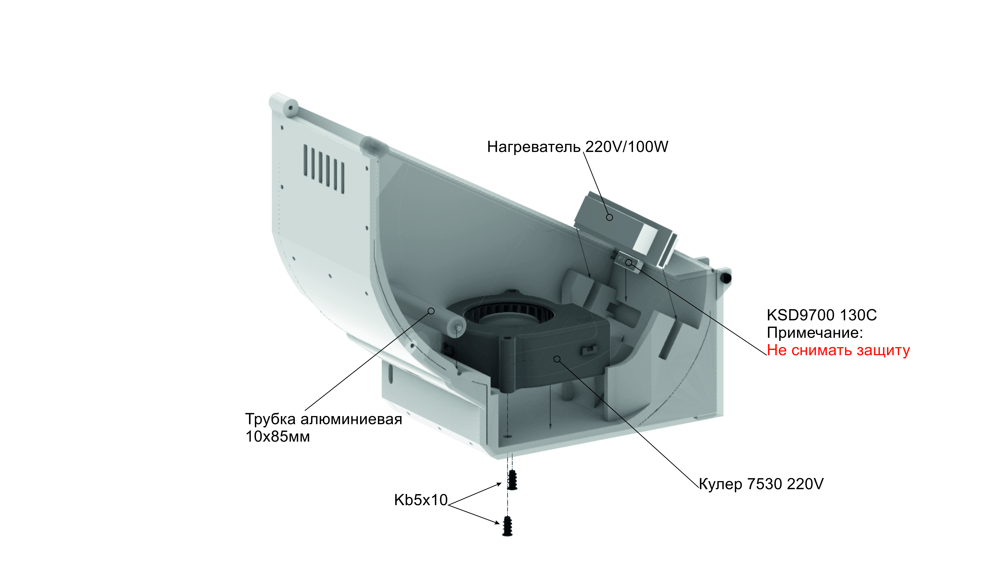
- 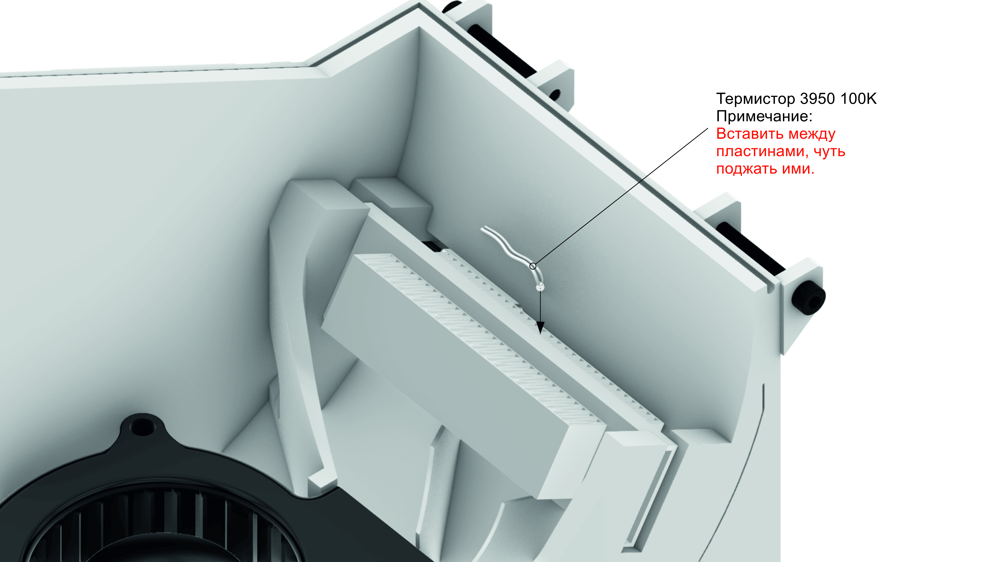

1. Install the spool holder rollers into the enclosure base.
2. Install the heating element in the designated mounting locations.
3. Secure the heater with spacers (left + right).
4. Install the Thermal Protector KSD9700 in contact with the heater.

!!! warning "Thermal Protector KSD9700"
    Ensure tight contact between KSD9700 and the heater body. Poor contact reduces the reliability of emergency protection.

### Steps 5–7: Ventilation and damper

- 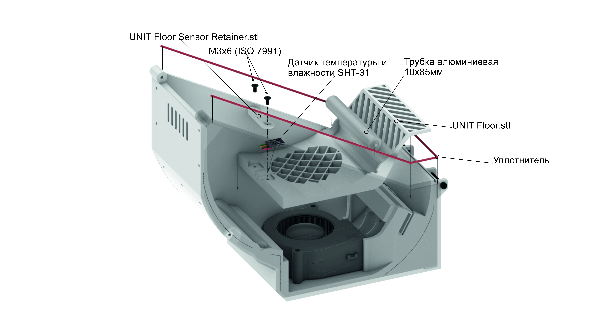
- 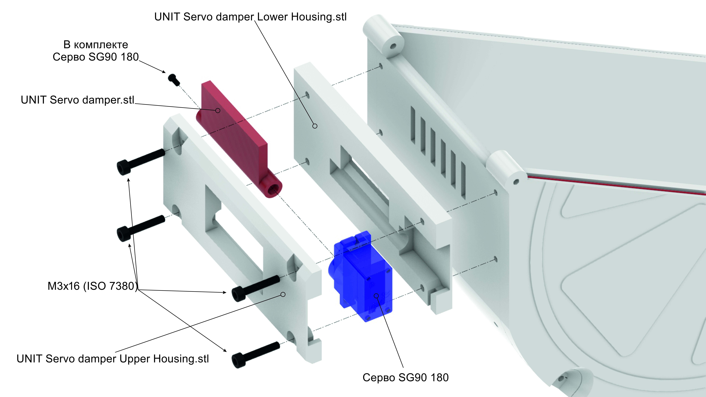
- 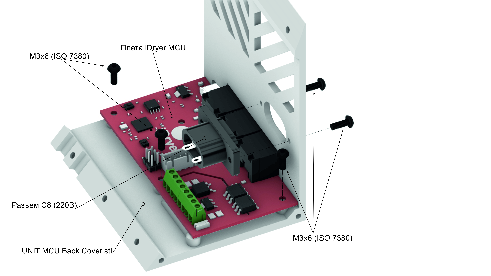

5. Install the fan in the enclosure, secure with fasteners.
6. Assemble the damper assembly: connect the blade and damper body. Damper type depends on the servo used (3.7 g or 9 g).
7. Connect the servo to the damper. **Do not screw the damper to the enclosure at this stage** — servo angles are configured after flashing.

### Steps 8–10: Electronics compartment

- 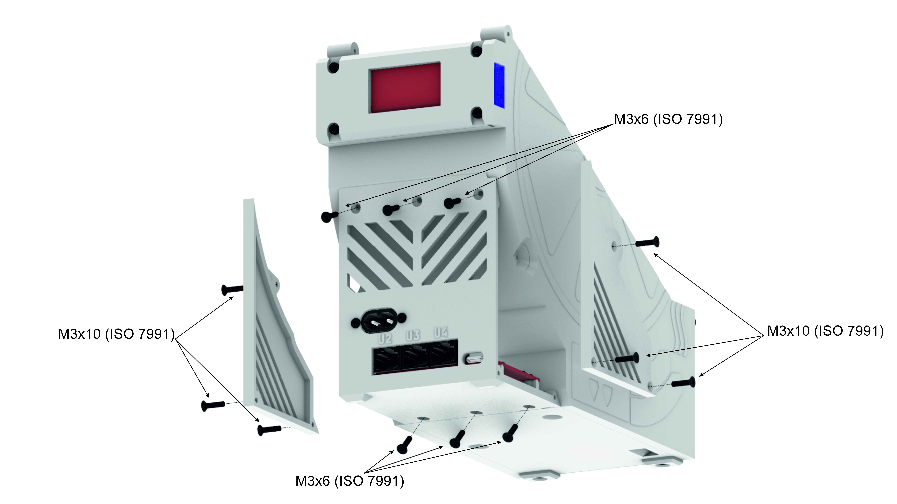
- 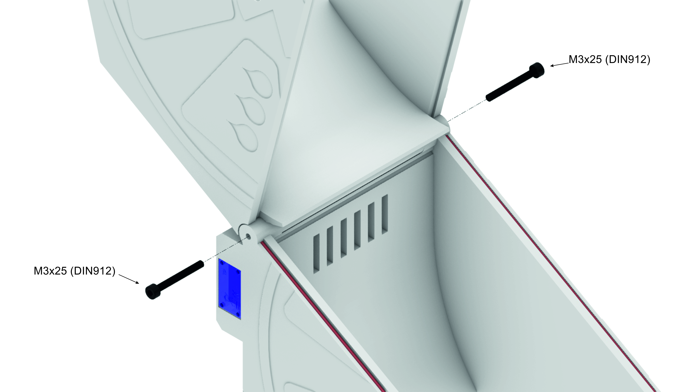
- 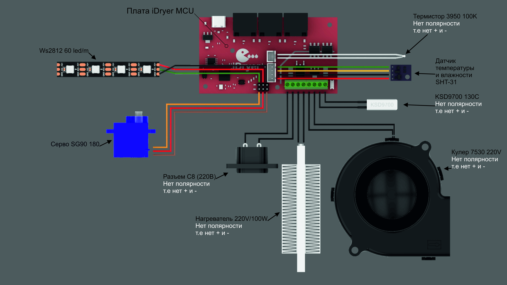

8. Secure the control board in the electronics compartment.
9. Install and connect the power connector. Use ferrule terminals for power wires.
10. Route and secure sensor wires in the cable channel. Install the electronics compartment cover.

!!! warning "Thermistor installation"
    Install the thermistor at the edge of the heater, approximately at mid-height of the heatsink fins.

    Exposed wire ends at the thermistor base must not contact the metal heater body. If necessary, insulate these sections with Kapton tape or place them in PTFE tubing / heat shrink.

    The heater temperature may reach 140 °C.

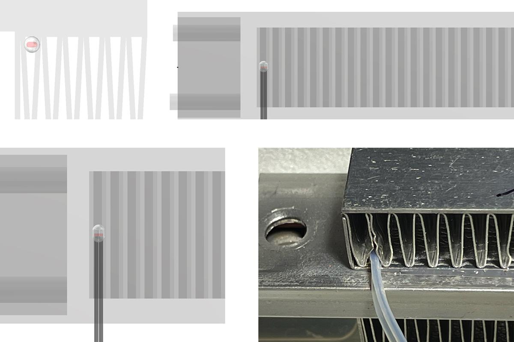

---

## After assembly

Before the first power-on:

- [ ] Check insulation of all connections.
- [ ] Make sure wires are not pinched by covers.
- [ ] Verify the thermal cutout makes firm contact with the heater.
- [ ] Check wiring integrity with a multimeter.

Next step — firmware installation in the **[Controller](../controller/board.md)** section.

---

!!! quote "Acknowledgements"
    Many thanks to Igor (@dr_perry_coke) for his incredible work, sense of aesthetics, and the provided iDryer Unit assembly images.
