# Modelle zum Drucken

!!! info "Consommation de matière"
    L'impression du boîtier standard iDryer Unit avec les paramètres recommandés nécessite moins de 1 kg de filament.

=== "iDryer v4 stl"

    | Teil | Beschreibung |
    |--------|----------|
    | 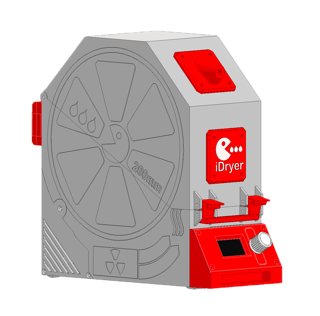 | [Archiv - Komponentensatz](../../../CAD/v4/STL/UNIT.zip) |
    | 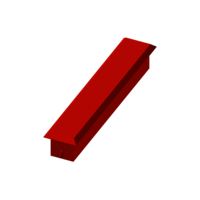 | [Diffusor](../../../CAD/v4/STL/UNIT_LIFGHT-DIFFUSER_Light_diffuser.stl) |
    | 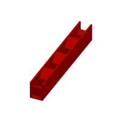 | [Separator](../../../CAD/v4/STL/UNIT_LIFGHT-DIFFUSER_Light_separator.stl) |
    |  | [Basis MCU - unterer Gehäuseteil ohne Relief](../../../CAD/v4/STL/UNIT_MCU_base_plain.stl) |
    |  | [Basis MCU - unterer Gehäuseteil](../../../CAD/v4/STL/UNIT_MCU_base_embossed.stl) |
    | 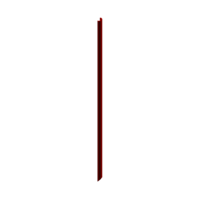 | [Kabelkanal für UTP-Kabel](../../../CAD/v4/STL/UNIT_MCU_cable_duct_UTP.stl) |
    | 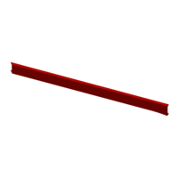 | [Kabelkanal](../../../CAD/v4/STL/UNIT_MCU_cable_duct.stl) |
    | 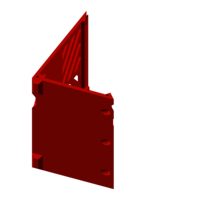 | [Rückabdeckung Elektronikschacht MCU](../../../CAD/v4/STL/UNIT_MCU_Back-Cover-3-ports.stl) |
    | 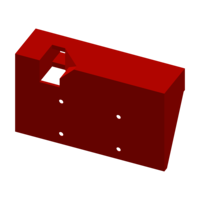 | [Display-Gehäuse](../../../CAD/v4/STL/UNIT_STANDALONE-FRONT-PANEL_ENCLOSURE.stl) |
    | 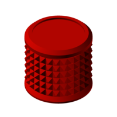 | [Knopf](../../../CAD/v4/STL/UNIT_STANDALONE-FRONT-PANEL_Knob_2.1.stl) |
    | 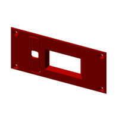 | [Display-Panel](../../../CAD/v4/STL/UNIT_STANDALONE-FRONT-PANEL_IDRYER_UNIT_display_panel3.stl) |
    |  | [Basis EXT - unterer Gehäuseteil ohne Relief](../../../CAD/v4/STL/UNIT_EXT_base_plain.stl) |
    | 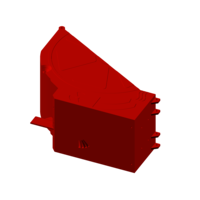 | [Basis EXT - unterer Gehäuseteil](../../../CAD/v4/STL/UNIT_EXT_base_embossed.stl) |
    |  | [Rückabdeckung Elektronikschacht EXT](../../../CAD/v4/STL/UNIT_EXT_Back-Cover-1-port.stl) |
    | 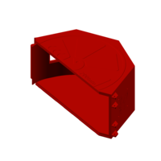 | [Abdeckung - oberer Gehäuseteil](../../../CAD/v4/STL/UNIT_top_cover_embossed.stl) |
    | 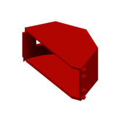 | [Abdeckung - oberer Gehäuseteil ohne Relief](../../../CAD/v4/STL/UNIT_top_cover_plain.stl) |
    | 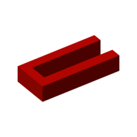 | [Heizer-Abstandshalter links](../../../CAD/v4/STL/UNIT_HEATER_SPACER_left.stl) |
    | 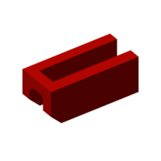 | [Heizer-Abstandshalter rechts](../../../CAD/v4/STL/UNIT_HEATER_SPACER_right.stl) |
    | 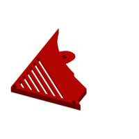 | [Seitliche Abdeckung Elektronikschacht](../../../CAD/v4/STL/UNIT_ELECTRONICS_BAY_Left-Cover.stl) |
    | 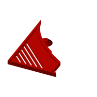 | [Seitliche Abdeckung Elektronikschacht](../../../CAD/v4/STL/UNIT_ELECTRONICS_BAY_Right-Cover.stl) |
    | 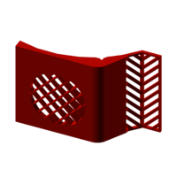 | [Gehäuseboden](../../../CAD/v4/STL/UNIT_FLOOR_Flor1.stl) |
    | 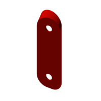 | [Halter auf dem Boden für flaches Sensor-Kabel](../../../CAD/v4/STL/UNIT_FLOOR_Flor2.stl) |
    | 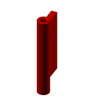 | [Klappe für Servo 3,7 g](../../../CAD/v4/STL/UNIT_AIR_DAMPER_SRVO_37G_damper_blade.stl) |
    | 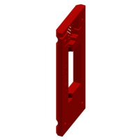 | [Klappengehäuse für Servo 3,7 g](../../../CAD/v4/STL/UNIT_AIR_DAMPER_SRVO_37G_housing_halve_1.stl) |
    | 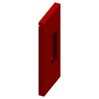 | [Klappengehäuse für Servo 3,7 g](../../../CAD/v4/STL/UNIT_AIR_DAMPER_SRVO_37G_housing_halve_2.stl) |
    | 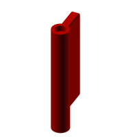 | [Klappe für Servo 9 g](../../../CAD/v4/STL/UNIT_AIR_DAMPER_SRVO_9G_damper_blade.stl) |
    | 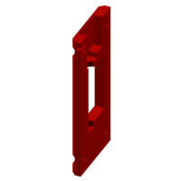 | [Klappengehäuse für Servo 9 g](../../../CAD/v4/STL/UNIT_AIR_DAMPER_SRVO_9G_housing_halve_1.stl) |
    | 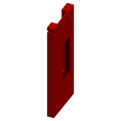 | [Klappengehäuse für Servo 9 g](../../../CAD/v4/STL/UNIT_AIR_DAMPER_SRVO_9G_housing_halve_2.stl) |
    | 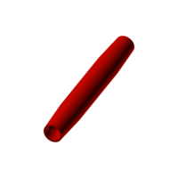 | [Gedruckte Rolle 11 × 84 für 693er Lager](../../../CAD/v4/STL/UNIT_SPOOL-ROLLER_PRINTED-ROLLER_Printable_Roller_Straight_Taper_with_Center_Flat_11x84mm_693.stl) |
    | 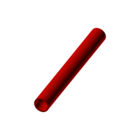 | [Gedruckte Rolle 11 × 84 für 693er Lager](../../../CAD/v4/STL/UNIT_SPOOL-ROLLER_PRINTED-ROLLER_Printable_Roller_Straight_Face11x84mm_693.stl) |
    | 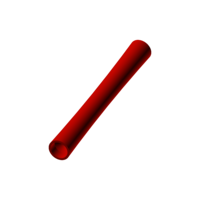 | [Gedruckte Rolle 11 × 84 für 693er Lager](../../../CAD/v4/STL/UNIT_SPOOL-ROLLER_PRINTED-ROLLER_Printable_Roller_Concave_Crown_11x84mm_693.stl) |
    | 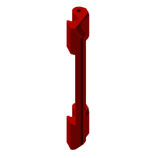 | [Allgemeiner Riegel](../../../CAD/v4/STL/UNIT_Latch-Handle.stl) |
    | 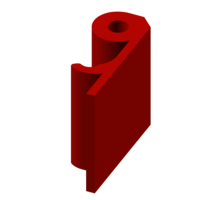 | [Riegel](../../../CAD/v4/STL/UNIT_Latch.stl) |
    | 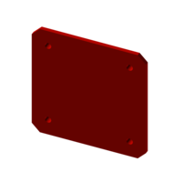 | [Schild mit Logo](../../../CAD/v4/STL/UNIT_Logo-Plate.stl) |
    | 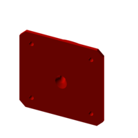 | [Filament-Ausgang für Kunststoff-Anschluss](../../../CAD/v4/STL/UNIT_Filament-Outlet.stl) |
    | 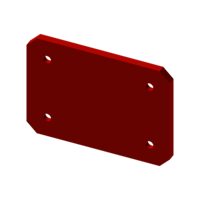 | [Gerätenameplate](../../../CAD/v4/STL/UNIT_Name-Plate.stl) |
    | 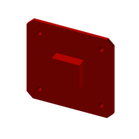 | [Verschluss des Filament-Ausgangs](../../../CAD/v4/STL/UNIT_Plug.stl) |
    | 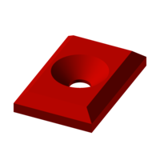 | [Fuß](../../../CAD/v4/STL/UNIT_Foot.stl) |

#### Druckparameter für Gehäuse:

  - Material ABS, ABS-CF, ABS-GF, PC, HTPLA

  - Linienbreite 0,6–0,8 (überprüfen Sie, dass beim Drucken scharfe Kammern entstehen)

  - Anzahl der Umfänge 1
  
  - Füllung 10–15 %

  - Füllmuster linear

  - Spielraum-Schließradius 0,02

### Teile-Ausrichtung auf der Druckplatte

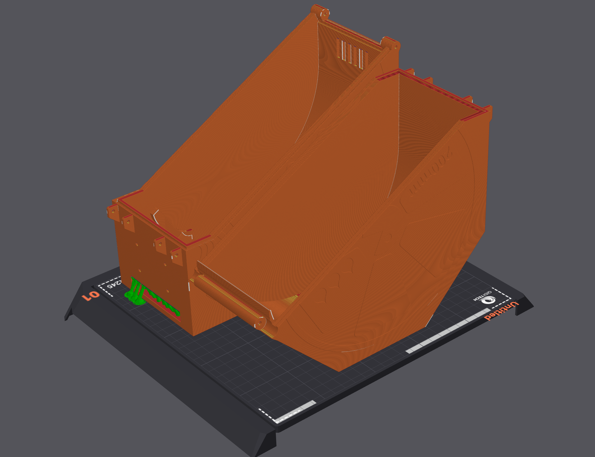
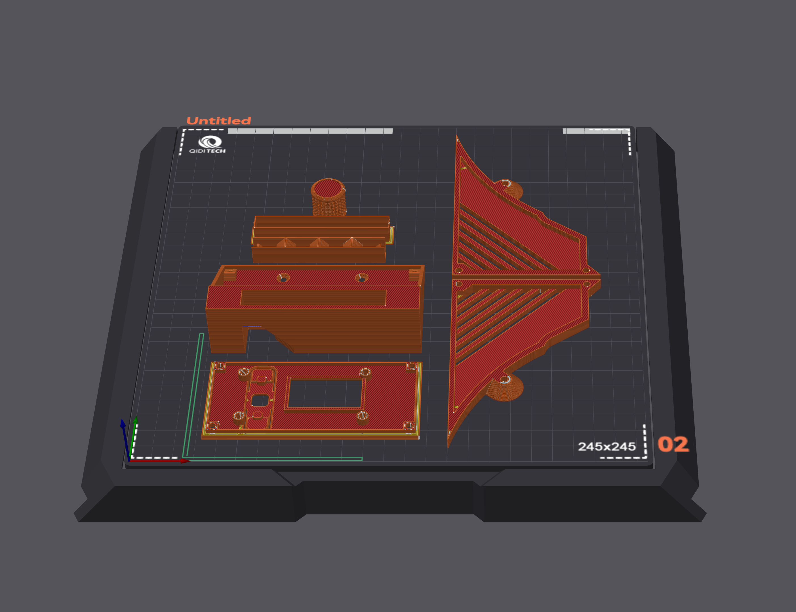
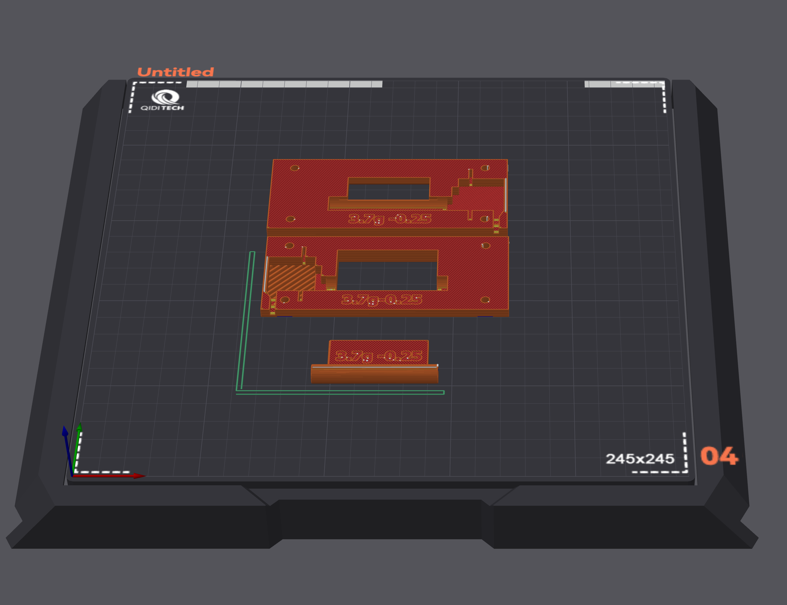
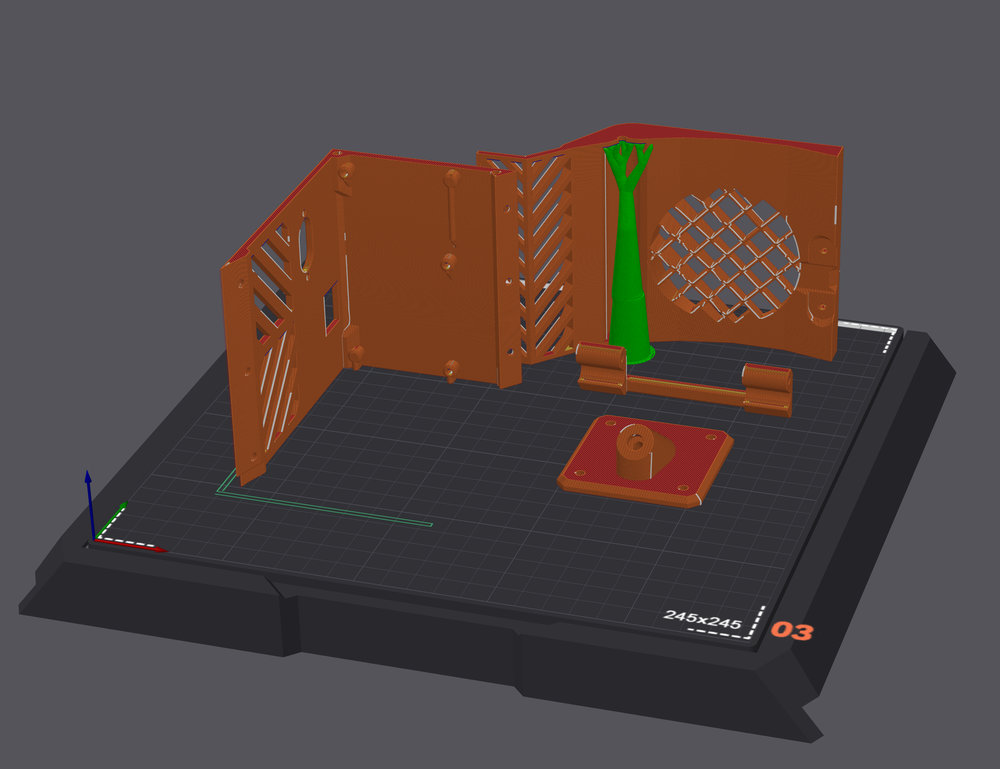
