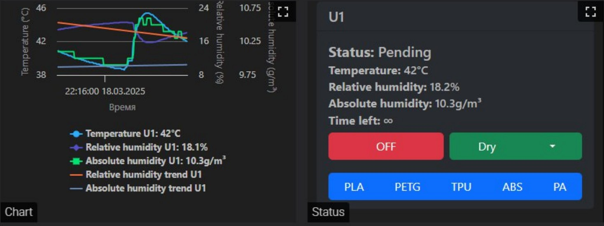

# Klipper: 設定

このページでは、Klipper環境でのiDryer Unitの設定ファイルのインストールと設定について説明します。コントローラーのファームウェアは事前にインストールされている必要があります。「ファームウェア」のセクションを参照してください。

---

## 設定: mcuまたはsecond_mcu

iDryer UnitはKlipperに2つの方法で接続されます。

=== "mcu (独立したホスト)"

    iDryer Unitは独立したホスト上のプライマリMCUとして機能します(例えば、フィラメントドライヤーのみ用のRaspberry Pi)。設定セクション:

    ```ini
    [mcu]
    serial: /dev/serial/by-id/usb-Klipper_rp2040_XXXXXXXXXXXXXXXX-XXXX
    ```

=== "second_mcu (プリンタと共有)"

    iDryer Unitはプリンタホストに1つのKlipperインスタンス内の第2MCUとして接続されます。設定セクション:

    ```ini
    [mcu iDryer]
    serial: /dev/serial/by-id/usb-Klipper_rp2040_XXXXXXXXXXXXXXXX-XXXX
    ```

    この場合、すべてのピンに`iDryer:`プレフィックスが付きます。例えば`iDryer:H_U1`。

---

## 設定ファイルのインストール

### 1. SSHでホストに接続

```bash
ssh user_name@printer_address
```

### 2. 設定ディレクトリに移動

```bash
cd ~/printer_data/config/
```

!!! note ""
    インストールバージョンに応じてパスが異なる場合があります: `~/klipper_config/`または`~/printer_data/config/`。ディレクトリに`printer.cfg`ファイルが存在することを確認してください。

### 3. インストールスクリプトのダウンロードと実行

=== "mcu"

    ```bash
    wget https://raw.githubusercontent.com/pavluchenkor/iDryer-Unit/main/sh/download_iDryer_mcu.sh
    chmod +x download_iDryer_mcu.sh
    ./download_iDryer_mcu.sh
    ```

=== "second_mcu"

    ```bash
    wget https://raw.githubusercontent.com/pavluchenkor/iDryer-Unit/main/sh/download_iDryer_second_mcu.sh
    chmod +x download_iDryer_second_mcu.sh
    ./download_iDryer_second_mcu.sh
    ```

スクリプトは必要な設定ファイル群を含むディレクトリを作成します。

### 設定ファイルの手動インストール

スクリプトを使用したインストールができない場合は、GitHubからプロジェクトアーカイブをダウンロードし、FluiddまたはMainsailのインターフェース経由で必要な設定ファイルを転送してください。

[GitHubからプロジェクトアーカイブをダウンロード](https://github.com/pavluchenkor/iDryer-Unit/archive/refs/heads/main.zip)

### 4. printer.cfgに設定を含める

`printer.cfg`ファイルの先頭に行を追加します:

=== "mcu"
    ```ini
    [include iDryer_mcu/iDryer.cfg]
    ```

=== "second_mcu"
    ```ini
    [include iDryer_second_mcu/iDryer.cfg]
    ```

### 5. iDryer.cfgにシリアルIDを指定

コントローラーIDを取得します:

```bash
ls /dev/serial/by-id/*
```

`iDryer.cfg`ファイルの`[mcu iDryer]`セクションでプレースホルダーを取得したIDに置き換えます:

```ini
[mcu iDryer]
serial: /dev/serial/by-id/usb-Klipper_rp2040_XXXXXXXXXXXXXXXX-XXXX
```

### 6. 追加モジュール(U2–U4)の接続

デフォルトではモジュールU1が接続されています。`iDryer.cfg`で必要な行をコメント解除します:

```ini
[include U1.cfg]
# [include U2.cfg]
# [include U3.cfg]
# [include U4.cfg]
```

---

## ハードウェア設定

### ヒーター

```ini
[heater_generic iDryer_U1_Heater]
heater_pin: H_U1
max_power: 1
sensor_type: NTC 100K MGB18-104F39050L32
sensor_pin: T_U1
control: pid
pwm_cycle_time: 0.3
min_temp: 0
max_temp: 120
pid_Kp: 32.923
pid_Ki: 5.628
pid_Kd: 48.150
```

### ファン

```ini
[heater_fan Fan_U1]
fan_speed: 1
pin: FAN_U1
# second_mcu使用時: pin: iDryer:FAN_U1
heater: iDryer_U1_Heater
heater_temp: 55
```

### 温度・湿度センサー

例ではI2Cバス上のSHT3Xを使用しています:

```ini
[temperature_sensor iDryer_U1_Air]
i2c_mcu: iDryer
sensor_type: SHT3X
i2c_bus: i2c0f
i2c_address: 68  # 68または69
```

!!! note ""
    センサーU1とU2は1つのI2Cバスに接続され、センサーU3とU4は別のバスに接続されています。同じバス上のセンサーアドレスは異なっている必要があります: 1つは`68`、もう1つは`69`。別のセンサーを使用する場合は、[Klipperドキュメント](https://www.klipper3d.org/Config_Reference.html#temperature-sensors)を確認してください。

---

## PIDキャリブレーション

ドライヤーのフタを閉じた状態でキャリブレーションを実行してください:

1. Klipperコンソールを開きます。
2. コマンドを実行します:
   ```
   PID_CALIBRATE HEATER=iDryer_U1_Heater TARGET=100
   ```
3. 完了を待ちます。
4. 取得した係数を`iDryer.cfg`に記録してください。

---

## ダンパーサーボの設定

### 1. 極限位置の決定

サーボは PWM信号で制御されます。異なるサーボモデルは同じ値に異なる反応を示します。キャリブレーションは常に個別です。

**このステップではダンパーをケースに固定しないでください** – 最初に動作範囲を決定してください。

Klipperコンソールのコマンドで極限位置を確認します:

```
SET_SERVO SERVO=srv_U1 ANGLE=0
SET_SERVO SERVO=srv_U1 ANGLE=90
```

サーボがケースに詰まっている場合は、範囲を調整してください。

### 2. 設定に角度を記録

`iDryer.cfg`のサーボセクションを確認してください:

```ini
[servo srv_U1]
pin: SRV_U1
maximum_servo_angle: 180
minimum_pulse_width: 0.00055
maximum_pulse_width: 0.002
```

`iDryer.cfg`ファイルの`DRY_U1`マクロで角度を設定します:

```ini
variable_servo_open_angle: 40    # 開いた位置の度数
variable_servo_closed_angle: 94  # 閉じた位置の度数
```

### 3. サーボの電源補正

複数のサーボを使用する場合、ホストのUSBポート負荷を超えるためにエラーが発生する可能性があります。

**オプション 1 – サーボの電源回路の抵抗:**

サーボの電源に4〜10オームの抵抗を取り付けてください。リビジョン3のボードではすでに抵抗が実装されていますが、正確な抵抗値は個別に選択する必要があります。

**オプション 2 – アクティブUSBハブ:**

別の電源を備えたUSBハブ経由でコントローラーを接続してください。これにより、ホストポートへの過負荷が防止されます。

!!! note ""
    通信安定性の問題(切断、MCUの再起動)は、電源ケーブルまたはファンからの電磁干渉が原因である場合があります。解決策 – USBケーブルのフェライトフィルターと、ファンと並列のRCスナッバー。「トラブルシューティング」セクションを参照してください。

---

## delta_high設定

`variable_delta_high`はヒーター温度と目標空気温度の差を管理します。

キャリブレーション手順:

1. 初期値`variable_delta_high: 15`を設定します。
2. マクロ`PA_U1`で加熱を開始します。
3. 安定化するまで待ちます。
4. チャンバー内の温度を確認します:
   - チャンバーが90 °Cの場合、値は適切です。
   - より低い場合は`variable_delta_high`を増加させてください。
5. 30分間実行してから、30〜60分ごとに状態を確認してください。

!!! warning ""
    ヒーターがプラスチックケースに付着している場合、プラスチックが温度に耐えられません。`variable_delta_high`を低下させるか、ABSまたはABS-CFからケースを再度3Dプリントするか、ヒーターの取付方法を変更してください。

---

## G-コードマクロ

材料のタイプに応じた乾燥制御に事前設定されたマクロを使用してください:

| マクロ | 温度 | 時間 |
|---|---|---|
| `PLA_U1` | 55 °C | 180 分 |
| `PETG_U1` | 65 °C | 240 分 |
| `ABS_U1` | 80 °C | 240 分 |
| `PA_U1` | 90 °C | 240 分 |
| `TPU_U1` | 60 °C | 300 分 |
| `OFF_U1` | オフ | — |

カスタムモードの起動:

```gcode
DRY_U1 UNIT_TEMPERATURE=70 HUMIDITY=10 TIME=180
```

ダンパーの手動開閉:

```gcode
SET_SERVO SERVO=srv_U1 ANGLE=90  ; 開く
SET_SERVO SERVO=srv_U1 ANGLE=0   ; 閉じる
```

---

## 代替制御アルゴリズム – PyUnit

コミュニティメンバー[@Xatang](https://github.com/xatang)による。設定可能な係数と情報豊富なグラフを備えた、乾燥および保管パラメータの自動維持。



→ [GitHubのPyUnitリポジトリ](https://github.com/xatang/PyUnit)
