# Lista de materiais (BOM)

Lista completa dos componentes para a montagem de um módulo iDryer Unit: eletrônica, sensores, parafusos e consumíveis. Os links apontam para os itens a comprar.

| | Name | Link | Quantity |
|---|---|---|---|
| 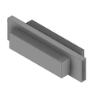 | 100W 220V\|110V Insulated PTC Ceramic Air Heater | [ссылка](https://www.aliexpress.com/item/1005007794042547.html) | 1 |
| 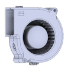 | Ec7530 Turbine Blower Double Ball Bearing 220V\|110V (аналог, не тестировался) | [ссылка](https://www.aliexpress.com/item/1005003429103124.html) | 1 |
| 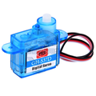 | GH-S37D Micro Digital Servo | [ссылка](https://www.aliexpress.com/item/1005007763122073.html) | 1 |
| 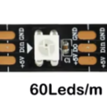 | WS2812 5050 RGB Pixels LED Strip DC5V 60 leds | [ссылка](https://www.aliexpress.com/item/1005009428772067.html) | 4 leds |
| 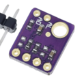 | SHT31 Temperature SHT31-D Humidity Sensor | [ссылка](https://www.aliexpress.com/item/1005008766957816.html) | 1 |
| 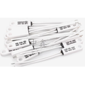 | KSD9700 5A 250V 135C Normal Close | [ссылка](https://www.aliexpress.com/item/32959243565.html) | 1 |
| 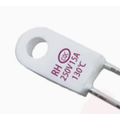 | RH 135C | [ссылка](https://www.aliexpress.com/item/1005001892569431.html) | 1 |
| 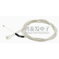 | 100K NTC3950 100CM xh2.54 | [ссылка](https://www.aliexpress.com/item/1005008996648273.html) | 2 |
| | 100K NTC3950 30CM xh2.54 | | 1 |
| 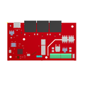 | PCB iDryer contoller | | 1 |
| 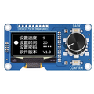 | 1.3-inch OLED Module, Button EC11 Rotary Encoder 3.3V | [ссылка](https://www.aliexpress.com/item/1005008666171055.html) | 1 |
| | XH 2.54MM, Length 20cm, 4Pin | [ссылка](https://www.aliexpress.com/item/1005007536283722.html) | 1 |
| 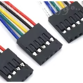 | Dupont Line Male 4P | [ссылка](https://www.aliexpress.com/item/4001200216310.html) | 1 |
| 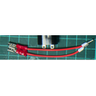 | Silicone Cable 1m 20AWG | [ссылка](https://www.aliexpress.com/item/1005008409314314.html) | 1m |
| 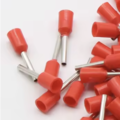 | E0508 Tube insulating Insulated terminals | [ссылка](https://www.aliexpress.com/item/32814805492.html) | 8 |
| 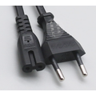 | US EU to C7 Cable | [ссылка](https://www.aliexpress.com/item/1005001299125752.html) | 1 |
| 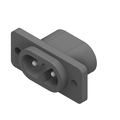 | Male Power Socket C7 AC-005 | [ссылка](https://www.aliexpress.com/item/1005010412204145.html) | 1 |
| 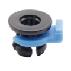 | Clip Pipe Embedded Clamp Bowden Coupling | [ссылка](https://www.aliexpress.com/item/1005005702615883.html) | 1 |
|  | Flexible Silicone Tube ID 1mm x OD 2mm | [ссылка](https://www.aliexpress.com/item/1005010788900111.html) | 1m |
| 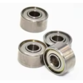 | Miniature Bearings 693ZZ 3\*8\*4mm | [ссылка](https://www.aliexpress.com/item/32822351866.html) | 4 |
| 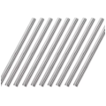 | Rod Bar for Motor Shaft 90mm | [ссылка](https://www.aliexpress.com/item/1005005184865336.html) | 2 |
| 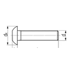 | M3\*25 ISO7380 | | 6 |
|  | M3\*16 ISO7380 | | 4 |
|  | M3\*6 ISO7380 | | 18 |
| 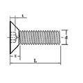 | M3\*10 din7991 | | 6 |
|  | M3\*6 din7991 | | 12 |
