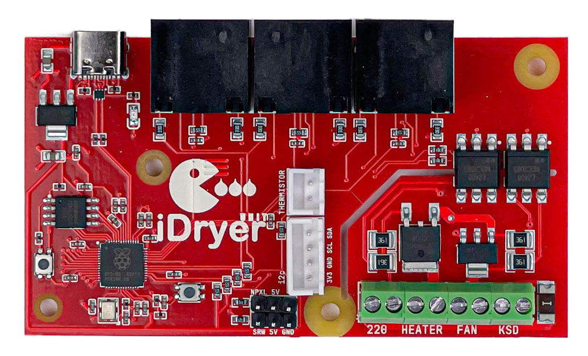
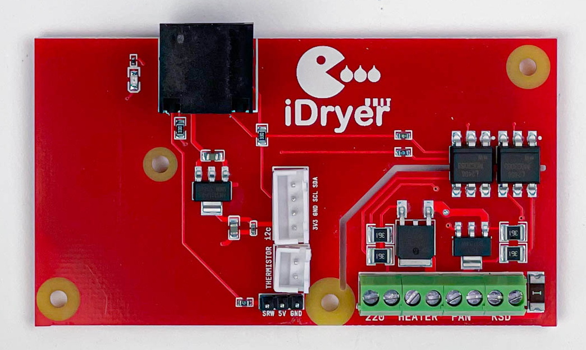

# 控制器

系統基於兩種類型的電路板構建：主要控制單元 MCU 和擴展模組 EXT。

## iDryer Unit MCU

帶有微控制器的主電路板。管理整個系統：讀取感測器、控制加熱器、風扇和擋板伺服馬達。與主機的連接使用 USB-C。三個 RJ45 接頭用於連接 EXT 模組。

## iDryer Unit EXT

不含微控制器的擴展電路板。通過 RJ45 網線連接到 MCU，由 MCU 直接控制。每個額外的乾燥腔室需要一個 EXT 電路板。

