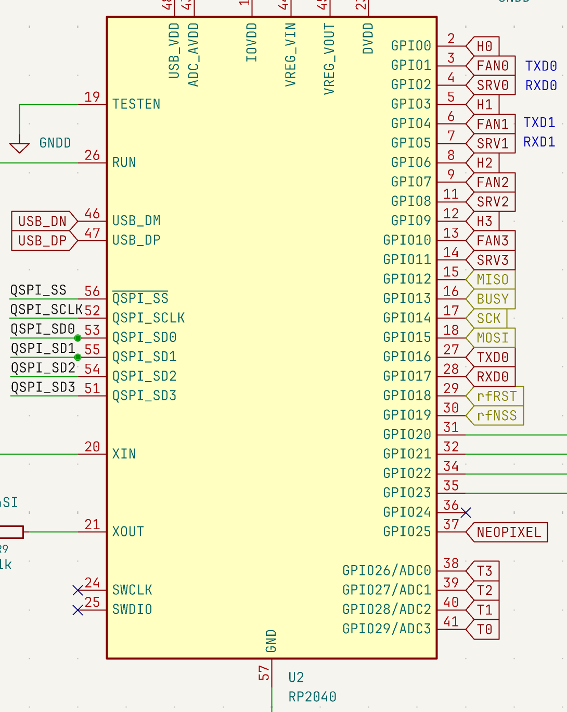
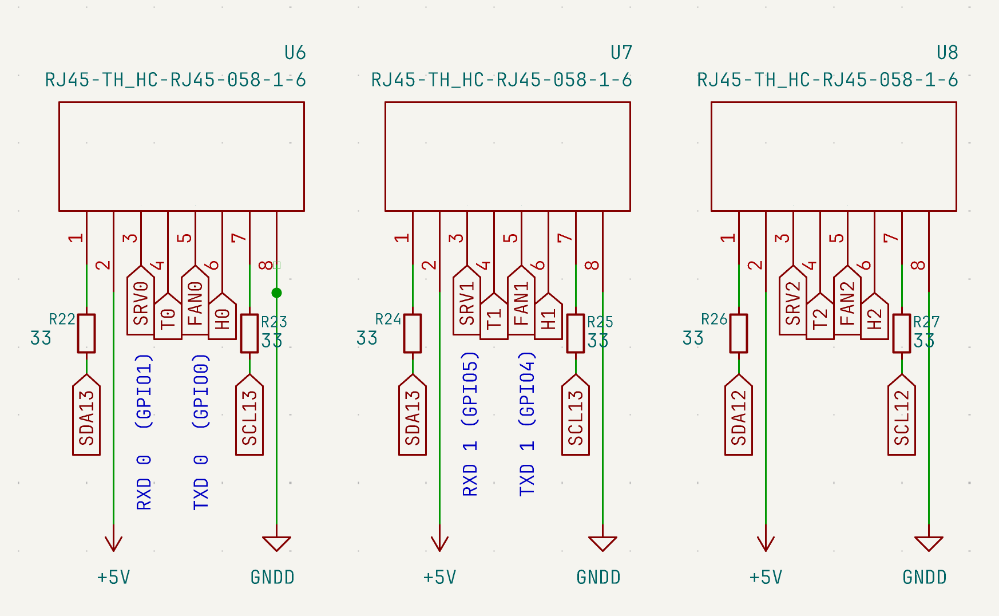

# DIY控制器

為想要自己組建控制器的人士準備的部分 – 無需預製MCU板。

---

## RP2040引腳分佈

---

## RJ45連接器引腳分佈

三個RJ45連接器（U6/U7/U8）用於連接EXT塊。每個連接器傳輸：SRV（舵機）、T（溫度感測器）、FAN（風扇）、H（加熱器）、SDA/SCL（I²C）、+5 V、GND。

---

## 原型板（EasyEDA）

最低預算，手工組裝在麵包板上。功能性原型 – 不適用於永久運行。

→ [EasyEDA項目](https://oshwlab.com/pavluchenko.r/2channel-dimmer-bread-board)

---

## 打印機板 + SSR

用作MCU的舊打印機板和用於控制110–230 V負載的固態繼電器。需要可用的GPIO輸出和相容的Klipper韌體。
