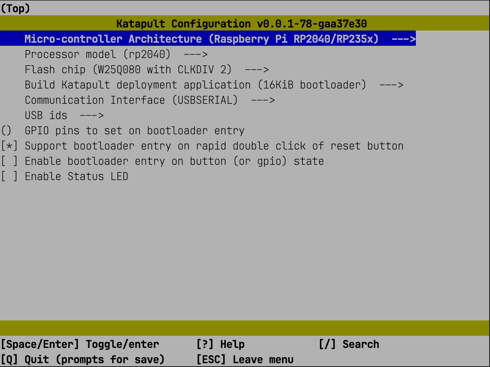
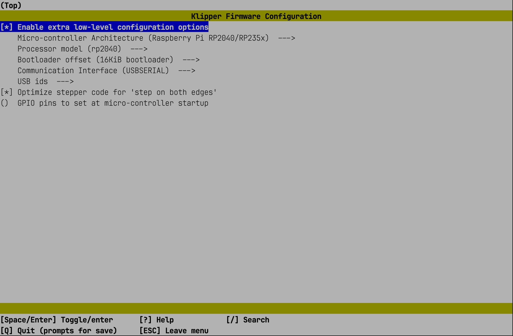

# Firmware Installation

## Installing Katapult

```
git clone https://github.com/Arksine/katapult
```

### Preparing the Katapult Firmware

```
cd katapult
make menuconfig
```

Choose the following options:



**Important:** Before flashing the firmware, ensure the Katapult build configuration is correct. Flashing with an incorrect configuration may brick the device, requiring a hardware programmer to recover.

### Building the Katapult Firmware

```
make
```

### Entering BOOT Mode on the Unit Microcontroller

Put your microcontroller into BOOT mode: press and hold the BOOT button, briefly press RESET, then release BOOT. Alternatively, unplug USB, hold BOOT, plug in USB, then release BOOT.

### Identifying the Microcontroller ID

```
lsusb
```

You should see something like:

```
Bus 001 Device 004: ID 2e8a:0003 Raspberry Pi RP2 Boot
```

### Flashing the Microcontroller Using Its ID

```
make flash FLASH_DEVICE=2e8a:0003
```

---

## Installing Klipper Firmware

### Preparing the Klipper Firmware

```
cd ~/klipper/
make clean
make menuconfig
```

Choose the following options:



### Building the Klipper Firmware

```
make
```

### Getting the Microcontroller's Serial ID

Reconnect the USB cable a few times, or press RESET if needed, until the device appears:

```
ls /dev/serial/by-id/*
```

You should see something like:

```
/dev/serial/by-id/usb-katapult_rp2040_XXXXXXXXXXXXXXXX-XXXX
```

### Installing Required Python Library

```
pip3 install pyserial
```

### Flashing Klipper via Katapult

```
cd ~/katapult/scripts
python3 flashtool.py -d usb-katapult_rp2040_XXXXXXXXXXXXXXXX-XXXX
```

Run

```
ls /dev/serial/by-id/*
```

If successful, the ID will contain "Klipper":

```
/dev/serial/by-id/usb-Klipper_rp2040_XXXXXXXXXXXXXXXX-XXXX
```
