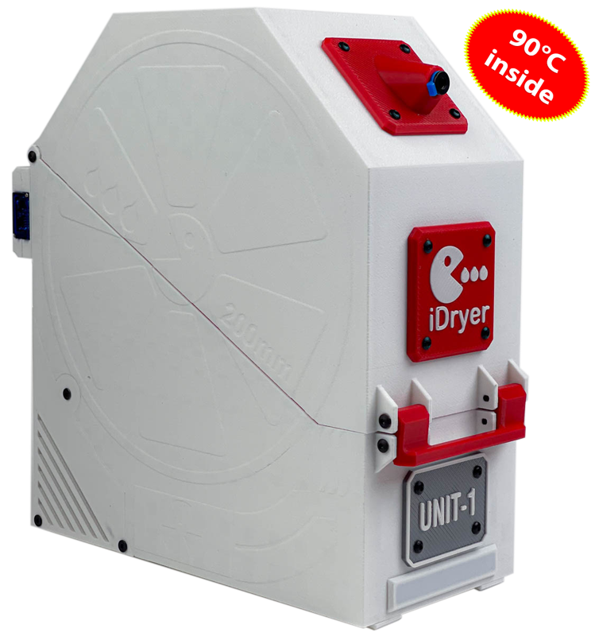
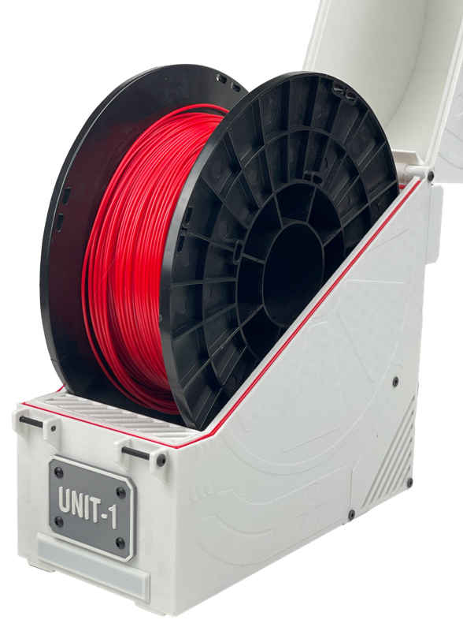
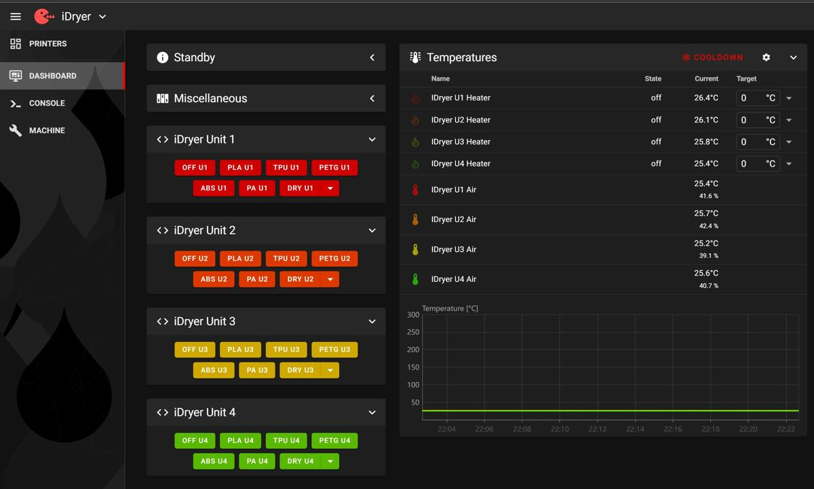
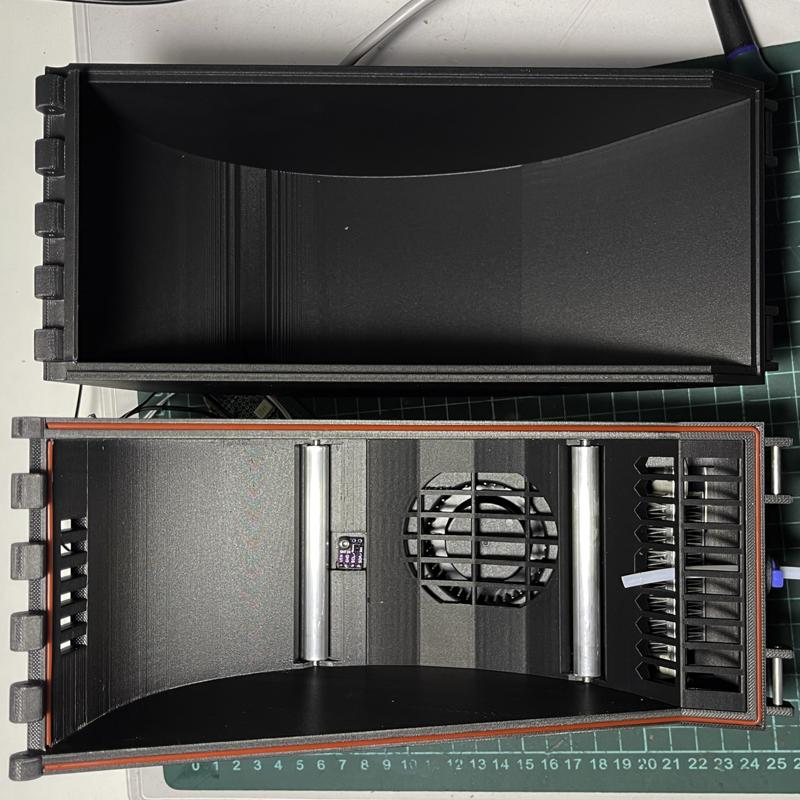
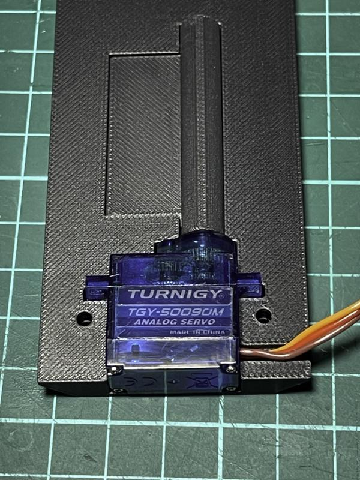
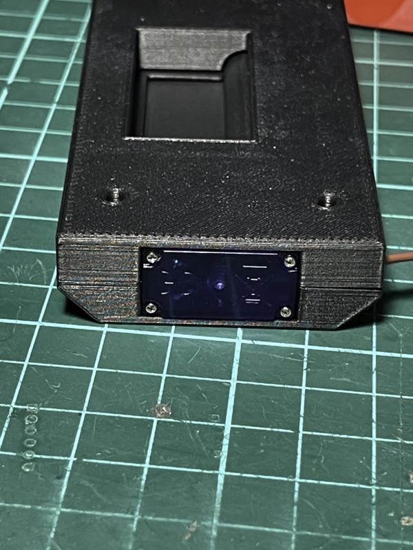

    

# iDryer Unit - Filament Drying System for 3D Printers Based on Klipper

### Project Release

This project is a modular filament drying control system for 3D printers. It supports up to four drying units, each with individual temperature and humidity settings. The system allows setting temperatures up to 90°C and includes a storage mode that maintains minimal humidity to prevent filament reabsorption.

Additionally, iDryer Unit supports connection to a Telegram bot to receive notifications about drying status, process completion, and events like overheating. For visual indication, addressable LEDs can be used-an output on the MCU board allows connecting an LED strip to display various states (e.g., active drying mode, cycle completion, or errors). The system can leverage Klipper functionality to show temperature, humidity, remaining drying time, automatically log events, and integrate with macros. It also supports advanced user profiles and extended scenarios such as scheduled startup, critical event alerts, and lighting features like color changes between modes.

## Key Features

* **Operating Modes: Drying and Storage.** Drying filament up to 90°C and maintaining ideal temperature and humidity for storage.

* **Modular Design:**

  * **iDryer Unit MCU** - main control unit with microcontroller.

  * **iDryer Unit EXT** - expansion modules without microcontrollers, connectable to the MCU unit. Up to three EXT units can be added.

* **Klipper Integration:** Display all drying parameters within Klipper interface.

* **Telegram Bot Notifications:** Receive real-time updates about status and process completion.

* **Visual Indication:** Addressable LEDs display current operating modes.

* **Printable Enclosure:** Available for one or two spools. Compatible with spools up to 85 mm wide and 200 mm in diameter. Can be printed using ABS or other suitable filament.

* **System Scalability:** Supports up to four drying units with individual settings. Each dryer can handle one or two spools simultaneously.

* **Add-on Module Support:** Additional dryers connect via patch cords using RJ45 connectors for reliable communication.

* **Centralized Architecture:** One dryer unit has an MCU and acts as the controller, while others are peripherals. iDryer can also be set up as a standalone Klipper instance or as a secondary MCU connected to the main printer board.

* **Safety:** Includes 130°C KSD9700 thermostat and Klipper safety mechanisms.

* **Drying Efficiency:** Features a humidity sensor and a servo-driven damper to manage chamber ventilation and achieve optimal drying results.
  
  

## Benefits of Use

* **Improved Print Quality:** Dry filament ensures consistent extrusion and better print results.
* **Time Savings:** Simultaneous drying of multiple spools.
* **Efficiency:** Boosts productivity by reducing drying time.
* **Flexibility:** Expandable and customizable for specific needs.
* **Visualization:** LED feedback enables quick device status assessment.
* **Safety:** Both hardware and firmware safety measures ensure secure operation.

## Technical Details

* **iDryer Unit MCU:** Main controller block with microcontroller.
* **iDryer Unit EXT:** Expansion module without microcontroller.
* **MCU:** Manages the main dryer and coordinates additional modules. Default connection is U1; U2-U4 are optional. iDryer can function as a separate Klipper instance or as a second MCU within a single Klipper setup.
* **Thermostat KSD9700:** 130°C bimetallic thermostat for emergency protection.
* **Temperature Range:** Drying up to 90°C, suitable for most filament types.
* **Connection Interfaces:** RJ45 connectors simplify installation and ensure reliable connections.
* **LED Output:** Allows connecting addressable LED strips for visual feedback.

## Operating Modes

**1. Drying Mode (DRYING)**

* Set temperature and drying duration.
* Automatically switches to storage mode upon completion.

**2. Storage Mode (STORAGE)**

* Maintains target temperature and humidity.
* Activates heater and fan if thresholds are exceeded.

## Setup and Configuration

**Connection:** Link additional modules to the main dryer using RJ45 patch cords. U1 connects by default; U2-U4 can be added by including the appropriate config files.

## Requirements

* 3D printer with up-to-date Klipper firmware.
* iDryer board with MCU for the main dryer.
* KSD9700 thermostat (130°C) per dryer.
* RJ45 patch cords and connectors to link expansion modules.
* Extra iDryer Unit control boards depending on the number of dryers used.

---

## Feedback

If you have questions or suggestions for improvement, please open an issue in the repository or reach out directly.

Or join the Telegram group.

## Notes

* Ensure temperature and humidity sensors (e.g., SHT3X or alternatives) are connected correctly.
* PID tuning may be needed for optimal temperature control.
* Use macros to monitor temperature and humidity readings for precise drying conditions.
* This project is under active development.

***Warning: Using heating elements and temperature control involves fire risk and potential equipment damage. Always follow manufacturer guidelines and adhere to electrical safety precautions. Never leave operating devices unattended.***

### DIY Version from Scrap Materials

You can build a prototype of the iDryer Unit yourself on a minimal budget. This is a prototype and should be treated accordingly.

[EasyEDA Project](https://oshwlab.com/pavluchenko.r/2channel-dimmer-bread-board)

### Using a Printer Board

Another excellent option is to reuse an old printer board as an MCU, with solid-state relays to control 110-220V loads.

