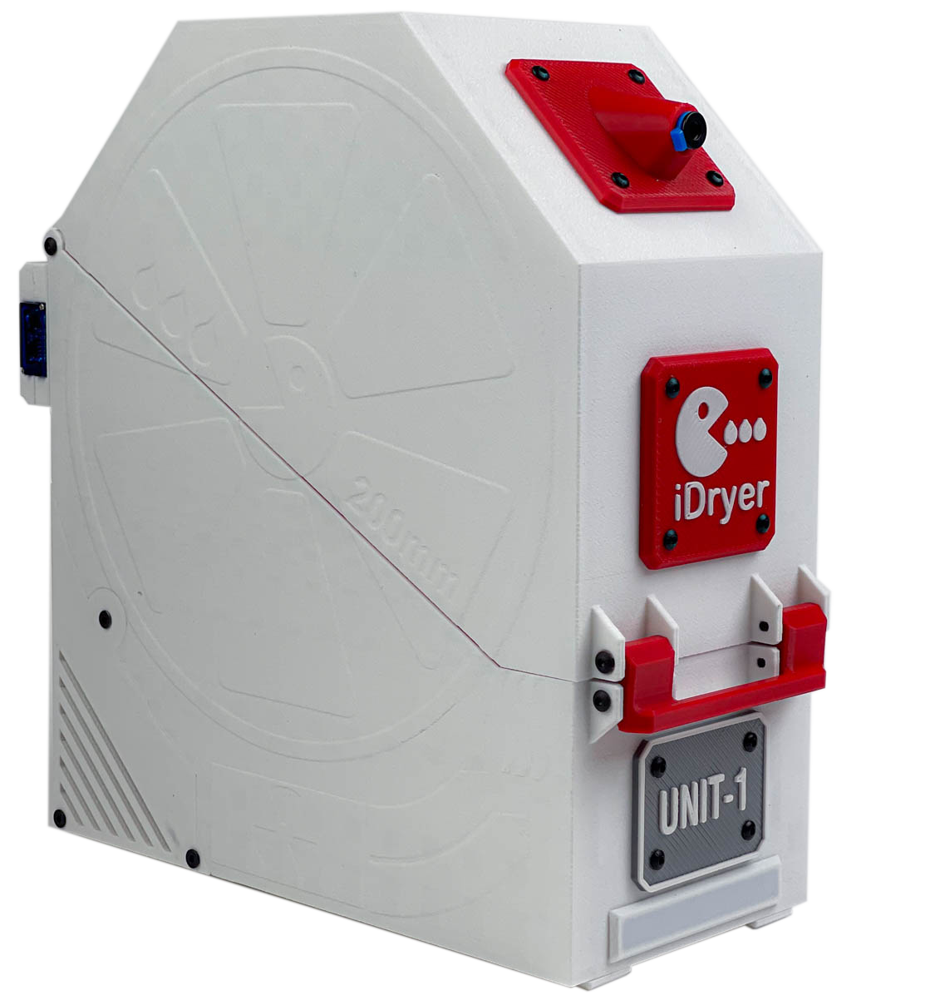
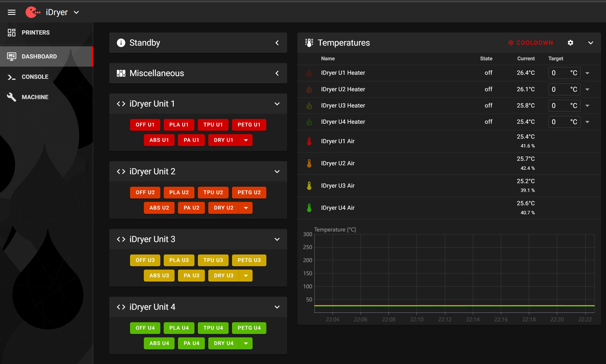
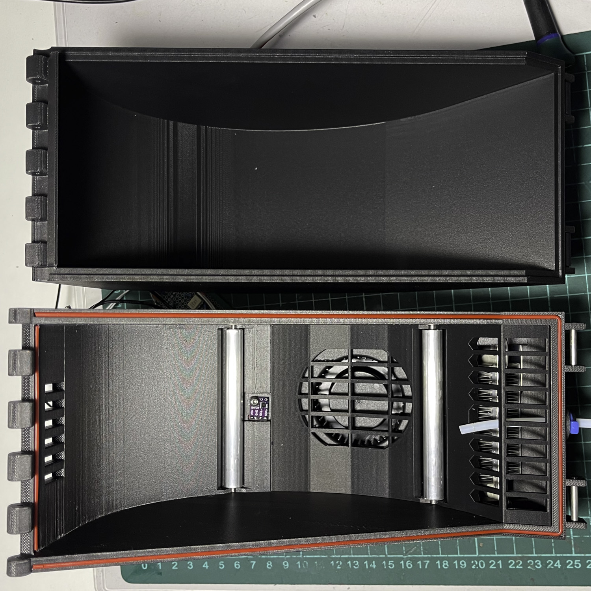
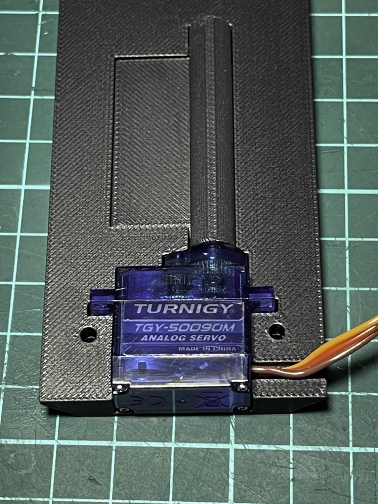
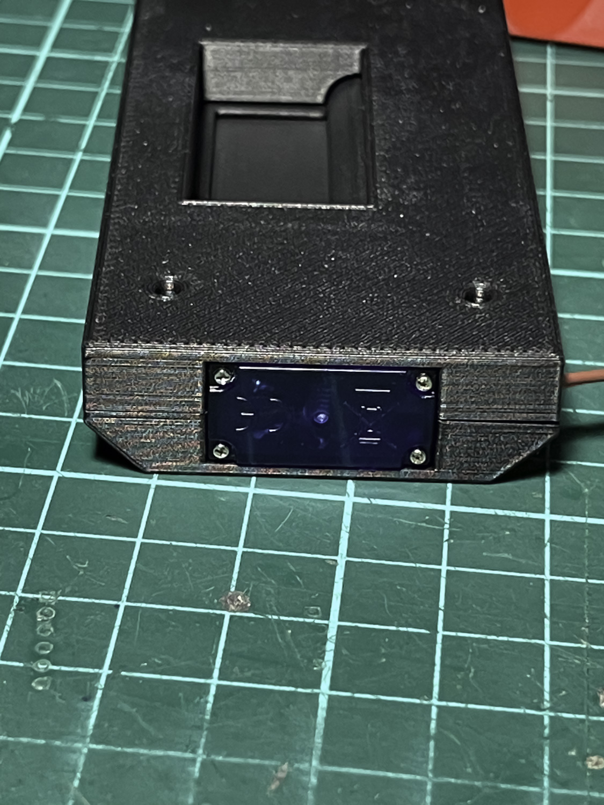
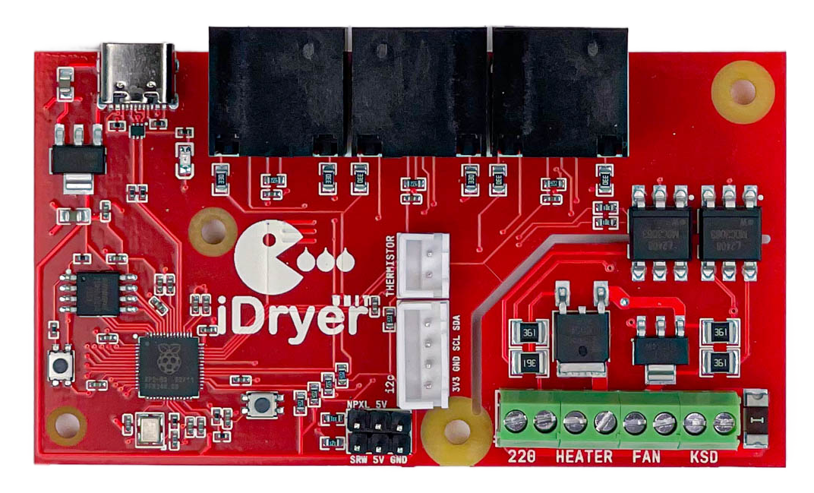
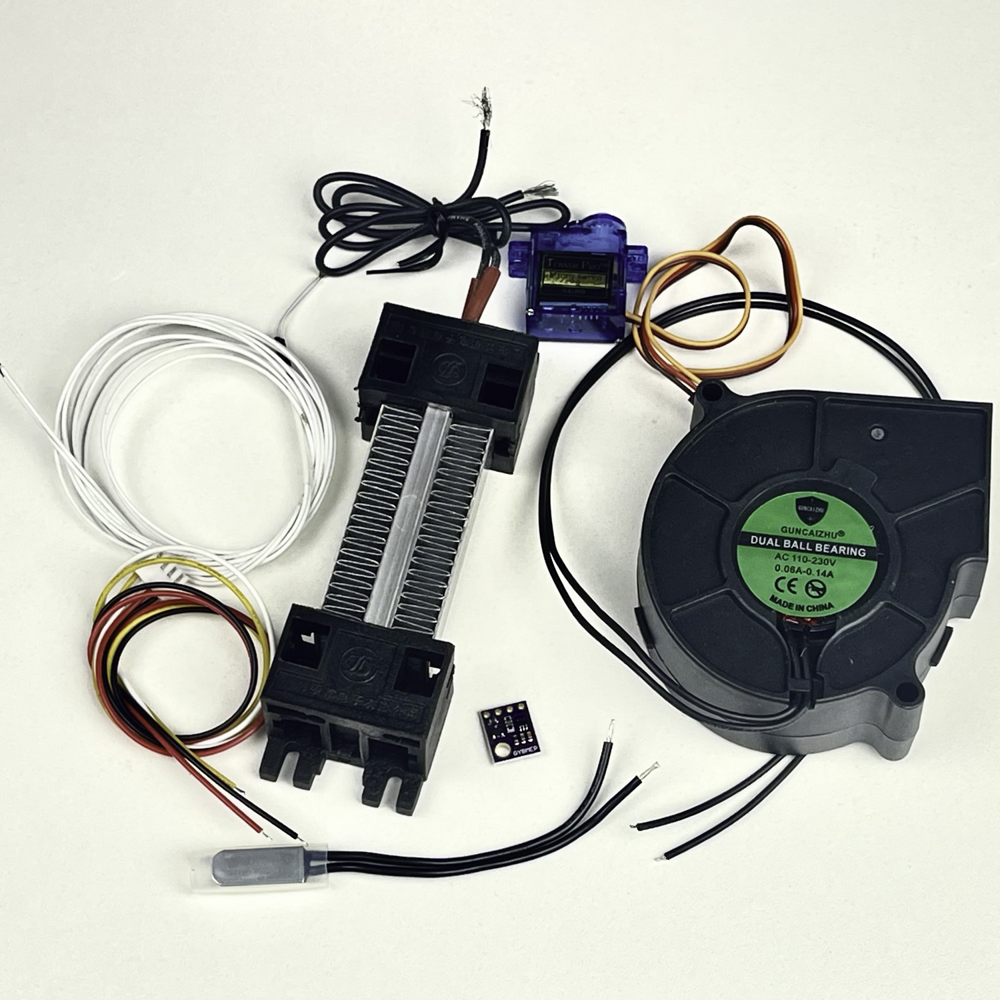
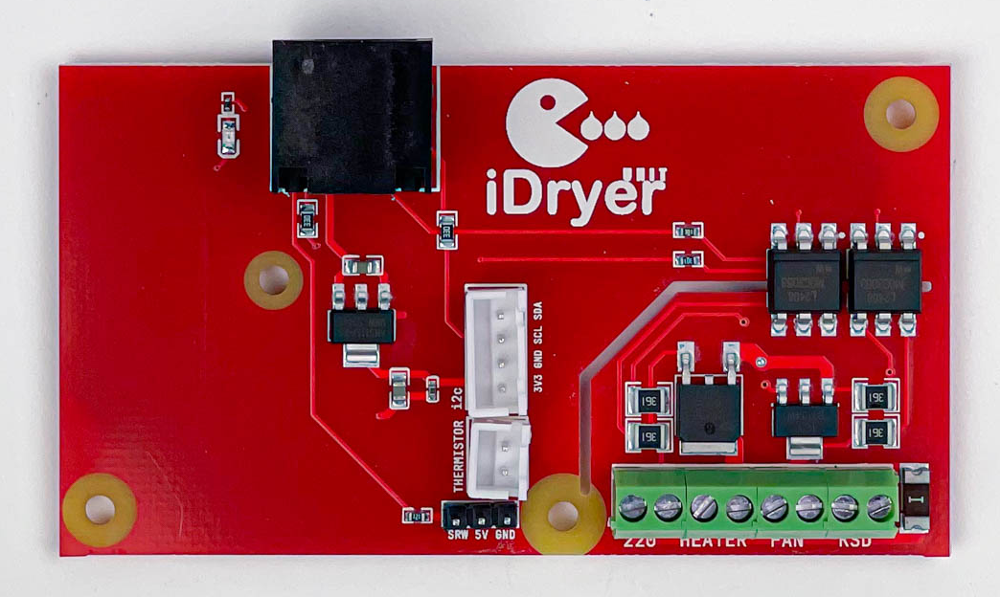
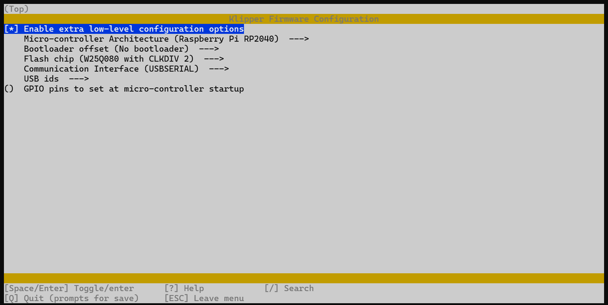
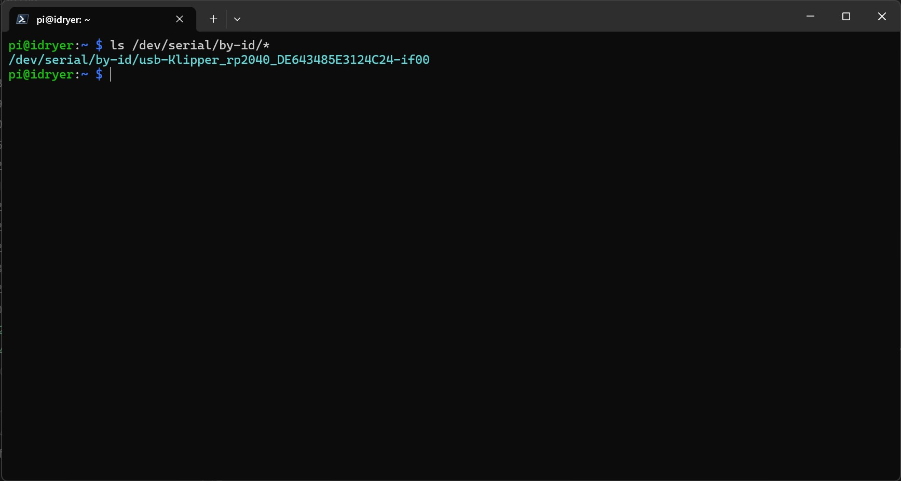

[](https://t.me/iDryer)  [](https://www.youtube.com/@iDryerProject) [](https://github.com/pavluchenkor/iDryer-Unit)

# iDryer Unit - система сушки пластика для 3D-принтеров на базе Klipper
### Релиз проекта


Этот проект представляет собой модульную систему управления сушкой пластика для 3D-принтеров, которая поддерживает до четырех сушильных блоков с индивидуальными настройками температуры и влажности. Система позволяет задавать температуру до 90°C и поддерживает режим хранения при минимальной влажности для предотвращения повторного набора влаги филаментом.

Кроме того, iDryer Unit поддерживает подключение к Telegram-боту для уведомлений о статусе сушки, завершении процессов и событий, таких как перегрев или окончание цикла. Для визуальной индикации можно использовать адресные светодиоды: отдельный выход на плате MCU позволяет подключить ленту и настроить её для отображения различных состояний (например, активный режим сушки, завершение цикла или ошибки). Система может использовать функционал Klipper для отображения данных о температуре, влажности, остатке времени сушки, а также автоматического логирования событий и интеграции с макросами. Поддерживаются сложные пользовательские профили и расширенные сценарии, такие как запуск по расписанию, настройка уведомлений по критическим событиям и активация дополнительных функций подсветки, например, смена цветов при переходе из одного режима в другой.



## Особенности проекта

  

- **Режимы работы: сушка и хранение.**: Возможность сушки пластика при температуре до 90°C и поддержание оптимальной температуры и влажности для хранения пластика.
- **Модульная структура:**:

  - **iDryer Unit MCU** — основной блок с микроконтроллером (MCU), управляющий всей системой.

  - **iDryer Unit EXT** — модули расширения без микроконтроллера, подключаемые к основному блоку. Можно подключить до трех таких блоков для увеличения емкости системы.

- **Интеграция с Klipper:** отображение всех параметров сушки в интерфейсе Klipper.

- **Подключение Telegram-бота:** получение уведомлений о текущем состоянии и завершении процесса.

- **Визуальная индикация:** использование адресных светодиодов для отображения режимов работы.

- **Печатаемый корпус:** доступен в вариантах для одной катушки и для двух катушек. Подходит для катушек шириной до 85 мм и диаметром до 200 мм. Корпус можно напечатать на 3D-принтере из ABS или другого подходящего пластика.

- **Гибкость системы:** поддержка до 4 сушильных блоков с индивидуальными настройками. Каждая сушилка может обслуживать одну или две катушки пластика одновременно.

- **Подключение дополнительных модулей**: Дополнительные сушилки подключаются к управляющей с помощью патчкордов через RJ45 разъёмы для надёжной связи.

- **Централизованная архитектура**: Одна сушилка оснащена MCU и выступает в роли управляющего блока, остальные сушилки подключаются к ней и управляются через периферию. Также возможна настройка iDryer как отдельного экземпляра Klipper для работы с отдельной системой управления или как второго MCU, подключенного к основной плате принтера на один экземпляр Klipper.

- **Безопасность:** встроенный термостат KSD9700 на 130°C и алгоритмы безопасности Klipper.

- **Эффективность сушки**: За счет использования датчика влажности и системы проветривания камеры, которая управляется сервоприводом заслонки по расписанию, достигаются оптимальные результаты сушки пластика в кратчайшие сроки.
  
  


## Преимущества использования

- **Улучшенное качество печати**: Сухой пластик обеспечивает стабильную экструзию и высокое качество печати.
- **Экономия времени**: возможность одновременно сушить до нескольких катуш
- **Эффективность**: Одновременная сушка нескольких катушек экономит время и повышает производительность.
- **Гибкость**: Система может быть расширена или настроена под конкретные нужды.
- **Визуализация**: светодиоды обеспечивают быструю оценку состояния устройства.
- **Безопасность**: Аппаратные и программные средства обеспечивают безопасную работу системы.

## Технические детали

- **iDryer Unit MCU**: основной блок управления с микроконтроллером.
- **iDryer Unit EXT**: модуль расширения без MCU.
- **MCU**: Используется для управления основной сушилкой и координации работы дополнительных модулей. По умолчанию подключается U1, остальные устройства (U2, U3, U4) можно подключить по необходимости для расширения системы. Возможна настройка iDryer как отдельного экземпляра Klipper для работы с отдельной системой управления (например, на Raspberry Pi, с двумя экземплярами Klipper: один для принтера, другой для сушилки) или как второго MCU, подключенного к основной плате принтера на один экземпляр Klipper.
- **Термостат KSD9700**: Биметаллический термостат на 130°C обеспечивает защиту в аварийной ситуации и отключает нагреватель.
- **Температурный режим**: Сушка проводится при температуре до 90°C, что подходит для большинства видов пластика.
- **Интерфейсы подключения**: RJ45 разъёмы используются для соединения между сушилками, что упрощает монтаж и обеспечивает надёжное соединение.
- **Выход для светодиодной ленты**: позволяет подключить адресные светодиоды для визуальной индикации.

## Режимы работы

**1. Режим сушки (DRYING)**

- Настройка температуры и времени сушки.
- Автоматический переход в режим хранения по завершении цикла.

**2. Режим хранения (STORAGE)**

- Поддержание температуры и минимальной влажности.
- Включение нагревателя и вентилятора при превышении заданных параметров.

## Установка и настройка

1. **Сборка оборудования**: Соберите основную сушилку с MCU и необходимые дополнительные модули.
2. **Подключение**: Соедините дополнительные модули с управляющей сушилкой с помощью патчкордов через RJ45 разъёмы. По умолчанию подключается U1, а дополнительные модули (U2, U3, U4) можно подключить, добавив соответствующие конфигурационные файлы.
3. **Настройка Klipper**: Интегрируйте систему сушки в конфигурацию Klipper.
4. **Тестирование**: Проверьте работу системы и убедитесь в корректности отображения данных в интерфейсе Klipper.

## Требования

- 3D-принтер с установленной прошивкой актуальной Klipper.
- плата iDryer с MCU для основной сушилки.
- Термостат KSD9700 на 130°C для каждой сушилки.
- RJ45 патчкорды и разъёмы для подключения дополнительных модулей к основной сушилке.
- Дополнительные платы управления iDryer Unit по количеству подключаемых сушилок.

---

# Конфигурация iDryer для Klipper

Этот репозиторий содержит конфигурационные файлы для сушилки пластика iDryer, основанной на прошивке Klipper и плате управления iDryer Unit с микроконтроллером RP2040. Конфигурация предназначена для автоматизации процесса сушки пластика для 3D-принтеров, включая контроль температуры и влажности.

## Оглавление

- [Требования](#требования)
- [Подготовка](#подготовка)
- [Установка прошивки на iDryer Unit](#установка-прошивки-на-idryer-unit)
- [Конфигурация Klipper](#конфигурация-klipper)
  - [Подключение MCU iDryer](#подключение-mcu-idryer)
  - [Настройка нагревателя](#настройка-нагревателя)
  - [Настройка вентилятора](#настройка-вентилятора)
  - [Настройка датчиков температуры и влажности](#настройка-датчиков-температуры-и-влажности)
  - [Макросы G-кода](#макросы-г-кода)
- [Использование](#использование)
- [Модели для 3д печати](#модели-для-печати)
- [Примечания](#примечания)

## Требования

- **Аппаратное обеспечение:**

  - Плата управления iDryer Unit с микроконтроллером RP2040
  
  
  - Терморезистор NTC 100K для контроля температуры (или любой другой датчик, поддерживаемый прошивкой Klipper)
  - Нагревательный элемент (оптимально 220В, 100Вт)
  - Вентилятор для циркуляции воздуха в сушилке
  - Датчик температуры и влажности (например, SHT3X, но может быть любой другой, поддерживаемый Klipper) &#x20;
  - Дополнительная плата
 


- **Программное обеспечение:**

  - Klipper (последняя версия)
  - Настроенный 3D-принтер с прошивкой Klipper

## Подготовка

1. **Сборка аппаратной части:**

   - Подключите нагревательный элемент и вентилятор к плате iDryer Unit.
   - Установите терморезистор и датчик SHT3X (или любой другой поддерживаемый датчик температуры/влажности) в сушилке и подключите их к соответствующим пинам на плате.

2. **Установка необходимых файлов:**

   - Скопируйте файлы `rp2040_pin_aliases.cfg`, `iDryer.cfg` и другие конфигурационные файлы в директорию конфигурации Klipper.

## Установка прошивки на iDryer Unit

### 1. Подготовка прошивки:

Если прошивка для RP2040 ещё не установлена:

- В меню конфигурации прошивки Klipper:
  - Войдите в меню конфигурации, используя команду в терминале.
  
```bash
make menuconfig
```
  
  - Выберите архитектуру **RP2040**.

  - Остальные параметры оставьте по умолчанию.

### 2. Сборка прошивки:

Выполните сборку прошивки:

```bash
make
```

### 3. Установка прошивки на iDryer Unit:

- Подключите плату iDryer Unit к компьютеру в режиме программирования (удерживая кнопку BOOT при подключении).

    ***эта секция может отличаться в зависимости от архитектуры и OS хоста***

- Смонтируйте устройство и загрузите прошивку:

```bash
sudo mount /dev/sda1 /mnt
sudo cp out/klipper.uf2 /mnt
sudo umount /mnt
```

## Конфигурация Klipper

### 1. Включение конфигурации iDryer:

В файл `printer.cfg` необходимо добавить строку для включения конфигурационного файла `iDryer.cfg`:

```ini
[include iDryer.cfg]
```

### Подключение MCU iDryer

[Найдите серийный порт вашего микроконтроллера:](https://www.klipper3d.org/Installation.html#building-and-flashing-the-micro-controller)



```bash
ls /dev/serial/by-id/*
```
и укажите его в конфигурационном файле

```ini
[mcu]
serial: /dev/serial/by-id/usb-Klipper_rp2040_DE63581213745233-if00
```

По умолчанию подключен U1, однако вы можете подключить дополнительные модули, такие как U2, U3, U4, добавив соответствующие конфигурационные файлы:

```ini
[include U1.cfg]
[include U2.cfg]
[include U3.cfg]
[include U4.cfg]
```

Таким образом, система может быть расширена для управления несколькими сушилками. iDryer может быть настроен как отдельный экземпляр Klipper, установленный на Raspberry Pi, для независимой работы или как второй MCU, подключённый к основной плате принтера и использующий один экземпляр Klipper:

```ini
[mcu iDryer]
serial: /dev/serial/by-id/usb-Klipper_rp2040_DE63581213745233-if00
```

### Настройка нагревателя

```ini
[heater_generic iDryer_U1_Heater]
heater_pin: H_U1
# if your iDryer is used as a second MCU use
# heater_pin: iDryer:H_U1
# and change everywhere!
max_power: 1
sensor_type: NTC 100K MGB18-104F39050L32 #Generic 3950
sensor_pin: T_U1
control: pid
pwm_cycle_time: 0.3
min_temp: 0
max_temp: 120
pid_Kp=32.923
pid_Ki=5.628
pid_Kd=48.150
```

### Настройка вентилятора

```ini
[heater_fan Fan_U1]
fan_speed: 1
pin: FAN_U1
heater: iDryer_U1_Heater
heater_temp: 55
```

### Настройка датчиков температуры и влажности

Вы можете использовать любой датчик температуры и влажности, поддерживаемый Klipper. В примере используется датчик **SHT3X**, подключённый через интерфейс I2C. Датчики для сушилок U1 и U2 подключены к одной шине I2C, а датчики для сушилок U3 и U4 подключены к другой шине I2C. Адреса датчиков на каждой шине должны отличаться:

```ini
[temperature_sensor iDryer_U1_Air]
sensor_type: SHT3X
i2c_address: 68
i2c_software_sda_pin: gpio20 #second HW version - green PCB | i2c_software_sda_pin: gpio18 #first HW version - red PCB
i2c_software_scl_pin: gpio21 #second HW version - green PCB | # i2c_software_scl_pin: gpio19 #first HW version - red PCB

```

**Примечание:** Если вы используете другой датчик температуры или влажности, проверьте документацию Klipper для соответствующей конфигурации.

### Макросы G-кода

Для управления процессом сушки с возможностью установки температуры для разных материалов, используйте следующие макросы:

```ini
[gcode_macro OFF_U1]
gcode:
    UPDATE_DELAYED_GCODE ID=_UPDATE_U1 DURATION=0
    UPDATE_DELAYED_GCODE ID=_TOGGLE_SERVO_U1 DURATION=0
    SET_HEATER_TEMPERATURE HEATER=iDryer_U1_Heater TARGET=0


[gcode_macro PLA_U1]
variable_unit_temp: 55
variable_unit_duration: 180
gcode:
    DRY_U1 UNIT_TEMPERATURE={unit_temp} HUMIDITY=10 TIME={unit_duration}


[gcode_macro PETG_U1]
variable_unit_temp: 65
variable_unit_duration: 240
gcode:
    DRY_U1 UNIT_TEMPERATURE={unit_temp} HUMIDITY=10 TIME={unit_duration}


[gcode_macro TPU_U1]
variable_unit_temp: 60
variable_unit_duration: 300
gcode:
    DRY_U1 UNIT_TEMPERATURE={unit_temp} HUMIDITY=10 TIME={unit_duration}


[gcode_macro ABS_U1]
variable_unit_temp: 80
variable_unit_duration: 240
gcode:
    DRY_U1 UNIT_TEMPERATURE={unit_temp} HUMIDITY=10 TIME={unit_duration}


[gcode_macro PA_U1]
variable_unit_temp: 90
variable_unit_duration: 240
gcode:
    DRY_U1 UNIT_TEMPERATURE={unit_temp} HUMIDITY=10 TIME={unit_duration}

```

### Макрос для обновления данных:

```ini
[delayed_gcode _UPDATE_U1]
gcode:
    
    
    
    
    # { action_respond_info("Unit_1 T: %s H: %.2f%%" %(temperature, printer["sht3x iDryer_U1_Air"].humidity))}
    
    
        
    
        
    
        
         
            
        
    
    
    SET_HEATER_TEMPERATURE HEATER=iDryer_U1_Heater TARGET={target_temp|int}
    UPDATE_DELAYED_GCODE ID=_UPDATE_U1 DURATION=1
```

### Макросы для установки температуры:

- Для ABS-пластика:

```gcode
ABS_U1
```

- Для нейлона:

```gcode
PA_U1
```

- Для поликарбоната:

```gcode
PC_U1
```

## Использование

- Установка температуры для сушки:

```gcode
DRY_UNIT1 UNIT_TEMPERATURE=60
```

- Остановка нагрева:

```gcode
iDryer_OFF  ; Отключить нагрев сушилки
```

### Модели для печати
!!! success "🛠️ Файлы для печати"

    
    **[База MCU](CAD/v3/UNIT%20MCU%20Base%20screw%20mounting.stl)**

    **[База EXT](CAD/v3/UNIT%20EXT%20Base%20screw%20mounting.stl)**

    **[Верхняя крышка](CAD/v3/UNIT%20Top%20Cover%20screw%20mounting.stl)**

    **[Задняя крышка отсека электроники EXT](CAD/v3/UNIT%20EXT%20Back%20Cover.stl)**

    **[Задняя крышка отсека электроники MCU](CAD/v3/UNIT%20MCU%20Back%20Cover.stl)**
    
    **[Левая крышка отсека электроники](CAD/v3/UNIT%20Left%20Cover.stl	)**

    **[Правая крышка отсека электроники](CAD/v3/UNIT%20Right%20Cover.stl	)**

    **[Ручка-защелка](CAD/v3/UNIT%20Latch%20Handle.stl	)**

    **[Защелка](CAD/v3/UNIT%20Latch.stl	)**


    **[Выход филамента](CAD/v3/UNIT%20Filament%20Outlet.stl)**

    **[Пол](CAD/v3/UNIT%20Floor.stl)**

    **[Фиксатор датчика](CAD/v3/UNIT%20Floor%20Sensor%20Retainer.stl)**


    **[Рассеиватель  MCU](CAD/v3/UNIT%20MCU%20Light%20diffuser.stl)**

    **[Разделитль 1 MCU](CAD/v3/UNIT%20MCU%20Light%20separator.stl)**
    
    **[Разделитль 2 MCU](CAD/v3/UNIT%20MCU%20Light%20separator%202.stl)**
    
    **[Разделитль 3 MCU](CAD/v3/UNIT%20MCU%20Light%20separator%203.stl)**
    
    **[Разделитль 4 MCU](CAD/v3/UNIT%20MCU%20Light%20separator%204.stl)**


    **[Заслонка](CAD/v3/UNIT%20Servo%20damper.stl)**
    
    **[Корпус заслонки низ](CAD/v3/UNIT%20Servo%20damper%20Lower%20Housing.stl)**
    
    **[Корпус заслонки верх](CAD/v3/UNIT%20Servo%20damper%20Upper%20Housing.stl)**


    
    **[Логотип](CAD/v3/UNIT%20Logo%20Plate.stl	)**
    
    **[Табличка 1](CAD/v3/UNIT%20Name%20Plate%201.stl	)**
    
    **[Табличка 2](CAD/v3/UNIT%20Name%20Plate%202.stl	)**
    
    **[Табличка 3](CAD/v3/UNIT%20Name%20Plate%203.stl	)**
    
    **[Табличка 4](CAD/v3/UNIT%20Name%20Plate%204.stl	)**
    
    **[Опора](CAD/v3/UNIT%20Foot.stl)**

    **[Заглушка](CAD/v3/UNIT%20Plug%201.stl)**

    **[Заглушка](CAD/v3/UNIT%20Plug%202.stl)**

    **Duo**

    **[Заглушка](CAD/v3/UNIT%20MCU%20duo%20Back%20Cover.stl)**

    **[Заглушка](CAD/v3/UNIT%20MCU%20duo%20Base%20screw%20mounting.stl)**

    **[Заглушка](CAD/v3/UNIT%20duo%20silica%20tray.stl)**

    **[Заглушка](CAD/v3/UNIT%20duo%20Top%20Cover%20screw%20mounting.stl)**


#### Параметры печати корпуса:

  - материал ABS, ABS-CF, ABS-GF, PP

  - ширина линии 0.6 - 0.8 (необходимо проверить чтобы при печати сформировались четкие камеры)

  - количество периметров 1
  
  - заполнение 10-15% 

  - шаблон заполнения прямолинейный

  - радиус закрытия пробелов(зазоров) 0.02

  Все детали корпуса печатаются без поддержек

### Файлы конфигурации
!!! success "📁 Файлы конфигурации"


    **[printer](printer.cfg)** | 
    **[iDryer](iDryer.cfg)** | 
    **[alias](rp2040_pin_aliases.cfg)** | 
    **[U1](U1.cfg)** | 
    **[U2](U2.cfg)** | 
    **[U3](U3.cfg)** | 
    **[U4](U4.cfg)** | 
  

## Обратная связь

Если у вас есть вопросы или предложения по улучшению системы, пожалуйста, создайте issue в этом репозитории или свяжитесь напрямую.

Или посетите группу в телеграм

## Примечания

- Убедитесь в правильности подключения датчиков температуры и влажности (например, SHT3X или другого).
- Для оптимального контроля температуры может потребоваться калибровка PID.
- Следите за показаниями температуры и влажности с помощью макросов для более точной настройки условий сушки.
- Проект находится в стадии разработки.

***Внимание: Использование нагревательных элементов и управление температурой связано с риском возгорания и повреждения оборудования. Всегда следуйте рекомендациям производителя и соблюдайте меры предосторожности и электробезопасности. Не оставляйте включенные электрические устройства без присмотра.***


### Вариант из подручных материалов

Вы можете собрать плату являвшуюся прототипом iDryer Unit самостоятельно и с минимальным бюджетом, это прототип и к нему нужно именно так и относиться

[Проект на Easyeda](https://oshwlab.com/pavluchenko.r/2channel-dimmer-bread-board)

### Плата принтера

Тоже отличный вариант для реализации которого потребуется старая плата принтера в качестве MCU и твердотельные реле для управления нагрузкой 110-220V 


[](https://t.me/iDryer)
[](https://www.youtube.com/@iDryerProject)
[](https://github.com/pavluchenkor/iDryer-Unit)
[](https://discord.gg/1332280943465201724)