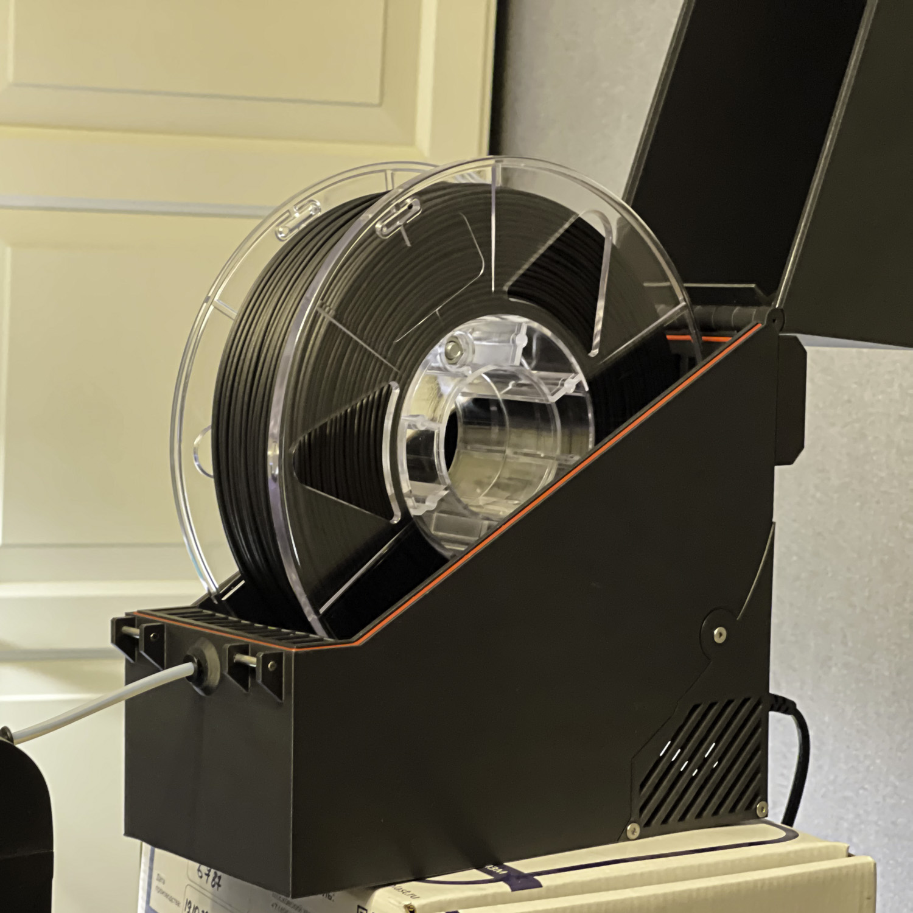
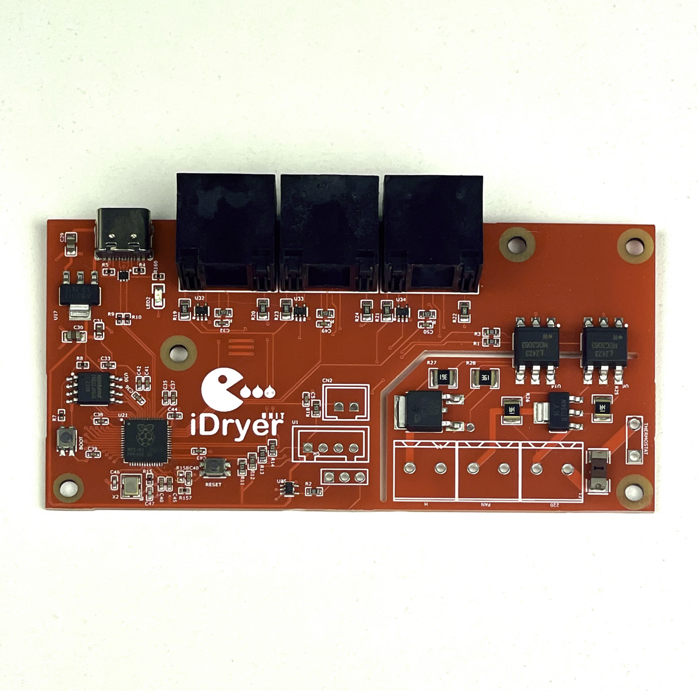
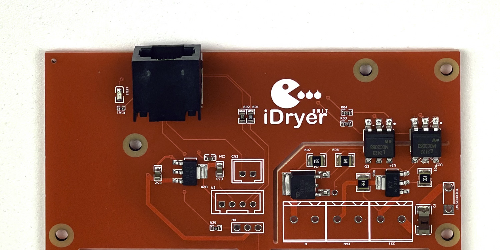

# iDryer Unit - Plastic Drying System for 3D Printers Based on Klipper


This project represents a plastic drying control system for 3D printers, running under the Klipper firmware and including up to four dryers with individual operating parameters.


## Project Features

  


- **Drying and Storage Mode**: Ability to dry plastic at temperatures up to 90°C and maintain optimal temperature and humidity for plastic storage.
- **Dryer Housing**: The housing is printed on a 3D printer.
- **Integration with Klipper**: All information about the drying process is displayed in the Klipper interface for convenient monitoring and control.
- **Centralized Architecture**: One dryer is equipped with an MCU and acts as the control unit, while other dryers are connected to it and managed through peripherals. It is also possible to configure iDryer as a separate instance of Klipper for operation with a separate control system or as a second MCU connected to the main printer board on a single Klipper instance.
- **Connection of Additional Modules**: Additional dryers are connected to the main unit using patch cords through RJ45 connectors for reliable communication.
- **Support for Up to Four Dryers**: Each dryer can service one or two spools of plastic simultaneously.
- **Safety**: Klipper safety algorithms and the use of a KSD9700 thermostat at 130°C to prevent accidents make the system safe for home use.
- **Drying Efficiency**: Optimal plastic drying results are achieved in the shortest possible time by using a humidity sensor and a venting system controlled by a servo-driven damper on schedule.

  
  

## Benefits of Use

- **Improved Print Quality**: Dry plastic ensures stable extrusion and high print quality.
- **Efficiency**: Simultaneous drying of multiple spools saves time and increases productivity.
- **Flexibility**: The system can be expanded or customized to meet specific needs.
- **Safety**: Hardware and software measures ensure the safe operation of the system.

## Technical Details

- **MCU**: Used to control the main dryer and coordinate the operation of additional modules. By default, U1 is connected, while other units (U2, U3, U4) can be connected as needed to expand the system. iDryer can be configured as a separate instance of Klipper for use with a separate control system (e.g., on a Raspberry Pi, with two instances of Klipper: one for the printer and one for the dryer) or as a second MCU connected to the main printer board on a single Klipper instance.
- **Thermostat KSD9700**: A 130°C bimetal thermostat ensures protection in emergency situations by turning off the heater.
- **Temperature Mode**: Drying is carried out at temperatures up to 90°C, which is suitable for most types of plastic.
- **Connection Interfaces**: RJ45 connectors are used to connect dryers, simplifying installation and ensuring reliable communication.

## Installation and Setup

1. **Equipment Assembly**: Assemble the main dryer with the MCU and any additional modules.
2. **Connection**: Connect the additional modules to the main dryer using patch cords through RJ45 connectors. By default, U1 is connected, and additional modules (U2, U3, U4) can be connected by adding the corresponding configuration files.
3. **Klipper Configuration**: Integrate the drying system into the Klipper configuration.
4. **Testing**: Verify system operation and ensure data is correctly displayed in the Klipper interface.

## Requirements

- 3D printer with Klipper firmware installed.
- iDryer board with MCU for the main dryer.
- KSD9700 thermostat at 130°C for each dryer.
- RJ45 patch cords and connectors for connecting additional modules to the main dryer.
- Additional iDryer Unit control boards for each connected dryer.

---

# iDryer Configuration for Klipper

This repository contains configuration files for the iDryer plastic dryer, based on Klipper firmware and the iDryer Unit control board with the RP2040 microcontroller. The configuration is intended to automate the plastic drying process for 3D printers, including temperature and humidity control.

## Table of Contents

- [Requirements](#requirements)
- [Preparation](#preparation)
- [Firmware Installation on iDryer Unit](#firmware-installation-on-idryer-unit)
- [Klipper Configuration](#klipper-configuration)
  - [Connecting iDryer MCU](#connecting-idryer-mcu)
  - [Heater Configuration](#heater-configuration)
  - [Fan Configuration](#fan-configuration)
  - [Temperature and Humidity Sensor Configuration](#temperature-and-humidity-sensor-configuration)
  - [G-Code Macros](#g-code-macros)
- [Usage](#usage)
- [Notes](#notes)

## Requirements

- **Hardware:**

  - iDryer Unit control board with RP2040 microcontroller
  
  
  - NTC 100K thermistor for temperature control (or any other sensor supported by Klipper firmware)
  - Heater element (optimally 220V, 100W)
  - Fan for air circulation in the dryer
  - Temperature and humidity sensor (e.g., SHT3X, but any other supported by Klipper can be used)
  - Additional Modules
   

- **Software:**

  - Klipper (latest version)
  - Configured 3D printer with Klipper firmware

## Preparation

1. **Hardware Assembly:**

   - Connect the heater element and fan to the iDryer Unit board.
   - Install the thermistor and SHT3X sensor (or any other supported temperature/humidity sensor) in the dryer and connect them to the appropriate pins on the board.

2. **File Installation:**

   - Copy the `rp2040_pin_aliases.cfg`, `iDryer.cfg`, and other configuration files to the Klipper configuration directory.

## Firmware Installation on iDryer Unit

### 1. Firmware Preparation:

If the firmware for RP2040 is not yet installed:

- In the Klipper firmware configuration menu:
  - Enter the configuration menu using the command in the terminal.

```bash
make menuconfig
```

  - Select the **RP2040** architecture.
  
  - Leave the remaining parameters as default.

### 2. Firmware Build:

Build the firmware:

```bash
make
```

### 3. Firmware Installation on iDryer Unit:

- Connect the iDryer Unit board to the computer in programming mode (holding the BOOT button while connecting).
- Mount the device and load the firmware:

```bash
sudo mount /dev/sda1 /mnt
sudo cp out/klipper.uf2 /mnt
sudo umount /mnt
```

## Klipper Configuration

### 1. Enabling iDryer Configuration:

Add a line to the `printer.cfg` file to include the `iDryer.cfg` configuration file:

```ini
[include iDryer.cfg]
```

### Connecting iDryer MCU

[Find the serial port of your microcontroller and specify it in the configuration file:](https://www.klipper3d.org/Installation.html#building-and-flashing-the-micro-controller)


```bash
ls /dev/serial/by-id/*
```

```ini
[mcu]
serial: /dev/serial/by-id/usb-Klipper_rp2040_DE63581213745233-if00
```

By default, U1 is connected, but you can connect additional modules such as U2, U3, U4 by adding the corresponding configuration files:

```ini
[include U1.cfg]
[include U2.cfg]
[include U3.cfg]
[include U4.cfg]
```

Thus, the system can be expanded to control multiple dryers. iDryer can be configured as a separate instance of Klipper installed on a Raspberry Pi for independent operation or as a second MCU connected to the main printer board and using a single Klipper instance:

```ini
[mcu iDryer]
serial: /dev/serial/by-id/usb-Klipper_rp2040_DE63581213745233-if00
```

### Heater Configuration

```ini
[heater_generic iDryer_M_Heater]
heater_pin: H0
max_power: 1
sensor_type: NTC 100K MGB18-104F39050L32
sensor_pin: T0
control: pid
pwm_cycle_time: 0.3
min_temp: 0
max_temp: 120
pid_Kp=32.923
pid_Ki=5.628
pid_Kd=48.150
```

### Fan Configuration

```ini
[heater_fan Master_Fan]
fan_speed: 1
pin: FAN0
heater: iDryer_M_Heater
heater_temp: 55
```

### Temperature and Humidity Sensor Configuration

You can use any temperature and humidity sensor supported by Klipper. In the example, an **SHT3X** sensor is used, connected via the I2C interface. The sensors for U1 and U2 are connected to one I2C bus, and the sensors for U3 and U4 are connected to another I2C bus. The sensor addresses on each bus must be different:

```ini
[temperature_sensor iDryer_M_Air]
sensor_type: SHT3X
i2c_address: 68
i2c_software_sda_pin: gpio18
i2c_software_scl_pin: gpio19
```

**Note:** If you are using a different temperature or humidity sensor, check the Klipper documentation for the appropriate configuration.

### G-Code Macros

To control the drying process with the ability to set the temperature for different materials, use the following macros:

```ini
[gcode_macro iDryer_OFF]
gcode:
    SET_HEATER_TEMPERATURE HEATER=iDryer_M_Heater TARGET=0
    UPDATE_DELAYED_GCODE ID=_UPDATE_UNIT1_DATA DURATION=0
    UPDATE_DELAYED_GCODE ID=_TOGGLE_SERVO1 DURATION=0

[gcode_macro DRY_UNIT1]
gcode:
    
    SET_GCODE_VARIABLE MACRO=DRY_MODE_U1 VARIABLE=temp VALUE={unit_temp}

[gcode_macro ABS_U1]
variable_unit_temp: 80
variable_unit_duration: 240
gcode:
    DRY_MODE_U1 UNIT_TEMPERATURE={unit_temp} HUMIDITY=10 TIME={unit_duration}

[gcode_macro PA_U1]
variable_unit_temp: 90
variable_unit_duration: 240
gcode:
    DRY_MODE_U1 UNIT_TEMPERATURE={unit_temp} HUMIDITY=10 TIME={unit_duration}

[gcode_macro PETG_U1]
variable_unit_temp: 65
variable_unit_duration: 240
gcode:
    DRY_MODE_U1 UNIT_TEMPERATURE={unit_temp} HUMIDITY=10 TIME={unit_duration}

[gcode_macro PLA_U1]
variable_unit_temp: 55
variable_unit_duration: 240
gcode:
    DRY_MODE_U1 UNIT_TEMPERATURE={unit_temp} HUMIDITY=10 TIME={unit_duration}
```

### Data Update Macro:

```ini
[delayed_gcode _UPDATE_UNIT1_DATA]
gcode:
    
    
    
    
    { action_respond_info("Unit_1 T: %s H: %.2f%%" %(temperature, printer["sht3x iDryer_M_Air"].humidity)) }
    
    
        
    
        
    
        
        
            
        
    
    
    SET_HEATER_TEMPERATURE HEATER=iDryer_M_Heater TARGET={target_temp|int}
    UPDATE_DELAYED_GCODE ID=_UPDATE_UNIT1_DATA DURATION=1
```

### Temperature Setting Macros:

- For ABS plastic:

```gcode
ABS_U1
```

- For PLA plastic:

```gcode
PLA_U1
```

- For PETG plastic:

```gcode
PETG_U1
```

## Usage

- Set the drying temperature:

```gcode
DRY_UNIT1 UNIT_TEMPERATURE=60
```

- Stop heating:

```gcode
iDryer_OFF  ; Turn off the dryer heater
```

## Feedback

If you have questions or suggestions for improving the system, please create an issue in this repository or contact us directly.

## Notes

- Ensure correct connection of temperature and humidity sensors (e.g., SHT3X or others).
- PID calibration may be required for optimal temperature control.
- Monitor temperature and humidity readings using macros for more accurate drying conditions adjustment.
- The project is under development.

***Warning: The use of heating elements and temperature control carries a risk of fire and equipment damage. Always follow manufacturer recommendations and observe safety and electrical precautions. Do not leave electrical devices unattended.***

