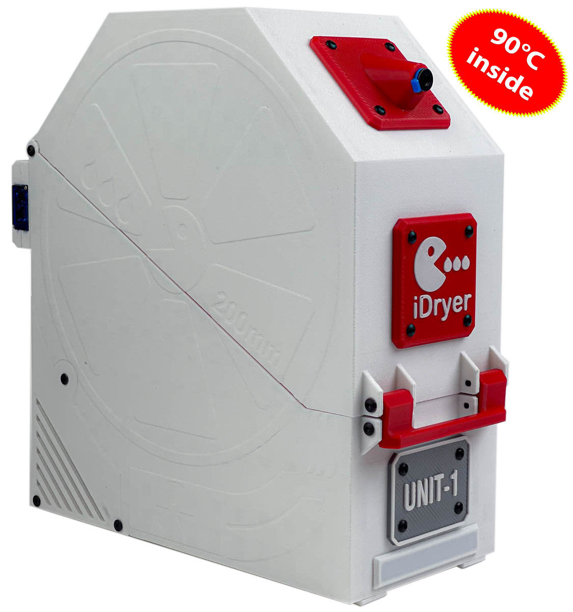

[](https://t.me/iDryer)  [](https://www.youtube.com/@iDryerProject) [](https://github.com/pavluchenkor/iDryer-Unit)

# iDryer UNIT - Plastic Drying System for 3D Printers Based on Klipper
### Release


This project is a modular plastic drying management system for 3D printers, supporting up to four drying units with individual temperature and humidity settings. The system allows setting temperatures up to 90°C and includes a storage mode with minimal humidity to prevent re-absorption of moisture by the filament.

Additionally, iDryer UNIT supports Telegram bot notifications about drying status, completion of processes, and events such as overheating or cycle completion. For visual indication, addressable LEDs can be used: the MCU board includes an output for connecting a strip, which can be configured to display various states (e.g., active drying mode, cycle completion, or errors). The system can leverage Klipper functionality to display temperature, humidity, and remaining drying time, while also automatically logging events and integrating with macros. Complex user profiles and advanced scenarios are supported, such as scheduled start, critical event notifications, and activation of additional lighting functions (e.g., color changes when transitioning between modes).


## Project Features


- **Operating modes: Drying and Storage.**: Drying plastic at up to 90°C and maintaining optimal temperature and humidity for storage.
- **Modular Structure:**:

  - **iDryer UNIT MCU** — the main UNIT with a microcontroller (MCU) that controls the entire system.

  - **iDryer UNIT EXT** — extension modules without a microcontroller, connected to the main unit. Up to three extension modules can be added to increase system capacity.

- **Klipper Integration:** Displays all drying parameters in the Klipper interface.

- **Telegram Bot Connection:** Receive notifications about the current status and process completion.

- **Visual Indication:** Addressable LEDs can be used to display operating modes.

- **Printable Enclosure:** Available in versions for one or two spools. Suitable for spools up to 85 mm wide and 200 mm in diameter. The enclosure can be printed on a 3D printer using ABS or other suitable plastic.

- **System Flexibility:** Supports up to 4 drying units with individual settings. Each dryer can handle one or two spools of plastic simultaneously.

- **Connection of Additional Modules**: Additional dryers are connected to the controller using patch cords via RJ45 connectors for reliable communication.

- **Centralized Architecture**: One dryer is equipped with an MCU and serves as the controller, while other dryers are connected to it and controlled via peripherals. iDryer can also be configured as a separate Klipper instance for independent operation or as a second MCU connected to the printer's mainboard in a single Klipper instance.

- **Safety:** Built-in KSD9700 thermostat at 130°C and Klipper safety algorithms.

- **Drying Efficiency**: Optimal drying results are achieved in minimal time using a humidity sensor and a chamber ventilation system controlled by a servo damper according to a schedule.
  
  

## Usage Benefits

- **Improved Print Quality**: Dry filament ensures stable extrusion and high-quality printing.
- **Time Saving**: Ability to dry multiple spools simultaneously.
- **Efficiency**: Simultaneous drying of multiple spools saves time and increases productivity.
- **Flexibility**: The system can be expanded or customized to specific needs.
- **Visualization**: LEDs provide quick status assessment.
- **Safety**: Hardware and software features ensure safe system operation.

## Technical Details

- **iDryer UNIT MCU**: Main control UNIT with a microcontroller.
- **iDryer UNIT EXT**: Extension module without an MCU.
- **MCU**: Used to control the main dryer and coordinate additional modules. By default, U1 is connected, while additional devices (U2, U3, U4) can be connected as needed to expand the system. iDryer can be configured as a standalone Klipper instance on a Raspberry Pi, operating independently, or as a second MCU connected to the printer's mainboard in a single Klipper instance.
- **KSD9700 Thermostat**: A bimetallic thermostat at 130°C ensures safety in emergency situations by disabling the heater.
- **Temperature Range**: Drying is conducted at temperatures up to 90°C, suitable for most types of plastic.
- **Connection Interfaces**: RJ45 connectors are used for connections between dryers, simplifying installation and ensuring reliable connections.
- **LED Strip Output**: Allows connecting addressable LEDs for visual indication.

## Operating Modes

**1. Drying Mode (DRYING)**

- Set drying temperature and time.
- Automatically switches to storage mode after the cycle ends.

**2. Storage Mode (STORAGE)**

- Maintains temperature and minimal humidity.
- Activates heater and fan if parameters exceed set thresholds.

## Installation and Setup

1. **Hardware Assembly**: Assemble the main dryer with an MCU and necessary extension modules.
2. **Connection**: Connect additional modules to the controller dryer using patch cords through RJ45 connectors. By default, U1 is connected, and additional modules (U2, U3, U4) can be added by including corresponding configuration files.
3. **Klipper Configuration**: Integrate the drying system into the Klipper configuration.
4. **Testing**: Verify system operation and ensure data is displayed correctly in the Klipper interface.

## Requirements

- A 3D printer with Klipper firmware installed.
- iDryer board with an MCU for the main dryer.
- KSD9700 thermostat at 130°C for each dryer.
- RJ45 patch cords and connectors for connecting additional modules to the main dryer.
- Additional iDryer UNIT control boards for each connected dryer.

---

# iDryer Configuration for Klipper

This repository contains configuration files for the iDryer plastic dryer based on Klipper firmware and the iDryer UNIT control board with an RP2040 microcontroller. The configuration automates the plastic drying process for 3D printers, including temperature and humidity control.

## Table of Contents

- [Requirements](#requirements)
- [Preparation](#preparation)
- [Installing Firmware on iDryer Unit](#installing-firmware-on-idryer-unit)
- [Klipper Configuration](#klipper-configuration)
  - [Connecting the iDryer MCU](#connecting-the-idryer-mcu)
  - [Heater Configuration](#heater-configuration)
  - [Fan Configuration](#fan-configuration)
  - [Temperature and Humidity Sensor Configuration](#temperature-and-humidity-sensor-configuration)
  - [G-code Macros](#g-code-macros)
- [Usage](#usage)
- [3D Printing Models](#3d-printing-models)
- [Notes](#notes)

## Requirements

- **Hardware:**

  - iDryer UNIT control board with an RP2040 microcontroller
  
  
  - NTC 100K thermistor for temperature control (or any other sensor supported by Klipper)
  - Heater element (ideally 220V, 100W)
  - Fan for air circulation in the dryer
  - Temperature and humidity sensor (e.g., SHT3X, or any other supported by Klipper)
  - Additional control board
 

- **Software:**

  - Klipper (latest version)
  - Configured 3D printer with Klipper firmware

## Preparation

1. **Hardware Assembly:**

   - Connect the heating element and the fan to the iDryer UNIT control board.
   - Install the thermistor and the SHT3X sensor (or any other supported temperature/humidity sensor) in the dryer and connect them to the appropriate pins on the board.


2. **Installing Necessary Files:**

   - Copy the files `rp2040_pin_aliases.cfg`, `iDryer.cfg`, and other configuration files into the Klipper configuration directory.

## Installing Firmware on iDryer Unit

### 1. Preparing the Firmware:

If the firmware for RP2040 has not been installed yet:

- In the Klipper firmware configuration menu:
  - Enter the configuration menu using the terminal command.

  
```bash
make menuconfig
```
  
  - Select the **RP2040** architecture.

  - Leave the remaining parameters as default.

### 2. Building the Firmware:

Run the command to build the firmware:

```bash
make
```

### 3. Installing the Firmware on iDryer Unit:

- Connect the iDryer UNIT board to your computer in programming mode (hold the BOOT button while connecting).

    ***This section may vary depending on the architecture and the host operating system.***

- Mount the device and upload the firmware:


```bash
sudo mount /dev/sda1 /mnt
sudo cp out/klipper.uf2 /mnt
sudo umount /mnt
```

## Klipper Configuration

### 1. Enabling the iDryer Configuration:

Add the following line to the `printer.cfg` file to include the `iDryer.cfg` configuration file:


```ini
[include iDryer.cfg]
```

### Connecting the iDryer MCU

[Find the serial port of your microcontroller:](https://www.klipper3d.org/Installation.html#building-and-flashing-the-micro-controller)


```bash
ls /dev/serial/by-id/*
```
and specify it in the configuration file:

```ini
[mcu]
serial: /dev/serial/by-id/usb-Klipper_rp2040_DE63581213745233-if00
```

By default, U1 is connected, but you can connect additional modules such as U2, U3, or U4 by adding the corresponding configuration files:

```ini
[include U1.cfg]
[include U2.cfg]
[include U3.cfg]
[include U4.cfg]
```

In this way, the system can be expanded to manage multiple dryers. The iDryer can be configured as a standalone Klipper instance installed on a Raspberry Pi for independent operation, or as a second MCU connected to the printer's mainboard and using a single Klipper instance:


```ini
[mcu iDryer]
serial: /dev/serial/by-id/usb-Klipper_rp2040_DE63581213745233-if00
```

### Heater Configuration

```ini
[heater_generic iDryer_U1_Heater]
heater_pin: H_U1
# if your iDryer is used as a second MCU use
# heater_pin: iDryer:H_U1
# and change everywhere!
max_power: 1
sensor_type: NTC 100K MGB18-104F39050L32 #Generic 3950
sensor_pin: T_U1
control: pid
pwm_cycle_time: 0.3
min_temp: 0
max_temp: 120
pid_Kp=32.923
pid_Ki=5.628
pid_Kd=48.150
```

### Fan Configuration

```ini
[heater_fan Fan_U1]
fan_speed: 1
pin: FAN_U1
heater: iDryer_U1_Heater
heater_temp: 55
```

### Temperature and Humidity Sensor Configuration

You can use any temperature and humidity sensor supported by Klipper. In this example, the **SHT3X** sensor is used, connected via the I2C interface. Sensors for dryers U1 and U2 are connected to one I2C bus, while sensors for dryers U3 and U4 are connected to another I2C bus. The sensor addresses on each bus must be unique:

```ini
[temperature_sensor iDryer_U1_Air]
sensor_type: SHT3X
i2c_address: 68
i2c_software_sda_pin: gpio20 #second HW version - green PCB | i2c_software_sda_pin: gpio18 #first HW version - red PCB
i2c_software_scl_pin: gpio21 #second HW version - green PCB | # i2c_software_scl_pin: gpio19 #first HW version - red PCB

```

**Note:** If you are using a different temperature or humidity sensor, refer to the Klipper documentation for the appropriate configuration.

### G-code Macros

To manage the drying process and set temperatures for different materials, use the following macros:

```ini
[gcode_macro OFF_U1]
gcode:
    UPDATE_DELAYED_GCODE ID=_UPDATE_U1 DURATION=0
    UPDATE_DELAYED_GCODE ID=_TOGGLE_SERVO_U1 DURATION=0
    SET_HEATER_TEMPERATURE HEATER=iDryer_U1_Heater TARGET=0


[gcode_macro PLA_U1]
variable_unit_temp: 55
variable_unit_duration: 180
gcode:
    DRY_U1 UNIT_TEMPERATURE={unit_temp} HUMIDITY=10 TIME={unit_duration}


[gcode_macro PETG_U1]
variable_unit_temp: 65
variable_unit_duration: 240
gcode:
    DRY_U1 UNIT_TEMPERATURE={unit_temp} HUMIDITY=10 TIME={unit_duration}


[gcode_macro TPU_U1]
variable_unit_temp: 60
variable_unit_duration: 300
gcode:
    DRY_U1 UNIT_TEMPERATURE={unit_temp} HUMIDITY=10 TIME={unit_duration}


[gcode_macro ABS_U1]
variable_unit_temp: 80
variable_unit_duration: 240
gcode:
    DRY_U1 UNIT_TEMPERATURE={unit_temp} HUMIDITY=10 TIME={unit_duration}


[gcode_macro PA_U1]
variable_unit_temp: 90
variable_unit_duration: 240
gcode:
    DRY_U1 UNIT_TEMPERATURE={unit_temp} HUMIDITY=10 TIME={unit_duration}

```

### Macro for Data Update:

```ini
[delayed_gcode _UPDATE_U1]
gcode:
    
    
    
    
    # { action_respond_info("Unit_1 T: %s H: %.2f%%" %(temperature, printer["sht3x iDryer_U1_Air"].humidity))}
    
    
        
    
        
    
        
         
            
        
    
    
    SET_HEATER_TEMPERATURE HEATER=iDryer_U1_Heater TARGET={target_temp|int}
    UPDATE_DELAYED_GCODE ID=_UPDATE_U1 DURATION=1
```

### Macros for Setting Temperature:

- For ABS filament:

```gcode
ABS_U1
```

- For PA filament:

```gcode
PA_U1
```

- For PС filament:

```gcode
PС_U1
```

## Usage

- Setting the drying temperature:

```gcode
DRY_UNIT1 UNIT_TEMPERATURE=60
```

- Stopping the heater:

```gcode
iDryer_OFF  ; Switch off the iDryer heating
```

### Printable Models
!!! success "🛠️ Printable Files"

        
    **[MCU Base](CAD/v3/UNIT%20MCU%20Base%20screw%20mounting.stl)**

    **[EXT Base](CAD/v3/UNIT%20EXT%20Base%20screw%20mounting.stl)**

    **[Top Cover](CAD/v3/UNIT%20Top%20Cover%20screw%20mounting.stl)**

    **[EXT Electronics Compartment Back Cover](CAD/v3/UNIT%20EXT%20Back%20Cover.stl)**

    **[MCU Electronics Compartment Back Cover](CAD/v3/UNIT%20MCU%20Back%20Cover.stl)**

    **[Electronics Compartment Left Cover](CAD/v3/UNIT%20Left%20Cover.stl)**

    **[Electronics Compartment Right Cover](CAD/v3/UNIT%20Right%20Cover.stl)**

    **[Latch Handle](CAD/v3/UNIT%20Latch%20Handle.stl)**

    **[Latch](CAD/v3/UNIT%20Latch.stl)**

    **[Filament Outlet](CAD/v3/UNIT%20Filament%20Outlet.stl)**

    **[Floor](CAD/v3/UNIT%20Floor.stl)**

    **[Sensor Retainer](CAD/v3/UNIT%20Floor%20Sensor%20Retainer.stl)**

    **[MCU Light Diffuser](CAD/v3/UNIT%20MCU%20Light%20diffuser.stl)**

    **[MCU Light Separator 1](CAD/v3/UNIT%20MCU%20Light%20separator.stl)**

    **[MCU Light Separator 2](CAD/v3/UNIT%20MCU%20Light%20separator%202.stl)**

    **[MCU Light Separator 3](CAD/v3/UNIT%20MCU%20Light%20separator%203.stl)**

    **[MCU Light Separator 4](CAD/v3/UNIT%20MCU%20Light%20separator%204.stl)**

    **[Damper](CAD/v3/UNIT%20Servo%20damper.stl)**

    **[Lower Housing for Damper](CAD/v3/UNIT%%20damper%20Lower%20Housing.stl)**

    **[Upper Housing for Damper](CAD/v3/UNIT%20Servo%20damper%20Upper%20Housing.stl)**

    **[Logo Plate](CAD/v3/UNIT%20Logo%20Plate.stl)**

    **[Name Plate 1](CAD/v3/UNIT%20Name%20Plate%201.stl)**

    **[Name Plate 2](CAD/v3/UNIT%20Name%20Plate%202.stl)**

    **[Name Plate 3](CAD/v3/UNIT%20Name%20Plate%203.stl)**

    **[Name Plate 4](CAD/v3/UNIT%20Name%20Plate%204.stl)**

    **[Foot](CAD/v3/UNIT%20Foot.stl)**

### Printing Parameters for the Enclosure:

- Material: ABS, ABS-CF, ABS-GF, PP
- Line width: 0.6–0.8 mm (ensure that clear chambers are formed during printing)
- Number of perimeters: 1
- Infill: 10–15%
- Infill pattern: Linear
- Closing gap radius: 0.02 mm

All enclosure parts can be printed without supports.


### Configuration Files
!!! success "📁 Configuration Files"

    **[printer](printer.cfg)** | 
    **[iDryer](iDryer.cfg)** | 
    **[alias](rp2040_pin_aliases.cfg)** | 
    **[U1](U1.cfg)** | 
    **[U2](U2.cfg)** | 
    **[U3](U3.cfg)** | 
    **[U4](U4.cfg)** | 
  

## Feedback

If you have questions or suggestions for improving the system, please create an issue in this repository or contact us directly.

Alternatively, join the Telegram group.

## Notes

- Ensure proper connection of temperature and humidity sensors (e.g., SHT3X or others).
- PID calibration may be required for optimal temperature control.
- Monitor temperature and humidity readings using macros for more precise drying condition adjustments.
- The project is under development.

***Warning: Using heating elements and temperature control involves risks of fire and equipment damage. Always follow manufacturer recommendations and adhere to safety and electrical precautions. Never leave powered devices unattended.***

### DIY Option

You can build the iDryer UNIT prototype board yourself with minimal budget. Please note that this is a prototype and should be treated as such.

[Project on Easyeda](https://oshwlab.com/pavluchenko.r/2channel-dimmer-bread-board)

### Printer Board Option

Another great implementation option involves using an old printer board as an MCU and solid-state relays to control a 110-220V load.


[](https://t.me/iDryer)
[](https://www.youtube.com/@iDryerProject)
[](https://github.com/pavluchenkor/iDryer-Unit)
[](https://discord.gg/1332280943465201724)