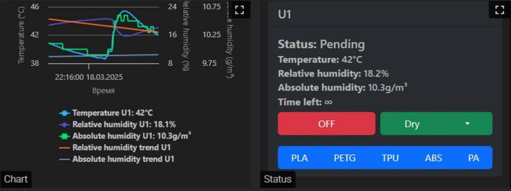

## **Руководство пользователя по настройке iDryer Unit**

### ⚠ Внимание! Работы с электрооборудованием повышенной опасности ⚠
Перед началом работы внимательно ознакомьтесь с мерами безопасности!

iDryer Unit содержит компоненты, работающие под высоким напряжением (220 В), а также открытые нагревательные элементы. Неправильное подключение или эксплуатация может привести к поражению электрическим током, возгоранию или выходу устройства из строя.


### **Подготовка к сборке**
Перед началом сборки необходимо выполнить следующие шаги:

- Убедиться в наличии всех комплектующих.
- Проверить подгонку всех деталей, особенно сопряжение движущихся частей.
- Убедиться в плавности и равномерности движения всех подвижных механизмов.

### **Предварительная проверка системы**
Рекомендуется сначала собрать всю систему **на столе**, без монтажа в корпус, и провести тестирование:

- Подключить все компоненты.
- Проверить работоспособность нагревателя, вентилятора, сервопривода заслонки и датчиков температуры.
- Подключить систему к **Klipper** и убедиться в корректной работе макросов.

После успешного тестирования можно монтировать комплектующие в корпус.
При финальной сборке укоротите провода датчиков и питания до минимально необходимой длины. 

---
## Использование `mcu` и `second_mcu`

В конфигурации Klipper секция `[mcu]` определяет основной микроконтроллер, осуществляющий управление 3D-принтером. Обычно он отвечает за шаговые двигатели, нагревательные элементы и сенсоры. В случае устройств вроде iDryer Unit, подключённых напрямую к управляющему хосту без основной платы принтера, основной микроконтроллер указывается в секции `[mcu]`.

Секция `[second_mcu]` применяется в случаях, когда используется дополнительный микроконтроллер. Это может быть необходимо при подключении внешних устройств или модулей расширения, таких как датчики, вентиляторы или платы управления, взаимодействующих с Klipper через USB, CAN или UART. В конфигурации с iDryer Unit, подключённым к основному хосту 3D-принтера, такой микроконтроллер указывается как `second_mcu`.

### Пример конфигурации

```
[mcu]
serial: /dev/ttyUSB0

[second_mcu my_board]
serial: /dev/ttyUSB1
```

---

## Установка конфигурационных файлов

1. Подключение к хосту:

```bash
ssh user_name@printer_address
```

2. Переход в директорию с конфигурацией:

```bash
cd ~/Printer_name/config/
```
Это может быть "klipper_config" или "Printer_data" в зависимости от версии и конфигурации установки

!!! note "Важно"

    Убедитесь, что в этой директории находится файл printer.cfg - основной конфигурационный файл Klipper.


=== "mcu"

    1 Загрузка скрипта установки:

    ```bash
    wget https://raw.githubusercontent.com/pavluchenkor/iDryer-Unit/main/sh/download_iDryer_mcu.sh
    ```

    2 Назначение прав на выполнение:

    ```bash
    chmod +x download_iDryer_mcu.sh
    ```

    3 Запуск скрипта:

    ```bash
    ./download_iDryer_mcu.sh
    ```

=== "second mcu"

    1 Загрузка скрипта установки:

    ```bash
    wget https://raw.githubusercontent.com/pavluchenkor/iDryer-Unit/main/sh/download_iDryer_second_mcu.sh
    ```

    2 Назначение прав на выполнение:

    ```bash
    chmod +x download_iDryer_second_mcu.sh
    ```

    3 Запуск скрипта:

    ```bash
    ./download_iDryer_second_mcu.sh
    ```


После выполнения будет создана директория, содержащая необходимые конфигурационные файлы.

#### В файле printer.cfg

Для подключения конфигурационных файлов iDryer к основной конфигурации Klipper принтера следует добавить соответствующую строку `include` в начале файла `printer.cfg`. Пример подключения можно найти в файле `example_printer.cfg`.

Файл printer.cfg после редактирования будет выглядеть примерно так

=== "mcu"
    ```
    ...
    [include iDryer_mcu/iDryer.cfg]
    ...
    ```
=== "second mcu"

    ```
    ...
    [include iDryer_second_mcu/iDryer.cfg]
    ...
    ```


### Файлы конфигурации

В случае если способ описанный выше невозможен, скачайте файлы, соответствующие конфигурации оборудования и переместите их при помощи интерфейса fluid или mainsail.

[скачать архив проекта с Github](https://github.com/pavluchenkor/iDryer-Unit/archive/refs/heads/main.zip)

#### В файле iDryer.cfg

В терминале

```
ls /dev/serial/by-id/*
```

результат

```
/dev/serial/by-id/usb-Klipper_rp2040_XXXXXXXXXXXXXXXX-XXXX
```

В фале iDryer.cfg в секции mcu заменить полученным ID

```ini
[mcu iDryer]
serial: /dev/serial/by-id/usb-Klipper_rp2040_XXXXXXXXXXXXXXXX-XXXX
```

По умолчанию в файле iDryer.cfg подключен первый юнит - U1, однако вы можете подключить дополнительные юниты, такие как U2, U3, U4, раскомментировав соответствующие конфигурационные файлы:

```ini
[include U1.cfg]
[include U2.cfg]
[include U3.cfg]
[include U4.cfg]
```
Таким образом, система может быть расширена для управления несколькими сушилками. iDryer может быть настроен как отдельный экземпляр Klipper, установленный на Raspberry Pi, для независимой работы или как второй MCU, подключённый к основной плате принтера и использующий один экземпляр Klipper.


## Настройка оборудования

### Настройка нагревателя

```ini
[heater_generic iDryer_U1_Heater]
heater_pin: H_U1
# if your iDryer is used as a second MCU use
# heater_pin: iDryer:H_U1
# and change everywhere!
max_power: 1
sensor_type: NTC 100K MGB18-104F39050L32 #Generic 3950
sensor_pin: T_U1
control: pid
pwm_cycle_time: 0.3
min_temp: 0
max_temp: 120
pid_Kp=32.923
pid_Ki=5.628
pid_Kd=48.150
```

### Настройка вентилятора

```ini
[heater_fan Fan_U1]
fan_speed: 1
pin: FAN_U1
#pin: iDryer:FAN_U1
heater: iDryer_U1_Heater
heater_temp: 55
```

### Настройка датчиков температуры и влажности

Вы можете использовать любой датчик температуры и влажности, поддерживаемый Klipper. В примере используется датчик **SHT3X**, подключённый через интерфейс I2C. Датчики для сушилок U1 и U2 подключены к одной шине I2C, а датчики для сушилок U3 и U4 подключены к другой шине I2C. Адреса датчиков на каждой шине должны отличаться:

```ini
[temperature_sensor iDryer_U1_Air]
i2c_mcu: iDryer
sensor_type: SHT3X
i2c_bus: i2c0f
i2c_address: 68 # 68 or 69
```

**Примечание:** Если вы используете другой датчик температуры или влажности, проверьте документацию Klipper для соответствующей конфигурации.


## **Финальная настройка системы**
### **Калибровка PID-регулятора нагревателя**
Перед эксплуатацией необходимо откалибровать **PID-регулятор** нагревателя.

- **Рекомендуемая температура сушки**: **90°C**.
- В конфигурации `iDryer.cfg` уже есть предварительные настройки PID, но рекомендуется провести **автокалибровку** для адаптации к конкретной системе.
  
**Калибровка:**

При закрытой крышке сушилки:
1. Открыть консоль Klipper.
2. Выполнить команду:
   ```
   PID_CALIBRATE HEATER=iDryer_U1_Heater TARGET=100
   ```
3. Дождаться завершения калибровки.
4. Записать полученные коэффициенты **Kp, Ki, Kd** в конфиг iDryer.cfg.

Пример секции нагревателя в `iDryer.cfg`:
```ini
[heater_generic iDryer_U1_Heater]
heater_pin: H_U1
max_power: 1
sensor_type: NTC 100K MGB18-104F39050L32
sensor_pin: T_U1
control: pid
pwm_cycle_time: 0.3
min_temp: 0
max_temp: 125
pid_Kp=29.625
pid_Ki=0.945
pid_Kd=232.186
```

---

### **Настройка параметра "variable_delta_high"**
Переменная `variable_delta_high` управляет разницей температур между нагревателем и камерой.

- **Начальное значение variable_delta_high:** 15°C
- Для корректной настройки:
  1. Установить `variable_delta_high=15`.
  2. Включить нагрев макросом `PA_U1`.
  3. Дождаться выхода температуры нагревателя на плато.
  4. Проверить температуру в камере:
      - **Если в камере 90°C** - необходимо оставить текущее значение `variable_delta_high`.
      - **Если температура ниже** - необходимо увеличить `variable_delta_high`.
  5. Для тестирования оставить сушилку работать **30 минут**, затем проверять состояние нагревателя **каждые 30-60 минут**.

**Важно!**  
Если нагреватель **прилипает к пластику**, значит, пластик не выдерживает температуру - необходимо снизить `variable_delta_high` перепечатать корпус други филаментом или изменить конструкцию крепления нагревателя.

**Отключение нагрева** - макрос OFF_U1

---

### **Настройка сервопривода заслонки**
Сервопривод управляет вентиляцией сушильной камеры.  

#### **Основные принципы работы серво**
- Серво управляется **ШИМ-сигналом**.
- Разные сервоприводы могут по-разному реагировать на одно и то же "ШИМ-значение".
- Настройка сервопривода должна быть **индивидуальной**.

#### **Настройка крайних положений заслонки**
1. **Не прикручивать заслонку к корпусу на первом этапе настройки**.
2. Определить **максимальные и минимальные** углы вращения серво:
   ```
   SET_SERVO SERVO=srv_U1 ANGLE=0
   ```
   ```
   SET_SERVO SERVO=srv_U1 ANGLE=90
   ```
3. Если серво упирается в корпус - скорректировать диапазон.

#### **Настройка в конфигурации**
В файле `iDryer.cfg` настроить:
```ini
[servo srv_U1]
pin: SRV_U1
maximum_servo_angle: 180
minimum_pulse_width: 0.00055
maximum_pulse_width: 0.002
```
Скорректировать значения углов variable_servo_open_angle и variable_servo_closed_angle : 

```
[gcode_macro DRY_U1]
variable_temp: 5
variable_humidity: 5
variable_duration: 5
variable_delta_high: 30
variable_servo_angle: 0
variable_servo_open_angle: 40 #degrees
variable_servo_closed_angle: 94 #degrees
variable_servo_open_time: 10 #second
variable_servo_closed_time: 300 #second
variable_data: {}
```

---

#### **Коррекция питания сервопривода**
Если используется несколько сервоприводов и возникают проблемы, рекомендуется воспользоваться **активным USB-хабом**.

Решение:
1. **Ограничение тока через резистор**  
   - Установить **резистор 4-10 Ом** в разрыв питания серво.
   - На платах 3-й ревизии установлены такие резисторы, но необходимое сопротивление может отличаться
   - Это поможет снизить пиковую нагрузку на USB порт хоста.
2. **Использование активного хаба**  
   - Подключение через USB-хаб с отдельным питанием поможет избежать перегрузки хост-системы.

---

## Описание работы системы
### Макросы G-кода

Для управления процессом сушки с возможностью установки температуры для разных материалов, используйте следующие макросы:

```ini
[gcode_macro OFF_U1]
gcode:
    UPDATE_DELAYED_GCODE ID=_UPDATE_U1 DURATION=0
    UPDATE_DELAYED_GCODE ID=_TOGGLE_SERVO_U1 DURATION=0
    SET_HEATER_TEMPERATURE HEATER=iDryer_U1_Heater TARGET=0


[gcode_macro PLA_U1]
variable_unit_temp: 55
variable_unit_duration: 180
gcode:
    DRY_U1 UNIT_TEMPERATURE={unit_temp} HUMIDITY=10 TIME={unit_duration}


[gcode_macro PETG_U1]
variable_unit_temp: 65
variable_unit_duration: 240
gcode:
    DRY_U1 UNIT_TEMPERATURE={unit_temp} HUMIDITY=10 TIME={unit_duration}


[gcode_macro TPU_U1]
variable_unit_temp: 60
variable_unit_duration: 300
gcode:
    DRY_U1 UNIT_TEMPERATURE={unit_temp} HUMIDITY=10 TIME={unit_duration}


[gcode_macro ABS_U1]
variable_unit_temp: 80
variable_unit_duration: 240
gcode:
    DRY_U1 UNIT_TEMPERATURE={unit_temp} HUMIDITY=10 TIME={unit_duration}


[gcode_macro PA_U1]
variable_unit_temp: 90
variable_unit_duration: 240
gcode:
    DRY_U1 UNIT_TEMPERATURE={unit_temp} HUMIDITY=10 TIME={unit_duration}

```


### Макросы для установки температуры:

- Для ABS-пластика:

```gcode
    ABS_U1
```

- Для нейлона:

```gcode
    PA_U1
```

- Для поликарбоната:

```gcode
    PC_U1
```

## Использование

- Установка температуры для сушки:

```gcode
    DRY_UNIT1 UNIT_TEMPERATURE=60
```

- Остановка нагрева:

```gcode
    iDryer_OFF  ; Отключить нагрев сушилки
```


### **Примеры команд для работы с сушилкой**
- **Выключение сушки**:
   ```gcode
   OFF_U1
   ```
- **Запуск сушки для ABS**:
   ```gcode
   ABS_U1
   ```
- **Запуск сушки для PLA**:
   ```gcode
   PLA_U1
   ```
- **Открыть заслонку вручную**:
   ```gcode
   SET_SERVO SERVO=srv_U1 ANGLE=90
   ```

---

## **Заключение**
Настройка iDryer Unit требует внимательной подгонки параметров PID, `variable_delta_high` и работы сервопривода. Если всё настроено правильно, система будет работать стабильно и эффективно, обеспечивая качественную сушку пластика.

## Альтернативный вариант алгоритма управления процессами

High End вариант от @Xatang
      
Автоматическое поддержание оптимальных параметров сушки и хранения с возможностью изменения базовых переменных и коэффициентов и информативными графиками



[Перейти в репозиторй проекта на GitHub](https://github.com/xatang/PyUnit)


      
## Общие меры предосторожности:
Отключайте устройство от сети перед любыми работами.

Не прикасайтесь к открытым токоведущим частям.

Проверяйте целостность проводки перед включением.

Не эксплуатируйте готовое устройство с поврежденным корпусом или оголенными проводами.

Не оставляйте устройство без присмотра во включенном состоянии.

Обеспечьте надежное заземление всех металлических частей корпуса.

При обнаружении запаха гари, дыма или нагрева корпуса выше нормы - немедленно отключите устройство от сети.

Избегайте попадания влаги и конденсата на элементы устройства.

**Дополнительные требования к подключению:**

Используйте автоматический выключатель или реле защиты от перегрузки.

Все соединения должны быть выполнены с соблюдением электрической изоляции.

Нарушение данных правил может привести к серьезным последствиям для жизни и здоровья!

При отсутствии опыта работы с электрооборудованием обратитесь к квалифицированному специалисту.


## Если остались вопросы:

### Связь и поддержка

[](https://t.me/iDryer)
[](https://www.youtube.com/@iDryerProject)
[](https://github.com/pavluchenkor/iDryer-Unit)
[](https://discord.gg/1332280943465201724)
