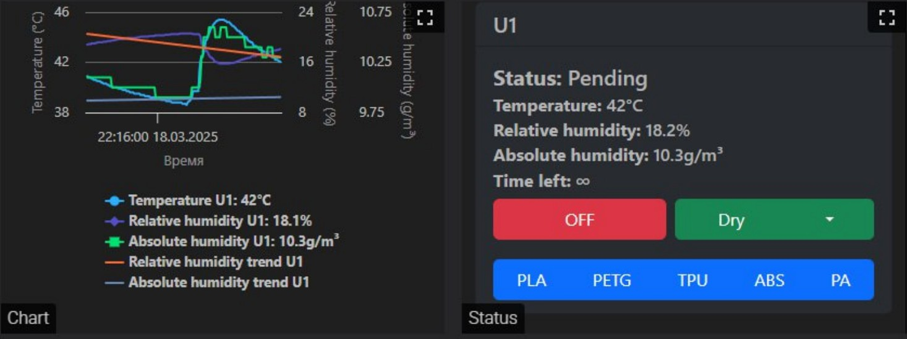

## **User Guide for iDryer Unit Setup**

### ⚠ Warning! Working with High-Risk Electrical Equipment ⚠
Before starting work, carefully review the safety measures!

The iDryer Unit contains components operating at **high voltage (220V)** and **exposed heating elements**. Incorrect connection or operation can lead to **electric shock, fire, or device failure**.

---

### **Preparation for Assembly**
Before assembly, complete the following steps:
- Ensure all components are available.
- Check the fitting of all parts, especially the alignment of moving components.
- Ensure the smooth and uniform movement of all mechanisms.

### **Initial System Check**
It is recommended to first assemble the system **on a table** without mounting it into the case and perform testing:
- Connect all components.
- Check the functionality of the heater, fan, damper servo, and temperature sensors.
- Connect the system to **Klipper** and ensure the macros operate correctly.

Once successful testing is complete, mount the components into the case.
During final assembly, shorten the sensor and power wires to the minimum required length.

---

## **Final System Setup**
### **PID Heater Calibration**
Before use, the **PID controller** of the heater must be calibrated.

- **Recommended drying temperature**: **90°C**.
- The `iDryer.cfg` configuration file already contains preliminary PID settings, but it is recommended to perform **auto-calibration** for adaptation to your specific system.

**Calibration:**

With the dryer lid closed:
1. Open the Klipper console.
2. Execute the command:
   ```
   PID_CALIBRATE HEATER=iDryer_U1_Heater TARGET=100
   ```
3. Wait for the calibration to complete.
4. Record the obtained **Kp, Ki, Kd** coefficients into the `iDryer.cfg` file.

Example heater section in `iDryer.cfg`:
```ini
[heater_generic iDryer_U1_Heater]
heater_pin: H_U1
max_power: 1
sensor_type: NTC 100K MGB18-104F39050L32
sensor_pin: T_U1
control: pid
pwm_cycle_time: 0.3
min_temp: 0
max_temp: 125
pid_Kp=29.625
pid_Ki=0.945
pid_Kd=232.186
```

---

### **Setting the "variable_delta_high" Parameter**
The `variable_delta_high` variable controls the temperature difference between the heater and the chamber.

- **Initial `variable_delta_high` value:** 15°C
- For proper adjustment:
  1. Set `variable_delta_high=15`.
  2. Start heating using the `PA_U1` macro.
  3. Wait for the heater temperature to stabilize.
  4. Check the chamber temperature:
      - **If the chamber is at 90°C**, keep the current `variable_delta_high` value.
      - **If the temperature is lower**, increase `variable_delta_high`.
  5. For testing, allow the dryer to run for **30 minutes**, then check the heater condition every **30–60 minutes**.

**Important!**  
If the heater **sticks to the plastic**, the plastic cannot withstand the temperature – reduce `variable_delta_high`, reprint the case with another filament, or modify the heater mounting structure.

**Turning off heating** - `OFF_U1` macro

---

### **Damper Servo Adjustment**
The servo controls the chamber ventilation.

#### **Basic Servo Principles**
- The servo is controlled by a **PWM signal**.
- Different servos may react differently to the same **PWM values**.
- Servo calibration should be **individual**.

#### **Setting the Damper End Positions**
1. **Do not attach the damper to the case during initial setup**.
2. Determine **maximum and minimum** servo angles:
   ```
   SET_SERVO SERVO=srv_U1 ANGLE=0
   ```
   ```
   SET_SERVO SERVO=srv_U1 ANGLE=90
   ```
3. If the servo hits the case, adjust the range.

#### **Configuration Settings**
Set up in `iDryer.cfg`:
```ini
[servo srv_U1]
pin: SRV_U1
maximum_servo_angle: 180
minimum_pulse_width: 0.00055
maximum_pulse_width: 0.002
```
Adjust the angle values for `variable_servo_open_angle` and `variable_servo_closed_angle`:
```ini
[gcode_macro DRY_U1]
variable_temp: 5
variable_humidity: 5
variable_duration: 5
variable_delta_high: 30
variable_servo_angle: 0
variable_servo_open_angle: 40 # degrees
variable_servo_closed_angle: 94 # degrees
variable_servo_open_time: 10 # seconds
variable_servo_closed_time: 300 # seconds
variable_data: {}
```

---

### **Servo Power Correction**
If multiple servos are used and issues arise, consider using an **active USB hub**.

Solution:
1. **Current Limitation via Resistor**  
   - Install a **7.5–15 Ohm resistor** in series with the servo power.
   - This reduces peak load on the host's USB port.
2. **Using an Active Hub**  
   - Connecting through a powered USB hub helps avoid host system overload.

---

## **Additional Recommendations**
- Monitor temperature and humidity readings through Klipper.
- Check component status during operation.
- Modify the damper and heater mounting if necessary.

---

### **Example Commands for Operating the Dryer**
- **Turn off drying**:
   ```gcode
   OFF_U1
   ```
- **Start drying for ABS**:
   ```gcode
   ABS_U1
   ```
- **Start drying for PLA**:
   ```gcode
   PLA_U1
   ```
- **Manually open the damper**:
   ```gcode
   SET_SERVO SERVO=srv_U1 ANGLE=90
   ```

---

### **Conclusion**
Setting up the iDryer Unit requires careful adjustment of PID parameters, `variable_delta_high`, and servo operation. When properly configured, the system will operate **stably and efficiently**, ensuring high-quality filament drying.

### Alternative variant of the process control algorithm

High End variant from @Xatang

Automatically maintains optimal drying and storage conditions, with adjustable parameters and coefficients, plus informative graphs.



[See it on GitHub](https://github.com/xatang/PyUnit)


### **General Safety Measures:**
- **Disconnect the device from the power supply before performing any work.**
- **Do not touch exposed live parts.**
- **Check the integrity of the wiring before turning on.**
- **Do not operate the device with a damaged case or exposed wires.**
- **Do not leave the device unattended while powered on.**
- **Ensure proper grounding of all metal case parts.**
- **If you detect a burning smell, smoke, or excessive heating of the case, immediately disconnect the device from the power.**
- **Avoid moisture and condensation on device components.**

### **Additional Connection Requirements:**
- Use a **circuit breaker** or **overload protection relay**.
- Ensure all connections are **properly insulated**.

Failure to follow these rules may result in **serious consequences for life and health!**

If you lack experience with electrical equipment, **seek assistance from a qualified specialist.**

---

## **Contact & Support**

[](https://t.me/iDryer)  
[](https://www.youtube.com/@iDryerProject)  
[](https://github.com/pavluchenkor/iDryer-Unit)  
[](https://discord.gg/1332280943465201724)


[](https://t.me/iDryer)
[](https://www.youtube.com/@iDryerProject)
[](https://github.com/pavluchenkor/iDryer-Unit)
[](https://discord.gg/1332280943465201724)
